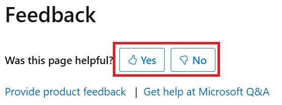

# Contribute to Microsoft Graph documentation

Thank you for your interest in Microsoft Graph documentation!

- [Ways to contribute](#ways-to-contribute)
- [Before we can accept your pull request](#before-we-can-accept-your-pull-request)
- [Use GitHub, Git, and this repository](#use-github-git-and-this-repository)
- [Contribute and edit content](#contribute-and-edit-content)
- [Contributions from community members](#contributions-from-community-members)
- [More resources](#more-resources)

## Ways to contribute

You can contribute to [Microsoft Graph documentation](https://developer.microsoft.com/graph/docs) in these ways:

- Contribute to articles by creating pull requests (PRs) in the [public Microsoft Graph developer docs repository](https://github.com/microsoftgraph/microsoft-graph-docs-contrib).
- Report bugs against a documentation page by selecting the "👍Yes 👎 No" feedback control on the right rail of the page and providing details in the form.
  
      
  
- Add or vote for documentation requests at [Microsoft Tech Community](https://techcommunity.microsoft.com/tag/Microsoft%20Graph?nodeId=board%3AMicrosoft365DeveloperPlatform).


## Before we can accept your pull request

### Minor corrections

Minor corrections or clarifications you submit for documentation and code examples in this repository don't require a Contribution License Agreement (CLA). Submissions are taken in the form of pull requests. We do our best to review pull requests within 10 business days.

### Larger submissions

If you submit new or significant changes to documentation and code examples, you need to sign a Contribution License Agreement (CLA) before we can accept your pull request if you are in one of these groups:

- Members of the Microsoft Open Technologies group
- Contributors who don't work for Microsoft

As a community member, **you must sign the Contribution License Agreement (CLA) before you can contribute large submissions to this project**, but you need to complete and submit the documentation only once. Carefully review the document; you might also need to have your employer sign the document.

Signing the Contribution License Agreement (CLA) doesn't grant you rights to commit to the main repository. However, it does mean that the Microsoft teams will be able to review and consider your contributions and you'll get credit if we do.

You can download or digitally sign the Contribution License Agreement (CLA) [here](https://cla.microsoft.com). Once we receive and process your CLA, we'll do our best to review your pull requests within 10 business days.

## Use GitHub, Git, and this repository

**Note:** 
- Most of the information in this section can be found in [GitHub Help][] articles.  If you're familiar with Git and GitHub, skip to the **Contribute and edit content** section for the particulars of the code/content flow of this repository.
- Before contributing for the first time to Microsoft Graph docs, employees of Microsoft should complete configuring their GitHub accounts. See the **Document** section of the [internal Microsoft Graph Partners onboarding documentation](https://aka.ms/msgraphcdk) for details.

### Setting up your fork of the repository

1. Set up a GitHub account so you can contribute to this project. If you haven't done so already, go to [GitHub Home][] and do it now.
2. Set up your machine with Git. Follow the instructions in the [Setting up Git Tutorial][Set Up Git].
3. Create your own fork of this repository. To do this, at the top of the page, select the **Fork** button.
4. Copy your fork to your local machine. To do this, open GitBash. At the command prompt enter:

```cmd
git clone https://github.com/{your user name}/microsoft-graph-docs.git
```

Next, create a reference to the root repository by entering these commands:

```cmd
cd microsoft-graph-docs
git remote add upstream https://github.com/microsoftgraph/microsoft-graph-docs.git
git fetch upstream
```

Congratulations! You've now set up your repository. You won't need to repeat these steps again.

## Contribute and edit content

Follow the guidance for [Quick edits to existing documents](https://learn.microsoft.com/contribute/#quick-edits-to-documentation) in our contributor guide.

Limit each branch to a single concept/article to streamline the workflow and reduce the chance of merge conflicts. The following types of contribution are appropriate for a new branch:

- A new article (and associated images)
- Spelling and grammar edits on an article
- Applying a single formatting change across a large set of articles (for example, applying a new copyright footer).

### Contributions from community members

After you raise a PR, a content reviewer will review your pull request and guide you on the next steps. The following are basic guidelines of contributions that are accepted:

#### Dos
+ Fix grammar and spelling errors and broken links
+ Fix omissions in existing sections
+ Correct existing or add new **HTTP** examples

#### Don'ts
+ Move sections in reference and resource files
+ Add code snippets (C#, JavaScript, Go, PowerShell, PHP samples) to examples or correct existing code snippets. These code snippets are autogenerated weekly for new and updated HTTP examples
+ Add missing properties or documentation
+ Update the permissions tables in the API reference docs, or the [permissions reference](https://learn.microsoft.com/en-us/graph/permissions-reference)

To recommend changes related to one of the types in this "Don'ts" list, [file a docs issue instead](#ways-to-contribute).

#### How to add new examples

Community members can add new examples to API docs. A complete example contains the request section, the response section and a few HTML comment blocks. You can use [Graph Explorer](https://aka.ms/ge) to test your requests and generate complete response objects for examples.

The following section shows the structure of a complete example. Line numbers are included for eligibility only.

```Markdown
 1:  ### Example 1: Get all users
 2:  
 3:  #### Request
 4:  
 5:  The following example shows a request.
 6:  
 7:  <!-- {
 8:    "blockType": "request",
 9:    "name": "get_users"
10:  } -->
11:  ```http
12:  GET https://graph.microsoft.com/v1.0/users
13:  ```
14:  
15:  #### Response
16:  
17:  The following example shows the response.
18:  
19:  >**Note:** The response object shown here might be shortened for readability.
20:  
21:  <!-- {
22:    "blockType": "response",
23:    "truncated": true,
24:    "@odata.type": "microsoft.graph.user",
25:    "isCollection": true
26:  } -->
27:  ```http
28:  HTTP/1.1 200 OK
29:  Content-type: application/json
30:  
31:  {
32:      "@odata.context": "https://graph.microsoft.com/v1.0/$metadata#users",
33:      "value": [
34:          {
35:              "displayName": "Conf Room Adams",
36:              "mail": "Adams@contoso.com",
37:              "mobilePhone": null,
38:              "officeLocation": null,
39:              "preferredLanguage": null,
40:              "surname": null,
41:              "userPrincipalName": "Adams@contoso.com",
42:              "id": "6ea91a8d-e32e-41a1-b7bd-d2d185eed0e0"
43:          }
44:      ]
45:  }
46:  ```
```

- Line 1: Add a descriptive title. Start with a verb. Don't skip heading levels.
- Line 3: Add the "Request" header.
- Line 8: Set the **blockType** to `request` to ensure the example is validated and code samples are autogenerated a few days after the PR is published.
- Line 9: Set a unique name for the example that doesn't conflict with names used by other examples. This name will be used for the code sample files.
- Lines 10-13: Add your request URL inside an HTTP code block. Using `msgraph-interactive` instead of `http` allows developers to use the "Try-It" button in docs.
- Line 15: Add the "Response" header using the same header level as the "Request" header.
- Line 17: Add any explanation for the example response.
- Lines 21-26: Indicate details about the type of response object that's returned. See other examples in the same document for guidance.
- Lines 27-46: Add the response object in an HTTP code block.

## More resources

- [Microsoft Learn documentation contributor guide overview][Learn contributor guide - public]
- For more information about Markdown, go to [their site][Markdown Home].
- For more information about using Git and GitHub, first check out the [GitHub Help] and if necessary contact the site administrators.

[Learn contributor guide - public]: https://learn.microsoft.com/en-us/contribute/
[GitHub Home]: https://github.com
[GitHub Help]: https://help.github.com/
[Set Up Git]: https://help.github.com/win-set-up-git/
[Markdown Home]: https://daringfireball.net/projects/markdown/
[vscode]: https://code.visualstudio.com/
