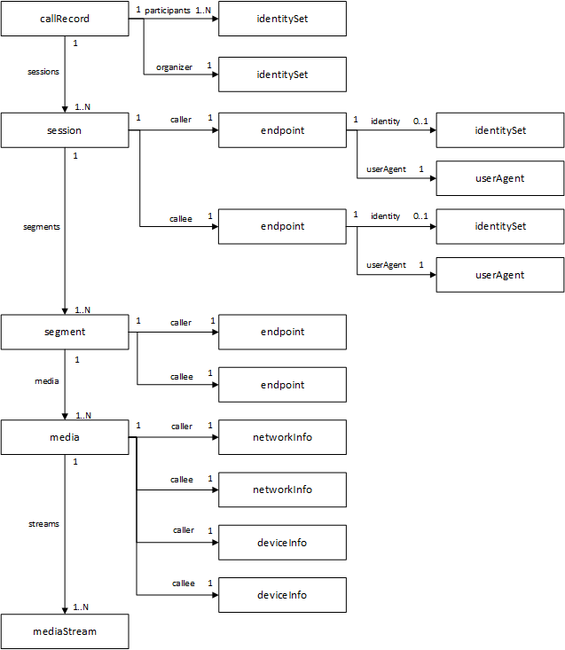

# Working with the call records API in Microsoft Graph

[!INCLUDE [beta-disclaimer](../../includes/beta-disclaimer.md)]

## Key resource types

| Resource | Methods |
| :-- | :-- |
| [callRecord](callrecords-callrecord.md) | [Get callRecord](../api/callrecords-callrecord-get.md) |
| [session](callrecords-session.md) | [Get callRecord](../api/callrecords-callrecord-get.md) |
| [segment](callrecords-segment.md) | [Get callRecord](../api/callrecords-callrecord-get.md) |

## See also

- [Webhook subscriptions](/graph/api/resources/webhooks?view=graph-rest-beta)