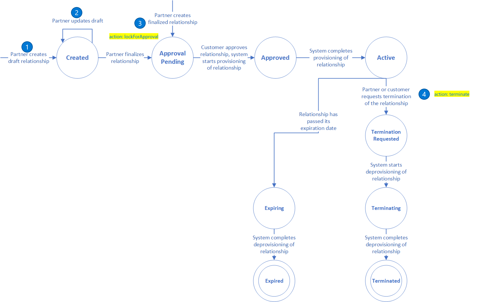
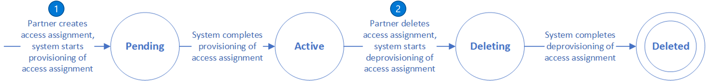

# Granular delegated admin privileges (GDAP) API overview

Namespace: microsoft.graph

As part of the Microsoft Partner Center ecosystem, Microsoft partners in the Cloud Solution Provider, Value Added Reseller, or Advisor programs can perform administrative operations on their customer tenants to help manage the customer's services, for example, Azure AD and Microsoft 365. This capability previously allowed partners to assume a Global Administrator role in the customer tenant indefinitely, creating potential security exposures and limiting market potential.

**Granular delegated admin privileges (GDAP)** provide partners with least-privileged access to their customer tenants following the [Zero Trust cybersecurity model](/security/zero-trust/). Through GDAP, partners configure and request granular and time-bound access to their customers' environments, and customers must explicitly grant this least-privileged access to partners. In addition, partners must request specific roles for customer tenant administration for a definite amount of time. This control eliminates the need for partners to have the Global Administrator role in their customer's tenant but rather, they now have lesser privileged permissions that they absolutely need for delegated administrative tasks.

For more information about GDAP, see:
+ [Introduction to granular delegated admin privileges (GDAP)](/partner-center/gdap-introduction)
+ [Least-privileged roles by task](/partner-center/gdap-least-privileged-roles-by-task)

## GDAP workflow

### Lifecycle of a GDAP Relationship

The status of the Delegated Admin relationship transitions as follows:

1. [Create delegatedAdminRelationship](../api/tenantrelationship-post-delegatedadminrelationships.md)
2. [Update delegatedAdminRelationship](../api/delegatedadminrelationship-update.md)
3. [Create delegatedAdminRelationshipRequest](../api/delegatedadminrelationship-post-requests.md) (action: lockForApproval)
4. [Create delegatedAdminRelationshipRequest](../api/delegatedadminrelationship-post-requests.md) (action: terminate)

>After running the [Create delegatedAdminRelationshipRequest](../api/delegatedadminrelationship-post-requests.md) API with the `lockForApproval` action, build the customer invitation link by using the following URI template, where *{adminRelationshipID}* is the ID of admin relationship request.
>
>`https://admin.microsoft.com/AdminPortal/Home#/partners/invitation/granularAdminRelationships/{adminRelationshipID}`

Send the invitation link to the customer for them to approve the GDAP request. For example, `https://admin.microsoft.com/AdminPortal/Home#/partners/invitation/granularAdminRelationships/5a6666c9-7282-0a41-67aa-25a5a3fbf339` is an invitation link, where `5a6666c9-7282-0a41-67aa-25a5a3fbf339` is the admin relationship request ID.

## Use cases for GDAP APIs

This section describes the ways that Microsoft partners can use the GDAP APIs to programmatically manage delegated admin relationships for their customers.

### Delegated admin relationship

| Use cases | APIs |
|--|--|
| Create a new delegated admin relationship for approval by any customer   Create a new delegated admin relationship for approval by a specific customer | [Create delegatedAdminRelationship](../api/tenantrelationship-post-delegatedadminrelationships.md) |
| List all delegated admin relationships of a partner   List all delegated admin relationships for a specific customer | [List delegatedAdminRelationships](../api/tenantrelationship-list-delegatedadminrelationships.md) |
| Get a delegated admin relationship by ID | [Get delegatedAdminRelationship](../api/delegatedadminrelationship-get.md)  |
| Delete delegated admin relationship | [Delete delegatedAdminRelationship](../api/delegatedadminrelationship-delete.md) |

### Delegated admin relationship request

| Use cases | APIs |
|--|--|
| Create a delegated admin relationship request to lock a relationship for customer approval or terminate an existing relationship. | [Create requests](../api/delegatedadminrelationship-post-requests.md) |
| Get a delegated admin relationship request by ID | [Get delegatedAdminRelationshipRequest](../api/delegatedadminrelationshiprequest-get.md) |
| List all delegated admin relationship requests for a given relationship | [List requests](../api/delegatedadminrelationship-list-requests.md) |

### Role assignments

| Use cases | APIs |
|--|--|
| Create new delegated admin access assignment for a delegated admin relationship | [Create accessAssignments](../api/delegatedadminrelationship-post-accessassignments.md) |
| List access assignments for a delegated admin relationship | [List accessAssignments](../api/delegatedadminrelationship-list-accessassignments.md) |
| Get a delegated admin relationship access assignment by ID | [Get delegatedAdminAccessAssignment](../api/delegatedadminaccessassignment-get.md) |
| Delete an access assignment of a delegated admin relationship | [Delete delegatedAdminAccessAssignment](../api/delegatedadminaccessassignment-delete.md) |
| Update role assignments for a delegated admin relationship access assignment | [Update delegatedAdminAccessAssignment](../api/delegatedadminaccessassignment-update.md) |

### Long-running operations

| Use cases | APIs |
|--|--|
| List all long running operations of a delegated admin relationship | [List operations](../api/delegatedadminrelationship-list-operations.md) |
| Get a long running operation of a delegated admin relationship | [Get delegatedAdminRelationshipOperation](../api/delegatedadminrelationshipoperation-get.md) |

### Delegated admin customers

| Use cases | APIs |
|--|--|
| List all delegated admin customers | [List delegatedAdminCustomers](../api/tenantrelationship-list-delegatedadmincustomers.md)|
| Get a single delegated admin customer by ID | [Get delegatedAdminCustomer](../api/delegatedadmincustomer-get.md) |
| Get service management details for a delegated admin customer | [List serviceManagementDetails](../api/delegatedadmincustomer-list-servicemanagementdetails.md) |

### Lifecycle of a GDAP Relationship Access Assignment

The status of the Delegated Admin access assignment. The status transitions are as follows:

1. [Create delegatedAdminAccessAssignment](../api/delegatedadminrelationship-post-accessassignments.md)
2. [Delete delegatedAdminAccessAssignment](../api/delegatedadminaccessassignment-delete.md)

## Permissions

To manage delegated admin relationships, the calling principal must be in the partner tenant and be granted the appropriate [granular delegated admin privileges permissions](/graph/permissions-reference#granular-delegated-admin-privileges-gdap-permissions).

## See also

+ [Introduction to granular delegated admin privileges (GDAP)](/partner-center/gdap-introduction)
