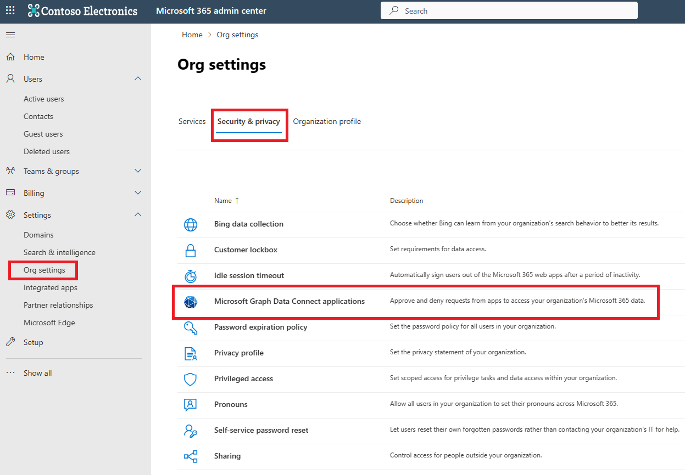
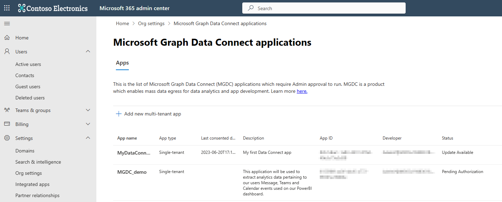
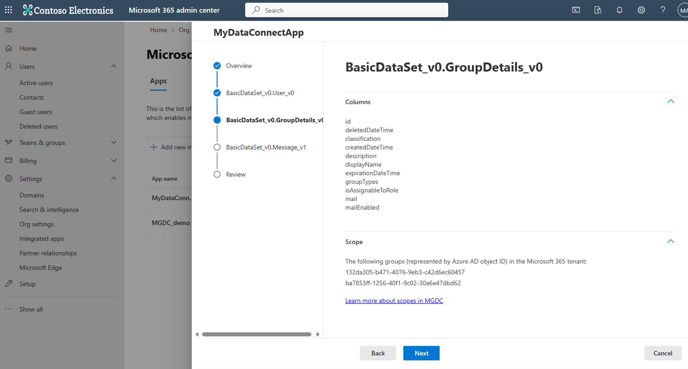
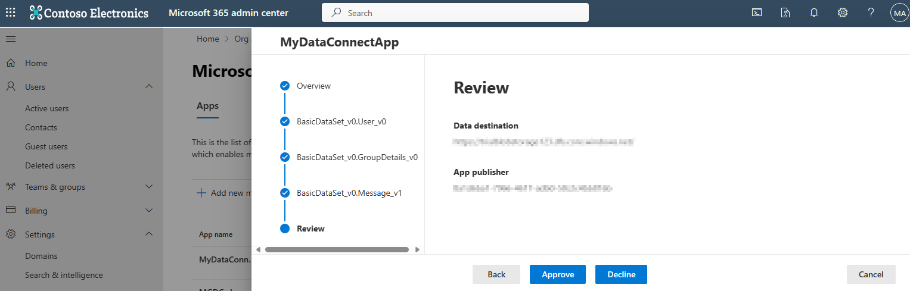
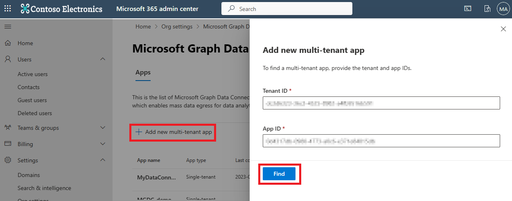
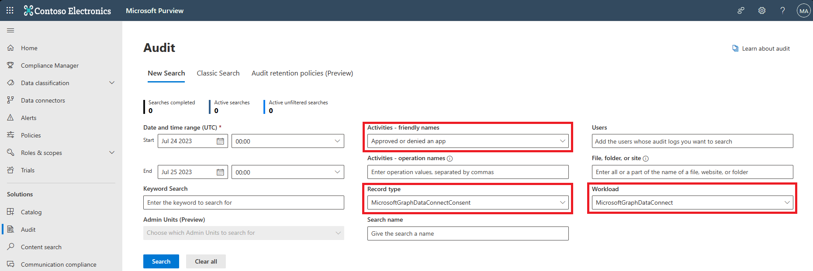

# Microsoft Graph Data Connect app authorization

The authorization experience for Microsoft Graph Data Connect apps is built in to the Microsoft 365 admin center. Only global administrators can authorize Data Connect applications. To authorize apps for your organization, global administrators can go to the [Microsoft Graph Data Connect authorization portal](https://admin.microsoft.com/Adminportal/Home#/Settings/MGDCAdminCenter), and choose the **Security & Privacy** tab in **Org settings**, and then select **Microsoft Graph Data Connect applications**, as shown in the following image.

## App summary view

The landing page of the Data Connect applications portal provides a quick view of all Data Connect applications that you might be interested in, as shown in the following image.

You'll find the following types of applications in the portal:

- **Single-tenant apps** — Applications that are registered in your tenant, and require access to data. These apps are typically enterprise scenarios.
- **Multi-tenant applications** — Applications that are hosted in another tenant, and require access to data from your tenant. These apps are typically ISV scenarios. Review these apps carefully. When you authorize multi-tenant apps, data from your tenant can be migrated to the app developer's tenant.

All single-tenant apps are populated in the table by default. Only approved, denied, or expired multi-tenant apps are included in the table. Other apps might be shown in the table with the following statuses:

- **Pending authorization** — Apps that haven't been acted upon yet. This status is only possible for single-tenant apps. Apps in this state will always fail at runtime.
- **Approved** — Apps that an admin has approved to access Microsoft 365 data for your tenant.
- **Denied** — Apps that an admin has denied to access Microsoft 365 data for your tenant. Apps in this state will always fail at runtime.
- **Expired** — Apps that an admin has approved to access Microsoft 365 data for your tenant, but the approval expired. Apps in this state will always fail at runtime.
- **Update available** — Apps that an admin has previously reviewed and acted upon, but have since been updated. Apps in this state will continue working as per previous authorization. When the admin provides a new approval, the new definition of the app will overwrite the old one.

### App details view

Select an app from the table to launch the app details view, which provides more information about the data the app requires. This wizard experience walks you through the relevant data access details. When you complete the wizard, you can approve or deny the app at the end. The following image shows the app details view.

First, the wizard shows overview information about the application:

- **Developer** — The user name of the developer who registered the application.

- **Data destination** — The sink where the data will be delivered. If approved, this app can move the requested data to any location within the listed sink.

- **App publisher** — The Azure AD tenant ID where the app is registered. For single-tenant apps, this should be the same Azure AD tenant ID as your tenant.

Next, the wizard includes multiple dataset steps, one step per dataset registered in the app. Each page shows you relevant information for each dataset. For example:

- **Columns** — Specifies columns the app intends to extract via Data Connect. If approved, this app can extract any subset of approved columns for the specified dataset.

- **Scope** — Specifies the scope (user selection) the app intends to extract via Data Connect. For details about scopes, see [Use Microsoft Graph Data Connect to define the scope of a dataset](./data-connect-users-and-groups.md).

For details about how authorization works with different scopes, see [Authorization validation during pipeline runtime](#authorization-validation-during-pipeline-runtime).

Finally, the wizard confirms some key information on the app for you to review. You can select **Approve**, **Decline**, or **Cancel**. An action on an app is all or nothing. Authorizing an app means you are authorizing all access specified in the previous steps.

When authorizing an app, you might encounter these error messages:

- `App approver and owner cannot be the same user.`
- `App registration not found. It is possible someone deleted this app.`

If an unexpected error occurs, the error message will include an error code. Make a note of this error code to share with Microsoft support.

### Discovering multi-tenant applications

To discover multi-tenant applications, select **Add new multi-tenant app** above the app summary table. If your tenant is enabled for cross-tenant data migration, you'll see two text boxes. After you enter the application ID and tenant ID, choose **Find**, and the portal will launch the app details view for the app you're searching for.

### Microsoft 365 audit logs

The Microsoft Graph Data Connect app authorization experience is integrated with Microsoft 365 audit logs. When admins approve or deny a Data Connect application, an auditable event emits to Microsoft 365 audit logs with relevant data about what was approved or denied. Use any of the following fields to search the audit logs for Data Connect authorization events:

- **Workload** - MicrosoftGraphDataConnect

- **Record type** - MicrosoftGraphDataConnectConsent

- **Activities** - Approved or denied an app (in **Microsoft Graph Data Connect Activities**)

### Authorization validation during pipeline runtime

At runtime, Data Connect validates incoming requests against all authorizations in the tenant. If a matching authorization is found, the job proceeds. If no authorization is discovered, the job fails. Data Connect no longer stalls on `ConsentPending` when awaiting authorization. If authorization validation fails, you'll receive a specific error message regarding why your job failed to match existing app authorizations.

Authorization validations applied during runtime include:

- The application ID for the incoming request matches an authorized app.
- The found app authorization is approved.
- The application's tenant ID for the incoming request matches the found app authorization's app registration tenant ID.
- The dataset for the incoming request is one of the datasets in the found app authorization.
- The columns in the incoming request are a subset of those that were authorized for the requested dataset.
- The destination tenant ID matches the found app authorization's destination tenant ID.
- The destination location for the incoming request is contained within the destination sink in the found app authorization.
- The scope for the incoming request aligns with the scope in the found app authorization.
  - If the app is authorized for all users/groups in the tenant, any scope will pass this validation.
  - If the app is authorized for a list of groups, any subset of the authorized groups will pass this validation.
  - If the app is authorized for a scope filter URI, the incoming request must precisely match the authorized value.
