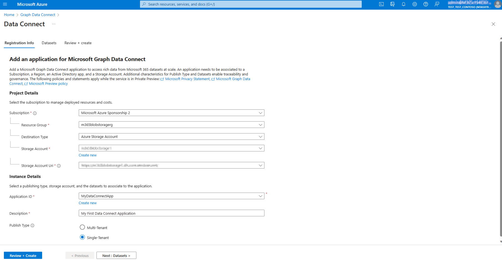

# Microsoft Graph Data Connect app registration

This article provides best practice guidance for using the Azure portal experience to register an Azure Active Directory (Azure AD) app with Microsoft Graph Data Connect.

## Azure portal experience

With the updated portal experience, developers and global administrators within the tenant can review all registered applications, level of detail for authorization, and ability to manage app registrations. Launch your experience in the [Azure portal](https://aka.ms/mgdcinazure). When you return to the portal, re-launch it in the search bar.

### Landing page

> [!IMPORTANT]
> If Microsoft Graph Data Connect **hasn't been enabled by your admin**, the portal experience is **disabled**.

The first screen of the Azure portal experience will prompt you to register your first app with Data Connect—or load existing registrations into a summary table view.

The table includes the following column fields:

- **Name**—the app registration name
- **App ID**—the Azure AD application ID
- **Registered On**—the date of registration of the app
- **Developer**—the email address of the developer who registered the application
- **Multi-tenant**—if the app is multi-tenant or single tenant
- **Last modified**—the most recent date when the application was changed

At the top of the table, three buttons are enabled by default: **Add**, **Refresh**, and **Delete**. **Add** starts an action for a new app registration. **Refresh** queries existing app registrations in the tenant again, and refreshes the table. **Delete** is only enabled for single selections, and initiates a deletion process.

## Register a new app

When adding a new app registration with Data Connect, follow the add wizard to complete the required details on the following tabs: **Registration Info**, **Datasets**, and **Review + create**.

### Registration Info page

The Registration Info page outlines standard requirements for app registrations. First, specify the project details—a process that's similar to creating a resource in Azure. The following are the project detail fields:

- **Subscription** (required) select a subscription in the tenant that will be used exclusively to filter the next 4 selections used to configure the destination for the data.

- **Resource Group** (required) select the group location for the data storage.
- **Destination Type** select the type of storage from Azure Storage Account or Azure SQL Database Server.

If the selected type of storage is SQL Database Server, then it will only support `Mapping Data Flows` types. For details, see [Mapping Data Flows](/azure/data-factory/concepts-data-flow-overview).

- **Storage Account** (required) select the storage account where the data to provision with Data Connect will be located, or create a new Azure Storage Account.
- **Storage Account Uri** (required) from the storage account selected above, select the Uri to use (Distributed File System (DFS) or blob).

> [!NOTE]
> The linked service you create during pipeline setup should align with what you've selected in previous steps on the Registration Info page. If you choose DFS, use an Azure Data Lake Storage Gen2 Linked Service—and if you choose blob, use Azure Blob Storage Linked Service.

If you select SQL for **Storage Account**, the **Uri** project detail field is disabled.

App registration requires you to select entries for the **Instance Details** that affect default behaviors such as the following fields:

- **Application ID** (required) select from Azure AD apps in the tenant, or create a new one.
- **Description** (required) provide details in the text field for app registration such as project goal, unique identifier, and organization project name.
- **Publish Type** (required) select from multi-tenant or single-tenant fields.
- **Key Vault** (required for multi-tenant app registrations) specify the key vault that will enable communication between tenants.

#### Datasets

After you complete the **Registration Info** page, specify the datasets that the app registration needs to query. This step is crucial for authorization. Only datasets selected here will be transferred for administrator authorization. For details about datasets, see [Datasets, regions, and sinks](./data-connect-datasets).

The wizard shows a table that allows the entry of multiple datasets, the selection of columns in the datasets, and further details if applicable—scope and scope options. For details about scopes, see [User selection and filtering capabilities in Microsoft Graph Data Connect](./data-connect-filtering). You can select each dataset that the app will request for authorization, and all or several columns from the dataset, depending on the level of granularity and privacy required:

When you're finished, choose **Next : Review + create**.

> [!IMPORTANT]
> If information is missing from the required fields in the previous tabs, the **Next : Review + create** button will be disabled.

#### Review + create

The last step in the wizard shows a summary page for you to review the specified details and confirm the creation of the app registration entry.

### View app registration details

After you create your app registration entry, to view the details that you specified, select the app name on the landing page. All details specified in creation are shown.

#### Update app registration entry

Access update functionality from the individual app overview page. Either the app owner or global admin can update properties or datasets associated with a Data Connect application. As shown in the following images, any updates to the destination storage for the app or the datasets, schema, or scopes associated with the app will invalidate the previous authorization, and will require the global admin to approve the app again from the Microsoft 365 admin center.

#### Delete an app registration entry

You can delete an app registration entry from either the individual app overview page, or from the landing page. Currently, either app owners or global administrators can delete app registration entries. When you delete an app registration entry, you need to type the name of the app to confirm the deletion. After the app is deleted, any dependency or pipeline that uses it will become unusable, specifically:

- Any current pipeline utilizing the application and past the authorization validation phase, would continue and succeed.
- Any pipeline before the authorization validation phase would start failing because the application is missing.

