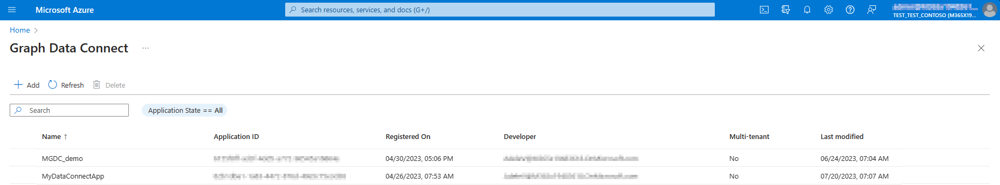
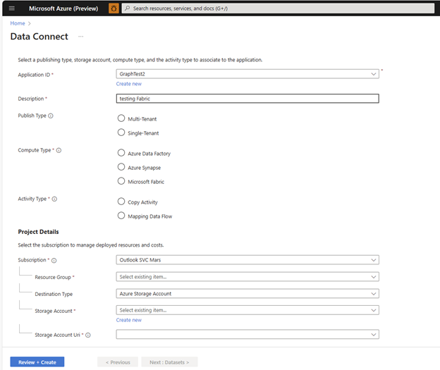
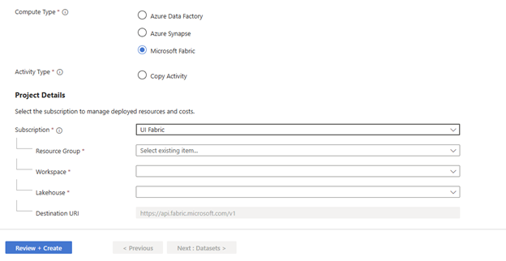
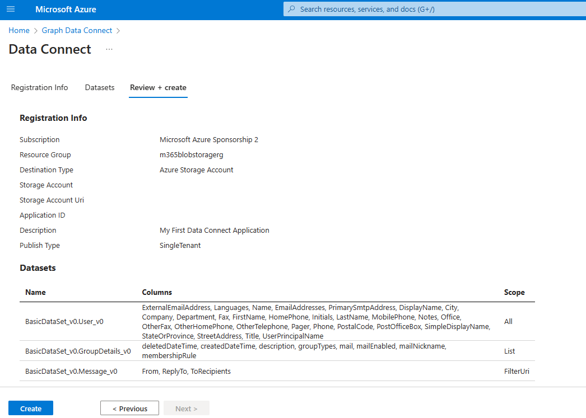
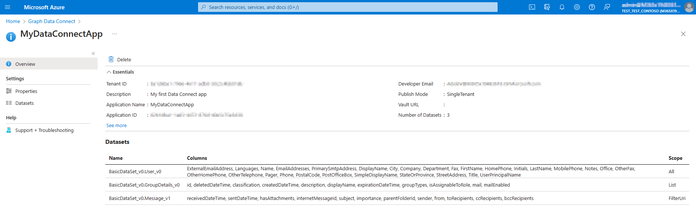
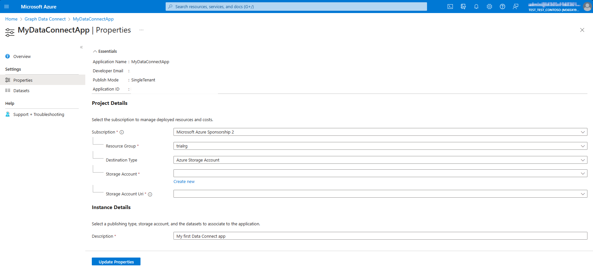
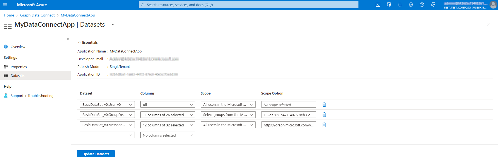
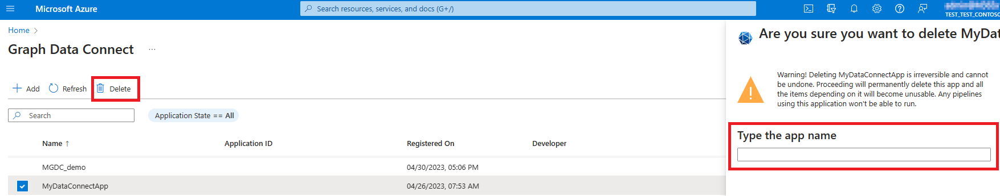

# Microsoft Graph Data Connect app registration

This article provides best practice guidance for using the Azure portal experience to register a Microsoft Entra app with Microsoft Graph Data Connect.

## Azure portal experience

In the [Azure portal](https://aka.ms/mgdcinazure) experience, developers and tenant Global Administrators can review all registered applications, authorize apps, and manage app registrations.

### Landing page

> [!IMPORTANT]
> If Microsoft Graph Data Connect hasn't been enabled by your admin, the portal experience is disabled. For details about how Global Administrators can enable Data Connect, see [Enable Microsoft Graph Data Connect in your Microsoft 365 tenant](/graph/data-connect-quickstart?tabs=NewConsentFlow%2CPAMMicrosoft365%2CAzureSynapsePipeline&tutorial-step=1)

The first screen of the Azure portal experience prompts you to register your first app with Data Connect, or load existing registrations into a summary table view.

The table includes the following column fields:

- **Name**: The app registration name.
- **App ID**: The Microsoft Entra application ID.
- **Registered On**: The date the app was registered.
- **Developer**: The developer who registered the application.
- **Multi-tenant**: Whether the app is multi-tenant or single tenant.
- **Last modified**: The most recent date when the application was changed.

At the top of the table, three buttons are enabled by default: **Add**, **Refresh**, and **Delete**. **Add** starts an action for a new app registration. **Refresh** queries existing app registrations in the tenant again, and refreshes the table. **Delete** is only enabled for single selections, and initiates a deletion process.

## Register a new app

When adding a new app registration with Data Connect, follow the add wizard to complete the required details on the following tabs: **Registration Info**, **Datasets**, and **Review + create**.

### Registration Info page

The Registration Info page outlines standard requirements for app registrations. App registration requires you to select entries that affect default behaviors, such as the following fields:

- **Application ID** (required): Select from Microsoft Entra apps in the tenant, or create a new one.
- **Description** (required): Provide details in the text field for app registration such as project goal, unique identifier, and organization project name.
- **Publish Type** (required): Select from multi-tenant or single-tenant fields.
- **Key Vault** (required **only** for multi-tenant app registrations): Specify the key vault that enables communication between tenants.
- **Compute Type** (required): Select the Azure product offering for this application.
- **Activity Type** (required): Select the Data Factory/Synapse/Fabric activity that is used to copy over the data.

Then specify the project details—a process that's similar to creating a resource in Azure. The following are the project detail fields:

- **Subscription** (required): Select a subscription in the tenant that is used exclusively to filter the next four sections that relate to data destination configuration.
- **Resource Group** (required): Select the group location for the data storage.
- **Destination Type**: Select the type of storage from Azure Storage Account or Azure SQL Database Server.

  >**Note:** If you select SQL Database Server, the app only supports `Mapping Data Flows` types. For more information, see [Mapping Data Flows in Azure Data Factory](/azure/data-factory/concepts-data-flow-overview).

- **Storage Account** (required): Select the storage account where the data to provision with Data Connect is located, or create a new Azure Storage Account.
- **Storage Account Uri** (required): From the storage account you selected, select the URI to use (Distributed File System (DFS) or blob).

> [!NOTE]
> The linked service that you create during pipeline setup should align with what you selected in previous steps on the Registration Info page. If you choose DFS, use an Azure Data Lake Storage Gen2 Linked Service, and if you choose blob, use Azure Blob Storage Linked Service.

If you select SQL for **Storage Account**, the **Uri** project detail field is disabled.

> [!NOTE]
> If you select Microsoft Fabric as the Compute Type, the app only supports Copy Activity type.

- **Workspace** (required): Select the Fabric workspace for your application. For more information, see [Fabric Workspaces](/fabric/get-started/workspaces). 
- **Lakehouse** (required): Select the OneLake instance to copy the data into. For more information, see [Fabric OneLake](/fabric/onelake/onelake-overview).

> [!NOTE]
> If you select Microsoft Fabric as the compute type, you need to register a **Microsoft.GraphServices** resource provider for the selected Azure subscription. The selected subscription and resource group are used for billing. For more information, see [Azure resource providers and types](/azure/azure-resource-manager/management/resource-providers-and-types).

#### Datasets

After you complete the **Registration Info** page, specify the datasets that the app registration needs to query. This step is crucial for authorization. Only the datasets that you select are transferred for administrator authorization. For more information about datasets, see [Datasets, regions, and sinks](./data-connect-datasets.md).

The wizard shows a table that allows the entry of multiple datasets, the selection of columns in the datasets, and more details if applicable, such as scope and scope options. You can select each dataset that the app requests for authorization, and all or several columns from the dataset, depending on the level of granularity and privacy required.

##### Scope selection

You can configure the scope for each dataset in three ways:

- **All information**: The default option. If you leave the field blank, the entire scope of the dataset is registered.
- **Select users or groups within the organization**: Enter the object IDs of the users or groups separated by commas. Learn more about [Microsoft Entra groups](/entra/fundamentals/groups-view-azure-portal).
- **Specific predicates**: Use the filtering mechanism similar to that of Microsoft Graph APIs to specify a scope within a column of the dataset. Learn more about [user selection](./data-connect-filtering.md#user-selection).

For more information about scopes, see [User selection and filtering capabilities in Microsoft Graph Data Connect](./data-connect-filtering.md).

When you're finished, choose **Next : Review + create**.

> [!NOTE]
> If information is missing from the required fields in the previous tabs, the **Next : Review + create** button is disabled.

#### Review + create

The last step in the wizard shows a summary page for you to review the specified details and confirm the creation of the app registration entry.

> [!NOTE]
> If you previously selected Microsoft Fabric as the compute type, a resource with the type **Microsoft.GraphServices** and the name *mgdc-<your_app_id>* is registered under the selected subscription and resource group. This resource is used for billing. For more information about how to enable the **Microsoft.GraphServices** resource provider, see [Azure resource providers and types](/azure/azure-resource-manager/management/resource-providers-and-types).

### View app registration details

After you create your app registration entry, to view the details that you specified, select the app name on the landing page. All details specified in creation are shown.

#### Update app registration entry

Access update functionality from the individual app overview page. Either the app owner or Global Administrator can update properties or datasets associated with a Data Connect application. As shown in the following images, any updates to the destination storage for the app or the datasets, schema, or scopes associated with the app invalidate the previous authorization, and require the Global Administrator to approve the app again from the Microsoft 365 admin center.

> [!NOTE]
> If not already created, a resource named *mgdc-<your_app_id>* of type **Microsoft.GraphServices** is registered under the selected subscription and resource group for the Microsoft Fabric compute type.

#### Delete an app registration entry

You can delete an app registration entry from either the individual app overview page, or from the landing page. Currently, either app owners or Global Administrators can delete app registration entries. When you delete an app registration entry, you need to type the name of the app to confirm the deletion. After the app is deleted, any dependency or pipeline that uses it becomes unusable, specifically:

- Every pipeline goes through multiple phases. In the first phase of the pipeline, we validate the consent. Any pipeline past the consent validation stage continues and succeeds.
- Any pipeline before the authorization validation phase fails because the application is missing.

