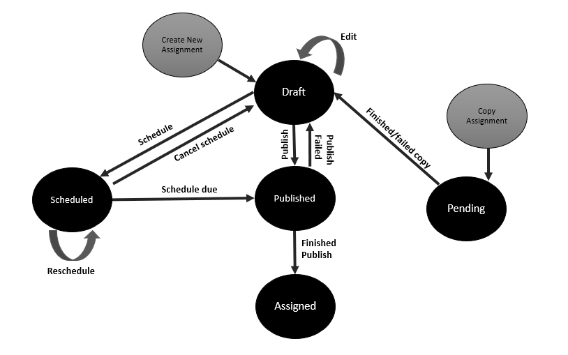
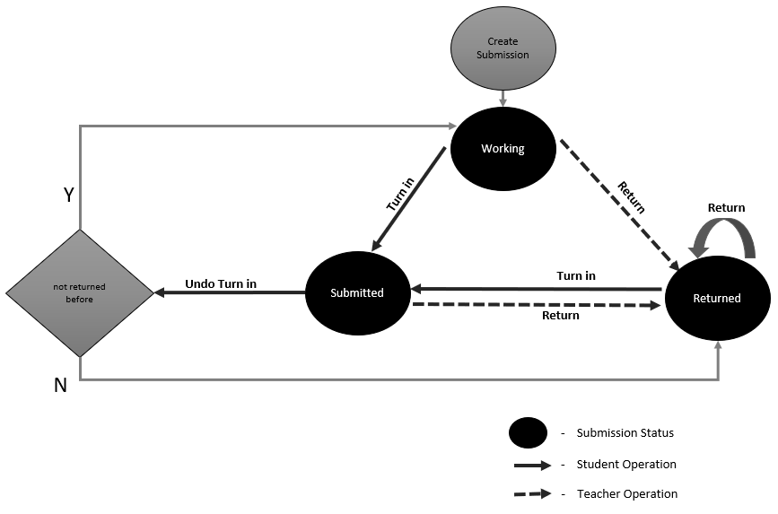

# States, transitions, and limitations for assignments and submissions in Microsoft Graph

Assignments and submissions are an important part in the interaction between teachers and students' actions. This article describes the changes in the assignment and submission states during the process flow and which education APIs in Microsoft Graph are involved.

## Assignment states and transitions

An assignment represents a task or unit of work assigned to a student or team members in a class as part of their study. Only teachers or team owners can create, copy, or schedule assignments. These actions have an impact on assignment states. The following table lists the assignment states and the APIs that are available to change the state. 

| State | Description | REST API call |
|:--|:--|:--|
| Draft | Initial status when a new assignment is created or copied from an existing assignment. | `POST /education/classes/{id}/assignments` |
| Published | A background processing state  when the assignment is distributed to each student assigned. | `POST /education/classes/{id}/assignments/{id}/publish` |
| Scheduled | Status when the teacher scheduled the assignment to publish in a future time. | `PATCH /education/classes/{id}/assignments/{id}` `POST /education/classes/{id}/assignments/{id}/publish` |
| Assigned | After finishing the publish, the assignment is moved to Assigned state and is available for the students. | `POST /education/classes/{id}/assignments/{id}/publish` |
| Pending | Background processing status when a new assignment is being copied from an existing one. | `POST /education/classes/{id}/assignments/{id}/copy` `PATCH /education/classes/{id}/assignments/{id}` |

The following diagram shows the state transitions that can occur for assignments.

### How to verify that an assignment is published
The caller must use the GET assignment operation t o check the current assignment status and verify that the publishing process succeeded.

### Assignments states transitions based on the allowed actions
| Current assignment state | Action | New state |
|:--|:--|:--|
| Draft | The teacher sets a due date. | Scheduled |
| Draft | Publish | Published |
| Draft | Edited | Draft |
| Draft | Discarded | |	
| Published | Publish finished | Assigned |
| Published | Discarded | |
| Scheduled | Reach due date | Published |
| Scheduled | Cancel schedule | Draft |
| Scheduled | Reschedule | Scheduled |
| Assigned | Discarded | |
| Pending |	Copy completed | Draft |
| Pending | Discarded | |	

`Note: Any action and state transition not listed in the table is NOT allowed`

### Sync vs. async operations over assignments API calls
The following table mentions the API calls that affect the assignment state and the operation type.

Synchronous operations are performed one at a time and only when one operation is completed can the following operation start, and the result is returned until the last operation is completed. With Asynchronous operations, the operation starts and another operation can run before the previous one finishes. The asynchronous operation performs some background activity, and the caller must be polling to get the result.

| API | Sync or async | Mechanism to get latest state |
|:--|:--|:--|
| `DELETE /education/classes/{id}/assignments/{id}` | Async | Poll |
| `POST /education/classes/{id}/assignments/{id}/publish` | Async | Poll |
| `PATCH /education/classes/{id}/assignments/{id}` | Async | Poll |
| `POST /education/classes/{id}/assignments` | Async | Poll |

## Submission states and transitions

A submission represents the resources that an individual (or group) turns in for an assignment. Submissions are owned by an assignment and are automatically created when an assignment is published.

The status is a read-only property in the submission and changes based on the actions of students and teachers.
 

| State | Description | REST API call |
|:--|:--|:--|
| Working |	Initial state after the submission is created. | `POST /education/classes/{id}/assignments` `POST /education/classes/{id}/assignments/{id}/submissions/{id}/unsubmit` |
| Submitted	| It happens after the student turned i n the assignment. | `POST /education/classes/{id}/assignments/{id}/submissions/{id}/submit` |
| Returned | After the teacher returned the assignment back to the student. | `POST /education/classes/{id}/assignments/{id}/submissions/{id}/return` |

The following diagram shows the state transition flow.

### Submissions states transitions based on allowed actions
| Current submission state | Action | New state |
|:--|:--|:--|
| Working |	Turn in	| Submitted |
| Working |	Return | Returned |
| Submitted	| Undo Turn in | Working |
| Submitted | Return | Returned |
| Returned | Turn in | Submitted |

`Note: Any action and state transition not listed in the table is NOT allowed`

### Sync vs. async operations over submissions API calls
The following table lists the API calls that affect the submission state and the operation type.

In this case, all the calls are asynchronous, which means that the operation starts and another operation can start before the first one finishes. The asynchronous operation performs some background activity, and the caller must be polling to get the result.  

| API | Sync or async | Mechanism to get latest state |
|:--|:--|:--|
| `POST /education/classes/{id}/assignments/{id}/submissions/{id}/submit` | Async | Poll |
| `POST /education/classes/{id}/assignments/{id}/submissions/{id}/unsubmit` | Async | Poll |
| `POST /education/classes/{id}/assignments/{id}/submissions/{id}/return` | Async | Poll |

### Limits
The following limits apply to all API calls:

* The maximum number of assignments and submissions resources are 10 for the teacher and plus 10 for the student.
* The maximum size allowed for resources is 50 MB overall or 10 resources.
* Throttling limits apply; for details, see [Microsoft Graph throttling guidance](https://docs.microsoft.com/graph/throttling).
