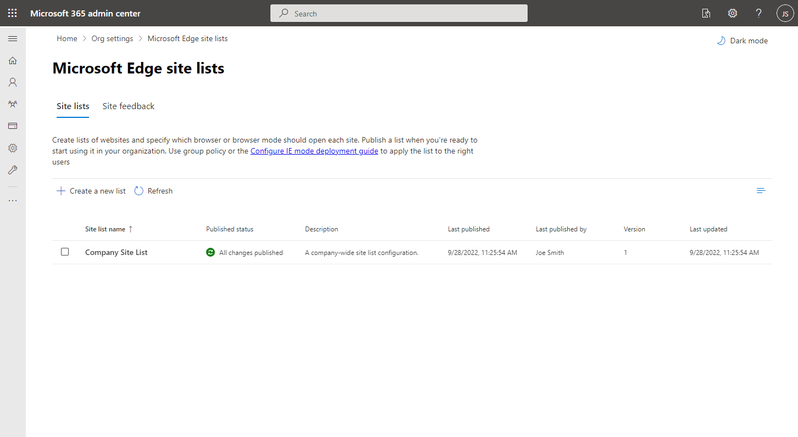

# Use the Edge API in Microsoft Graph to manage browsers

The [Microsoft 365 admin center](https://admin.microsoft.com/) lets administrators manage applications, services, data, devices, and users across Microsoft 365 services in an organization. Microsoft Edge is one of the applications that administrators manage through the admin center.

## Why integrate with Edge settings in the Microsoft 365 admin center?

### Use a single browser for legacy and modern sites

Edge supports [IE mode](/deployedge/edge-ie-mode) to enable your organization to use a single browser for both legacy and modern websites and applications. Organizations can use [cloud site lists](/deployedge/edge-ie-mode-cloud-site-list-mgmt#overview) for IE mode to manage a list of websites that should automatically load in IE mode, supporting the transition from IE11 to IE mode. As an alternative to using the Microsoft 365 admin center, apps can use the Microsoft Graph API to manage the same [browser site lists](/graph/api/resources/browsersitelist) configured through the Microsoft 365 admin center.

### Manage and store IE mode sites in the cloud

Cloud site lists for IE mode allows admins to manage and store a list of websites that require Internet Explorer mode to a compliant cloud location. Admins can publish one or more site lists to an authenticated endpoint that Microsoft Edge clients within their tenant can download. Subsequent publishes of these site lists reflect automatically on Microsoft Edge clients with no additional steps.

### Automate the management of site lists

The Microsoft Graph APIs for managing cloud site lists retain the same core functionality that is currently offered in the Microsoft 365 admin center. Administrators can automate common tasks such as [creating site lists](/graph/api/internetexplorermode-post-sitelists), [adding sites](/graph/api/browsersitelist-post-sites), [adding shared cookies](/graph/api/browsersitelist-post-sharedcookies), and [publishing site lists](/graph/api/browsersitelist-publish).

## API reference

Looking for the API reference for this service?

- [Use the Edge API in Microsoft Graph](/graph/api/resources/browser-edge-api-overview)

## Next steps

Find out more about the [use cases](/graph/api/resources/browser-edge-api-overview#common-use-cases) of the Edge API in Microsoft Graph.
