# Get change notifications delivered different ways (preview)

Change notifications can be delivered different ways to subscribers. If change notifications' main delivery mode is through webhooks, it can be challenging to leverage webhooks for high throughput scenarios.

## Using Azure Event Hubs to receive change notifications

[Azure Event Hubs](https://azure.microsoft.com/en-us/services/event-hubs) is a popular real-time events ingestion and distribution service built for scale. You can leverage Azure Events Hubs to receive change notifications instead of traditional webhooks. This feature is currently in preview.  
Using Azure Event Hubs to receive change notifications differs in a few ways including:

- You don't rely on publicly exposed notification URLs : the Event Hubs SDK will relay the notifications to yoru application
- You don't need to implement the [notification URL validation](webhooks.md#notification-endpoint-validation)
- You'll need to provision an Azure Event Hub
- You'll need to provision an Azure Key Vault

### Setup a Subscription using Event Hubs

This section will walk you through the setup of a subscription using Azure Event Hubs to deliver the notifications.

#### Configuring the Azure Event Hub

In this section you will:

- Create an Azure Event Hub namespace
- Add a hub to that namespace that will relay and deliver notifications
- Add a shared access policy that will allow you to get a connection string to the newly created hub.

Steps:

1. Open a browser to the [Azure Portal](https://portal.azure.com).
1. Select "Create a resource".
1. Type "Event Hubs" in the search bar.
1. Select the "Event Hubs" suggestion. The Event Hubs creation page will load.  
    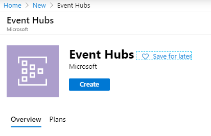
1. On the Event Hubs creation page click "Create".
1. Fill-in the Event Hubs namespace creation details and click "Create".  
    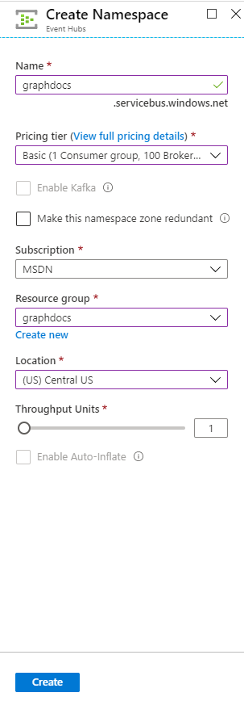
1. Once the Event Hub namespace is provisioned, navigate to it's page.  
    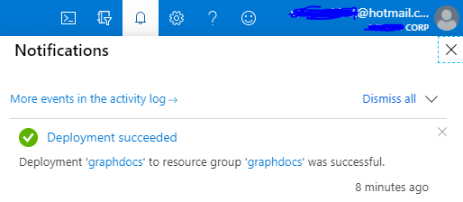
1. Click on "Event Hubs" and "+ Event Hub".  
    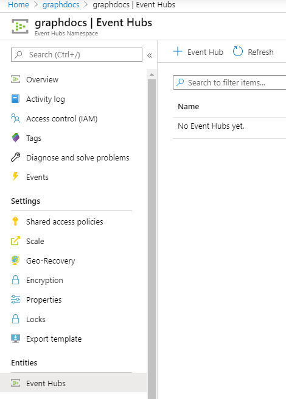
1. Give a name to the new Event Hub and click "Create".  
    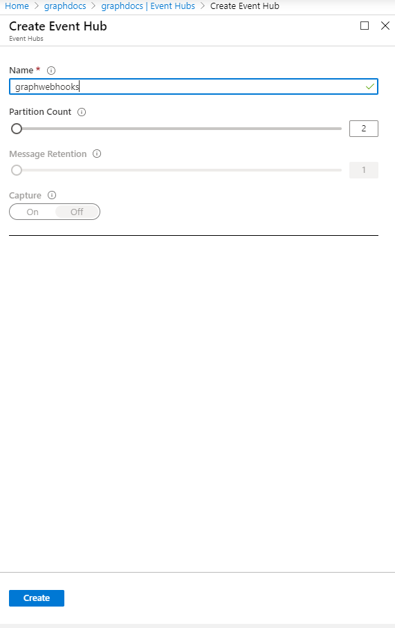
1. Once the Event Hub has been created click on it's name, on "Shared access policies" and "+ Add" to add a new policy.  
    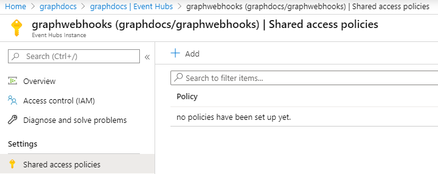
1. Give a name to the policy, check "Send" and click "Create".  
    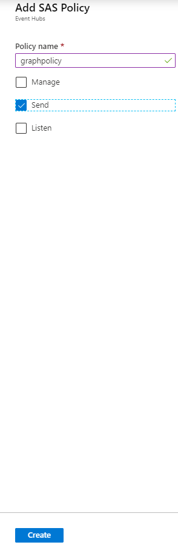
1. Once the policy has been created, click on it's name to open the details panel, then copy the "Connection string-primary key" value. Write it down, you'll need it as the next step.  
    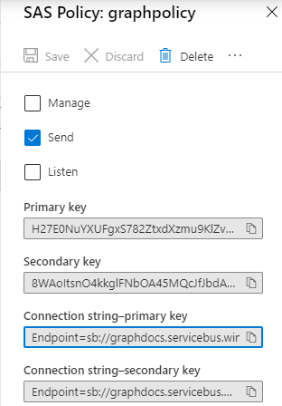

#### Configuring the Azure Key Vault

In order to access the Event Hub securely and to allow for key rotations, the Microsoft Graph gets the connection string to the Event Hub through Azure Key Vault.  
In this section you will:

- Create an Azure Key Vault to store secret.
- Add the connection string to the Event Hub as a secret.
- Add an access policy for the Microsoft Graph to access the secret.

Steps:

1. Open a browser to the [Azure Portal](https://portal.azure.com).
1. Select "Create a resource".
1. Type "Key Vault" in the search bar.
1. Select the "Key Vault" suggestion. The Key Vault creation page will load.
1. On the Key Vault creation page, click "Create".  
    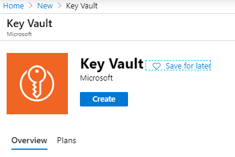
1. Fill-in the Key Vault creation details, click "Review + Create" and "Create".  
    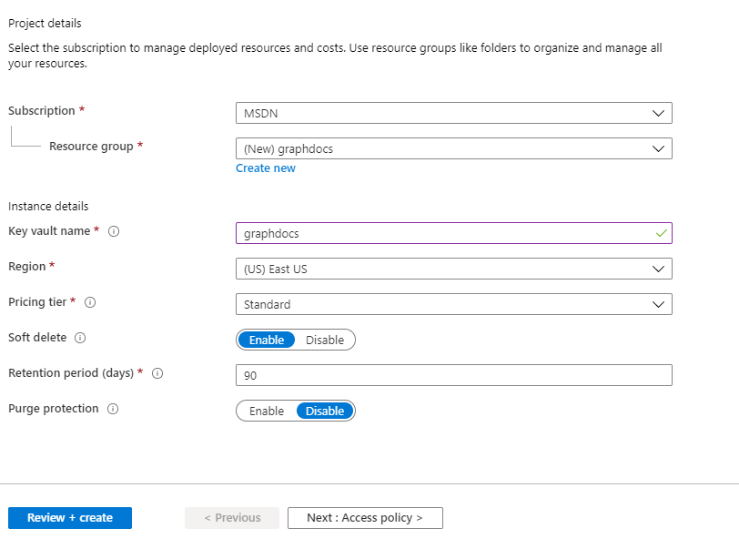
1. Navigate to the newly crated key vault using the "Go to resource" from the notification.  
    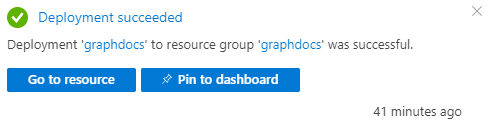
1. Copy the "DNS name", you will need it for the next step.  
    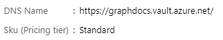
1. Navigate to "Secrets" and click on "+ Generate/Import".  
    
1. Give a name to the secret, and keep the name for later, you will need it for the next step. For the value, paste in the connection string you generated at the Event Hubs step. Click "Create".  
    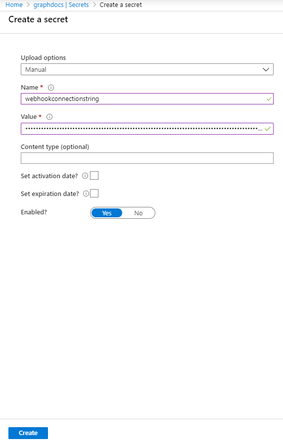
1. Click on "Access Policies" and "+ Add Access Policy".  
    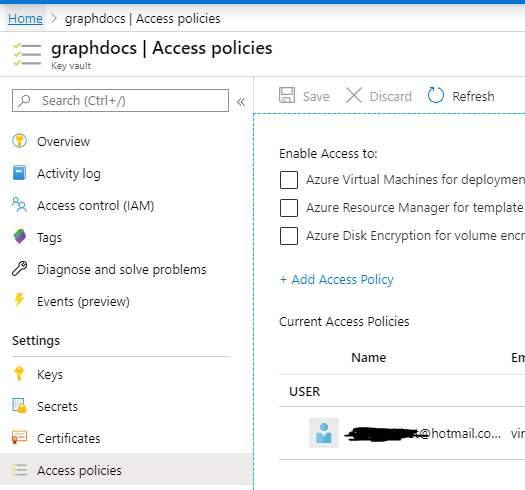
1. For "Secret permissions" select "Get" and for "Select Principal" select "Microsoft Graph Change Tracking". Click "Add".  
    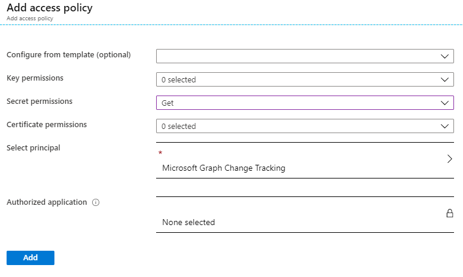

#### Creating the Subcription

Subscriptions to change notifications with Event Hubs are almost identical to change notifications with webhooks, the key difference being they rely on Event Hubs to deliver notifications. All other operations are similar, including [subscription creation](/graph/api/subscription-post-subscriptions?view=graph-rest-beta).  

The main difference during subscription creation will be the **notificationUrl**, you must set it to `EventHub:https://<azurekeyvaultname>.vault.azure.net/secrets/<secretname>?tenantId=<domainname>`:

- azure key vault name: the name you gave to the key vault when you created it. Can be found in the DNS name.
- secret name: the name you gave to the secret when you created it. Can be found on the Azure Key Vault "Secrets" page.
- domain name: name of your tenant e.g. consto.onmicrosoft.com or contoso.com.

#### Receiving notifications

Events will be now delivered to your application by Event Hubs, please refer to [receiving events](https://docs.microsoft.com/en-us/azure/event-hubs/get-started-dotnet-standard-send-v2#receive-events) from the Event Hubs documentation.
