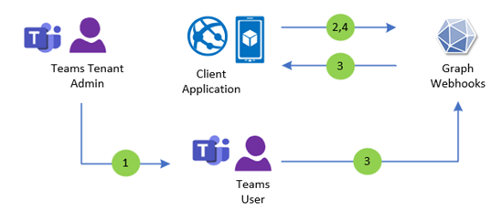

# Get change notifications for Microsoft Teams emergency call event updates

Microsoft Teams supports notifications for emergency calls. These notifications can be routed to inform specific security personnel within Teams. Microsoft Graph's emergency call events notification extends this capability to allow emergency call notifications to be received outside of Teams (for example, by custom client applications), as shown in the following diagram. 



1.	The Teams tenant admin configures [emergency calling](/microsoftteams/configure-dynamic-emergency-calling) for the tenant.
2.	The client application creates a Microsoft Graph emergency call event subscription. 
3.	The emergency call event notification is fired to the client application when a Teams user makes an emergency call (for example, 911) on Teams. 
4.	The client application either [renews](/graph/api/subscription-update) the existing subscription before it expires or [creates](/graph/api/subscription-post-subscriptions) a new one after it expires to continue to subscribe to emergency call event notifications.


## Permissions 

| Permission type                        | Permissions (from least to most privileged)              | Supported versions |
|:---------------------------------------|:---------------------------------------------------------|:-------------------|
| Delegated (work or school account)     | Not supported.                                           | Not supported.     |
| Delegated (personal Microsoft account) | Not supported.                                           | Not supported.     |
| Application                            | CallEvents-Emergency.Read.All                            | beta, v1.0        |

## Subscribe to emergency call started events

To subscribe to when an emergency call policy number is dialed, set the `resource` property in the subscription payload to `communications/calls/getEmergencyEventsByPolicy(policyName='{policyName}')`, replacing the `{policyName}` field with the policy name configured for your organization.

Subscriptions for emergency call events only support rich notifications. Set `includeResourceData` to `true` and provide base64 encoded certificate value for `encryptionCertificate` and a string identifier for `encryptionCertificateId`. For more information, see [Set up change notifications that include resource data](/graph/change-notifications-with-resource-data).

Subscriptions for emergency call events have a max subscription life time of one day. To keep subscriptions for longer, update the **expirationDateTime** property of the subscription. For more information, see [Update subscription API](/graph/api/subscription-update).

> [!NOTE]
> Subscriptions are limited to one subscription per application, tenant, and policy name combination. A second subscription that uses the same application, tenant, and emergency policy as another will fail with the HTTP status code 409, meaning that the subscription request was duplicated and cannot be created.

### Subscription payload example

```http
POST https://graph.microsoft.com/v1.0/subscriptions
Content-Type: application/json

{
  "changeType": "updated",
  "notificationUrl": "https://contoso.com/notificationUrl",
  "resource": "communications/calls/getEmergencyEventsByPolicy(policyName='EmergencyPolicy')",
  "includeResourceData": true,
  "encryptionCertificate": "{base64encodedCertificate}",
  "encryptionCertificateId": "{customId}",
  "expirationDateTime": "2021-02-01T11:00:00.0000000Z",
  "clientState": "{secretClientState}"
}
```

For the definition of properties on the subscription request, see [Subscription resource](/graph/api/resources/subscription).


## Emergency call event notifications

Notifications for emergency calls are triggered when a call with an applicable emergency call policy is initiated.

### Notification payload example

```http
POST https://contoso.com/notificationUrl
Content-Type: application/json

{
  "value": [{
    "subscriptionId": "{Subscription id}",
    "clientState": "{secret client state}",
    "changeType": "updated",
    "tenantId": "00000000-0000-0000-0000-000000000000",
    "resource": "communications/calls/getEmergencyEventsByPolicy(policyName='EmergencyPolicy')",
    "subscriptionExpirationDateTime": "2021-02-01T11:00:00.0000000Z",
    "resourceData": {
        "@odata.id": "communications/calls/getEmergencyEventsByPolicy(policyName='EmergencyPolicy')",
        "@odata.type": "#microsoft.graph.emergencyCallEvent",
        "id": "11111111-0000-0000-0000-000000000000",
    },
    "organizationId": "00000000-0000-0000-0000-000000000000",
    "encryptedContent": {
      "data": "{Encrypted content}",
      "dataSignature": "{Encrypted data signature}",
      "dataKey": "{Encrypted data key for encrypting content}",
      "encryptionCertificateId": "{User specified id of encryption certificate}",
      "encryptionCertificateThumbprint": "{Encrpytion certification thumbprint}"
    }
  }],
  "validationTokens": ["{Validation Tokens}"]
}
```

### Decrypted notification resource data example

```json
{
    "@odata.id": "communications/calls/getEmergencyEventsByPolicy(policyName='EmergencyPolicy')",
    "@odata.type": "#microsoft.graph.emergencyCallEvent",
    "id": "11111111-0000-0000-0000-000000000000",
    "emergencyCallEvent": { 
        "id": "11111111-0000-0000-0000-000000000000",  
        "callEventType": "callStarted",
        "policyName": "EmergencyPolicy",
        "eventDateTime": "2024-01-01T10:00:00.0000000+00:00",
        "emergencyNumberDialed": "{emergencyNumberDialed}",
        "callerInfo": {
            "displayName": "Emergency caller display name", 
            "upn": "emergencyCaller@contoso.com", 
            "phoneNumber": "00000000000",
            "tenantId": "00000000-0000-0000-0000-000000000000",
            "location": {
                "address": {
                    "street": "Microsoft Way",
                    "city": "Redmond",
                    "state": "WA",
                    "countryOrRegion": "United States",
                    "postalCode": "00000",
                    "additionalData": {
                    "companyName": "Company name",
                    "additionalInfo": "700",
                    "houseNumber": "725",
                    "county": "County",
                    "streetSuffix": "Street suffix"
                    }
                },
                "coordinates": {
                    "latitude": "00.0000",
                    "longitude": "00.0000"
                }
            }
        }
    }
}
```

## Related content
- [Change notifications through webhooks](change-notifications-delivery-webhooks.md)
- [Microsoft Graph API change notifications](/graph/api/resources/change-notifications-api-overview)
- [Manage emergency calling policies in Microsoft Teams](/microsoftteams/manage-emergency-calling-policies)