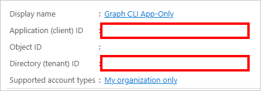

# Use app-only authentication with the Microsoft Graph CLI

The Microsoft Graph command-line interface (CLI) supports two types of authentication: [delegated access](../auth-v2-user.md), and [app-only access](../auth-v2-service.md). This topic describes the configuration needed to enable app-only access.

[!INCLUDE [cli-preview](../../includes/cli-preview.md)]

> [!NOTE]
> App-only access grants permissions directly to an application, and requires an administrator to consent to the required permission scopes. For more information, see [Microsoft identity platform and the OAuth 2.0 client credentials flow](/azure/active-directory/develop/v2-oauth2-client-creds-grant-flow).

In this topic, you'll configure app-only access for a simple script to list users and groups in your Microsoft 365 tenant.

## Configuration

Before you can use app-only access with the SDK, you need the following:

- A certificate to use as a credential for the application. This can be a self-signed certificate or a certificate from an authority. For details about how to create a self-signed certificate, see the [See also](#see-also) section.
- [Register an application](/azure/active-directory/develop/app-objects-and-service-principals) in Azure AD, configure it with the permission scopes your scenario requires, and share the public key for your certificate.

### Certificate

You'll need an X.509 certificate installed in your user's trusted store on the machine where you'll run the script. You'll also need the certificate's public key exported in .cer, .pem, or .crt format. You'll need the value of the certificate subject or its thumbprint.

### Register the application

You can register the application in the [Azure Active Directory portal](https://aad.portal.azure.com).

1. Open a browser, go to the [Azure Active Directory admin center](https://aad.portal.azure.com), and sign in using a Microsoft 365 tenant organization admin.

1. In the left pane, select **Azure Active Directory**, and under **Manage**, select **App registrations**.

    

1. Select **New registration**. On the **Register an application** page, set the values as follows.

    - Set **Name** to `Graph CLI App-Only`.
    - Set **Supported account types** to **Accounts in this organizational directory only**.
    - Leave **Redirect URI** blank.

1. Select **Register**. On the **Graph CLI App-Only** page, copy the values of the **Application (client) ID** and **Directory (tenant) ID** and save them.

    

1. Under **Manage**, select **API Permissions**. Choose **Add a permission**.

1. Select **Microsoft Graph**, then **Application Permissions**. Add **User.Read.All** and **Group.Read.All**, then select **Add permissions**.

1. In the **Configured permissions**, remove the delegated **User.Read** permission under **Microsoft Graph** by selecting the **...** to the right of the permission and selecting **Remove permission**. Select **Yes, remove** to confirm.

1. Select the **Grant admin consent for...** button, then select **Yes** to grant admin consent for the configured application permissions. The **Status** column in the **Configured permissions** table changes to **Granted for ...**.

    

1. Under **Manage**, select **Certificates & secrets**, then select the **Certificates** tab. Select the **Upload certificate** button. Browse to your certificate's public key file and select **Add**.

## Authenticate

You should have three pieces of information after completing the previous configuration steps:

- Certificate subject or thumbprint of the certificate uploaded to your Azure AD app registration.
- Application ID for your app registration.
- Your tenant ID.

You'll use this information to test authentication. Open PowerShell and run the following command, replacing the placeholders with your information.

```bash
mgc login --client-id YOUR_APP_ID --tenant-id YOUR_TENANT_ID --certificate-name "YOUR_CERT_SUBJECT" --strategy ClientCertificate
```

Alternatively, you can use the certificate thumbprint instead of the subject.

```bash
mgc login --client-id YOUR_APP_ID --tenant-id YOUR_TENANT_ID --certificate-thumb-print "YOUR_CERT_THUMBPRINT" --strategy ClientCertificate
```

## List users and groups

Run the following command to list the first 50 users in your tenant, formatted as a table.

```bash
mgc users list --select displayName,id --top 50 --output TABLE
```

The command returns users' display names and IDs in a table.

```bash
┌────────────────────────────────────┬──────────────────────────────────────────────────┐
│ displayName                        │ id                                               │
├────────────────────────────────────┼──────────────────────────────────────────────────┤
│ Conf Room Adams                    │ 70214bd8-c3eb-4ec4-8c3e-9027b2764c52             │
│ Adele Vance                        │ 05fb57bf-2653-4396-846d-2f210a91d9cf             │
│ MOD Administrator                  │ 965d30b5-f1ba-4f59-90f0-4d81dfb1aa42             │
│ Alex Wilber                        │ a36fe267-a437-4d24-b39e-7344774d606c             │
│ Allan Deyoung                      │ 54cebbaa-2c56-47ec-b878-c8ff309746b0             │
└────────────────────────────────────┴──────────────────────────────────────────────────┘
```

Run the following command to list the first 50 groups in your tenant, formatted as JSON.

```bash
mgc groups list --select displayName,id --top 50
```

The command returns groups' display names and IDs in JSON format.

```json
{
  "@odata.context": "https://graph.microsoft.com/v1.0/$metadata#groups(displayName,id)",
  "value": [
    {
      "displayName": "Parents of Contoso",
      "id": "1a0405b3-57d1-48fc-ad18-6cb63b350826"
    },
    {
      "displayName": "Digital Initiative Public Relations",
      "id": "22cf3814-dbef-4eb0-abe3-759b320b7d76"
    },
    {
      "displayName": "Communications",
      "id": "268360c5-ad3a-44c0-b35c-cef473609d9d"
    },
    {
      "displayName": "Paralegals",
      "id": "2fb31b50-4c46-4ae9-8177-19347e68ce8e"
    },
    {
      "displayName": "Leadership",
      "id": "364fad81-7c37-455d-94bb-7d5a209c42fe"
    },
  ]
}
```

## Sign out

Finally, sign out of the CLI.

```bash
mgc logout
```

## See also

- [How to: Create a self-signed public certificate to authenticate your application](/azure/active-directory/develop/howto-create-self-signed-certificate).
