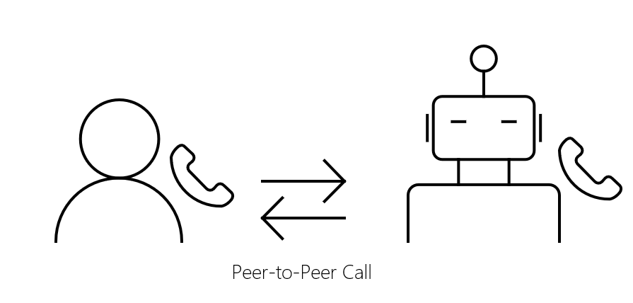
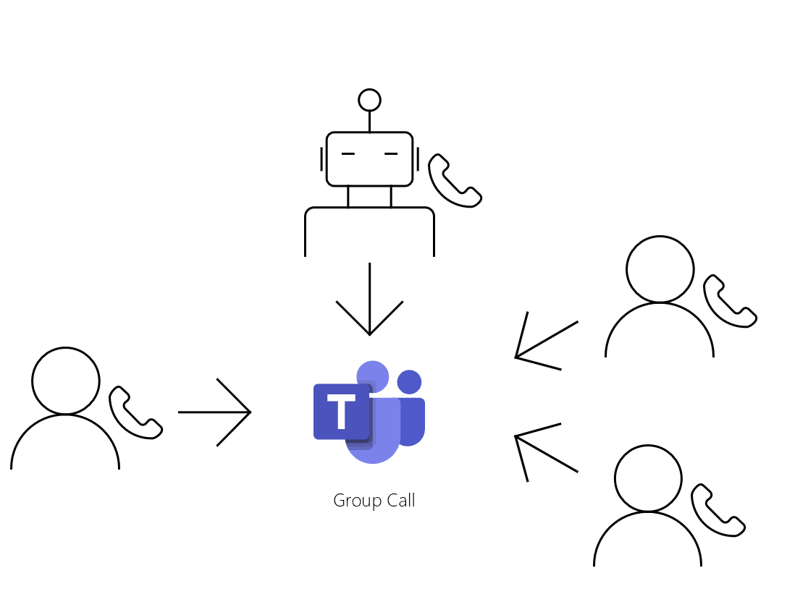

# Calls overview

The cloud communications APIs in Microsoft Graph add a new dimension to how your apps and services interact with users through various communications related features, such as calls and online meetings. This article describes the supported call types and how they're used for the signaling process.

## Peer-to-peer calls
A call is peer-to-peer (P2P) when one participant is directly calling another participant. If a bot calls a user, and the user is the only calling target specified, this is an example of a P2P call.

If a user wants to call a bot, the bot doesn't need any additional permissions in order to respond to the P2P call. In order for a bot to call a user, it must have the Calls.Initiate.All permission for a P2P call.

## Group calls

A group call occurs if there are either three or more participants in the call, or if [meeting coordinates](/graph/api/resources/onlinemeeting) were specified when the call was initially created. 

You can create a group call through Microsoft Teams, for example.

Currently, bots are able to:
- Create group calls
- Join exisiting group calls
- Invite other participants into an existing group call
- Be invited into existing group calls

## See also

- [Cloud communications API overview](cloud-communications-concept-overview.md)
- [Permissions for calls](./permissions-reference.md#calls-permissions)
