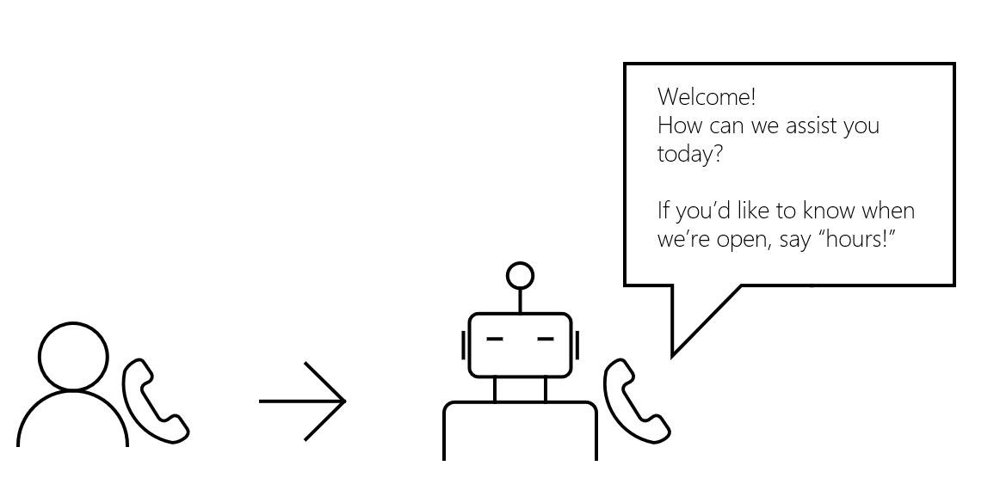

# Cloud communications API overview
The cloud communications APIs in Microsoft Graph add a new dimension to how your apps and services interact with users through various communications related features, such as calling and online meetings. Grow your business by expediting how you respond to your customers’ needs and how your employees collaborate with each other.

## Why integrate with the cloud communications APIs?

Discover the benefits of using cloud communications APIs to build service applications ([bots](https://microsoftgraph.github.io/microsoft-graph-comms-samples/docs/articles/calls/register-calling-bot.html?q=create%20bot)).

### Handle incoming calls

It can be overwhelming at times when workers receive a lot of business calls and it isn't possible, or productive, to answer all of them. A bot can serve as a front-desk assistant and handle these calls by rejecting what seem like spam calls, and redirecting (forwarding) specific calls to a different number.

You can use the cloud communications APIs to:

- Have a user [call a bot](/graph/api/application-post-calls?view=graph-rest-1.0) through VoIP.
- Have a bot [redirect the incoming call](/graph/api/call-redirect?view=graph-rest-1.0) to the appropriate agent if necessary.
- Have a bot [answer](/graph/api/call-answer?view=graph-rest-1.0) or [reject](/graph/api/call-reject?view=graph-rest-1.0) the call.

### Simplify the customer service experience
Whether you own a large helpdesk service or a small storefront, it can be difficult to handle multiple customer requests, especially if you don’t have any context of what problem they’re trying to solve beforehand. Handle incoming calls from customers through an **Interactive Voice Response** (IVR) system, where a bot will initially interact with them.

When a customer is prompted for a response from the bot, the customer can press a key on their keypad that corresponds to their selection. The bot can then gather the dial-tone multi-frequency (DTMF) from the customer.

You can use the cloud communications APIs to build a bot that:

- [Answers a call](/graph/api/call-answer?view=graph-rest-1.0) from a customer.
- [Plays a prompt](/graph/api/call-playprompt?view=graph-rest-1.0) to inform and prompt a customer for a selection.
- [Subscribes to a tone](/graph/api/call-subscribetotone?view=graph-rest-1.0) to gather the DTMF from a customer.
- [Transfers a customer](/graph/api/call-transfer?view=graph-rest-1.0) to an agent.
- [Ends a call](/graph/api/call-delete?view=graph-rest-1.0) with a customer.

To create a more intelligent interaction between your customers and your bot, when a customer is prompted for a response, they will be able to directly speak about what they need help with.

Integrating with a natural language processing service means that the customer's speech can be analyzed for its sentiment. The bot can then respond to the customer's need accordingly.

>**Note:** You may not record or otherwise persist media content from calls or meetings that your application accesses, or data derived from that media content. Make sure you are compliant with the laws and regulations of your area regarding data protection and confidentiality of communications. Please see the [Terms of Use](/legal/microsoft-apis/terms-of-use) and consult with your legal counsel for more information.

You can use the cloud communications APIs to build a bot that:

- [Answers a call](/graph/api/call-answer?view=graph-rest-1.0) from a customer.
- [Plays a prompt](/graph/api/call-playprompt?view=graph-rest-1.0) to inform and prompt the customer to speak.
- [Records a short audio clip](/graph/api/call-record?view=graph-rest-1.0) of a customer speaking.
- [Plays a prompt](/graph/api/call-playprompt?view=graph-rest-1.0) with the appropriate response to the customer, after their speech is analyzed.

### Collaborate through group calls
Enable users to engage with coworkers or customers by creating a group call so that everyone can contribute to the conversation.

You can use the cloud communications APIs to build a bot that:

- [Creates a group call](/graph/api/application-post-calls?view=graph-rest-1.0#example-3-create-a-group-call-with-service-hosted-media) with multiple participants.
- [Invites another bot or user](/graph/api/participant-invite?view=graph-rest-1.0) to an existing group call.
- [Joins an existing group call](/graph/api/application-post-calls?view=graph-rest-1.0#example-5-join-scheduled-meeting-with-service-hosted-media) as a bot.
- [Lists the participants](/graph/api/call-list-participants?view=graph-rest-1.0) in the group call.
- [Mutes another participant](/graph/api/participant-mute?view=graph-rest-1.0).

### Send reminders reliably
To enable users to send customers a reminder for an appointment or a reminder for a payment deadline that’s approaching, you can have a bot call the customer automatically. <!--If the customer misses the call, it will leave a voicemail with the automated message. (Add this back once bot to PSTN calling works)-->

You can use the cloud communications APIs to build a bot that:

- [Calls a customer](/graph/api/application-post-calls?view=graph-rest-1.0) on Teams.
- [Plays a recorded prompt](/graph/api/call-playprompt?view=graph-rest-1.0) to serve as a reminder.
- [Ends the call](/graph/api/call-delete?view=graph-rest-1.0).

### Set up online meetings
Whether scheduling a meeting between a doctor and a patient or between a user and their direct reports, you can build solutions that generate meetings that users can rely on. For added flexibility, users can call other users and invite them to the meeting while it's ongoing.

You can use the cloud communications APIs to:

- Have a user [create an online meeting](/graph/api/application-post-onlinemeetings?view=graph-rest-1.0).
- Have a user [retrieve the details](/graph/api/onlinemeeting-get?view=graph-rest-1.0) of an online meeting.
- Have a bot or a user [join an online meeting](/graph/api/application-post-calls?view=graph-rest-1.0#example-5-join-scheduled-meeting-with-service-hosted-media).

## API reference
Looking for the API reference for this service?

- [Cloud Communications APIs in Microsoft Graph (v1.0)](/graph/api/resources/communications-api-overview?view=graph-rest-1.0)
- [Cloud Communications APIs in Microsoft Graph (beta)](/graph/api/resources/communications-api-overview?view=graph-rest-beta)

## Next steps

- Use bots to [get started](cloud-communications-get-started.md).
- Learn more about [calls](cloud-communications-calls.md), [media](cloud-communications-media.md), and [online meetings](cloud-communications-online-meetings.md).
- View the API usage [limits](throttling.md#cloud-communication-service-limits).
- Learn how to [manage phone numbers](cloud-communications-phone-number.md) for your bots.

## See also

- [Delegated and application permissions](/azure/active-directory/develop/v1-permissions-and-consent)
- [Calls permissions](./permissions-reference.md#calls-permissions)
- [Online meeting permissions](./permissions-reference.md#online-meetings-permissions)
- [Cloud communications samples](https://github.com/microsoftgraph/microsoft-graph-comms-samples)
