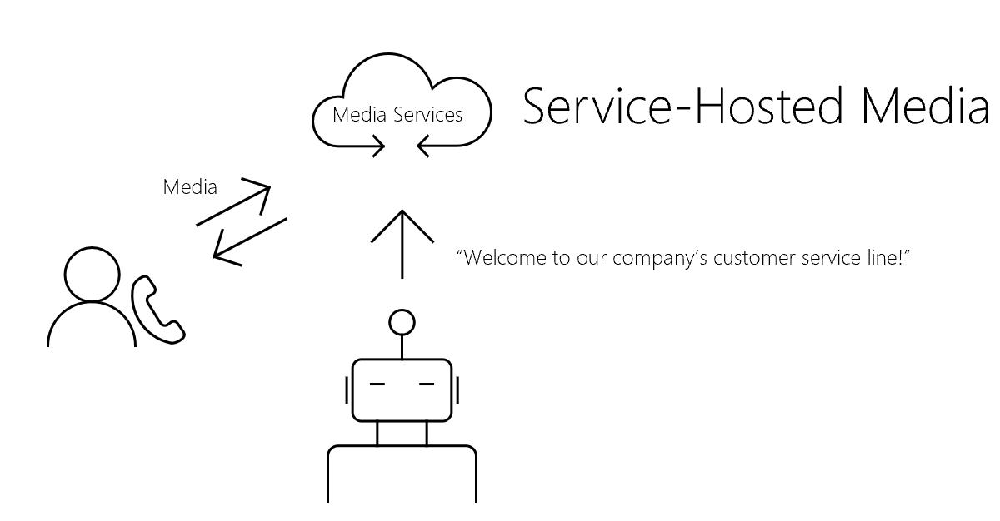
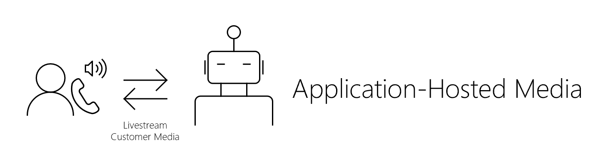

# Media overview

The cloud communications APIs in Microsoft Graph add a new dimension to how your apps and services interact with users through various communications related features, such as calling and online meetings. You can enable your bots to send and receive audio- and video-related content. By making use of media, you can create a more interactive experience between your bots and users.

This article will help you discover which media hosting option is right for you based on your needs.

## Service-hosted media (remote hosting)
If you want your bot to play a custom prompt when a customer dials your business's number, or to detect phone tones, record short voice clips, or perform any of the various Interactive Voice Response ([IVR](/graph/api/resources/calls-api-ivr-overview)) scenarios, consider using the [service-hosted media APIs](/graph/api/resources/communications-api-overview).

**If your media needs are simpler, explore this option first**. Because the heavy media processing is offloaded remotely, this is a lighter weight solution that allows you to build your bot in a more flexible way.

For an example that shows you how to create a bot that uses service-hosted media, see the [Remote media calling bot samples](https://github.com/microsoftgraph/microsoft-graph-comms-samples/tree/master/Samples/BetaSamples/RemoteMediaSamples).

## Application-hosted media (local hosting)
If you want your bot to access a live stream of your customers' audio and video to use for recording, transcribing, translating, or sentiment analysis through a natural language processing service, consider hosting your media locally.

>**Note:** You **cannot** use the Media Access API to record or otherwise persist media content from calls or meetings that your application accesses, or data derived from that media content ("record" or "recording"), without first calling the [updateRecordingStatus API](/graph/api/call-updaterecordingstatus) to indicate that recording has begun, and receiving a success reply from that API. If your application begins recording any meeting/call, it must end the recording prior to calling the updateRecordingStatus API to indicate that the recording has ended. Make sure you are compliant with the laws and regulations of your area regarding data protection and confidentiality of communications. Please see the [Terms of Use](/legal/microsoft-apis/terms-of-use) and consult with your legal counsel for more information.

**If you'd like more control over your media, choose this option**. You'll have direct access to media streams and will be able to make use of video-based screen sharing. You'll be able to build more sophisticated IVR scenarios that are speech enabled. This is a heavier weight solution that gives you the most flexibility in how you want to program your media.

See also the [requirements and considerations](/microsoftteams/platform/concepts/calls-and-meetings/requirements-considerations-application-hosted-media-bots) for application-hosted media bots.

For an example that shows you how to create a bot that uses application-hosted media, see the [local media samples](https://github.com/microsoftgraph/microsoft-graph-comms-samples/tree/master/Samples/V1.0Samples/LocalMediaSamples).

## See also

- [Calls permissions](./permissions-reference.md#calls-permissions)
