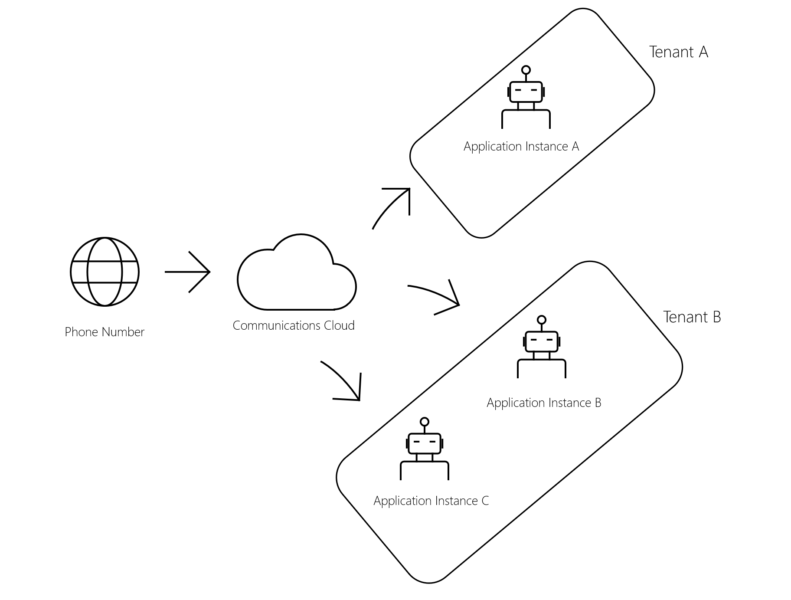

# Manage phone numbers for bots 

This article describes how to create a bot that is reachable through a phone number. As you create your bot, it will be helpful to be familiar with the following terms:

- **Application** – An application that is hosted on Azure, also referred to as a **bot**.

- **Application instance** – A disabled-user object that can be assigned to a phone number that can be used by a bot. This is also known as a [resource account](/microsoftteams/manage-resource-accounts). This is the only way a phone number can be assigned to a bot.

One application can have multiple application instances, and each tenant can have multiple application instances, as shown in the following image.

## Prerequisite - Register a bot
To get started, follow the instructions to [register a calling bot](https://microsoftgraph.github.io/microsoft-graph-comms-samples/docs/articles/calls/register-calling-bot.html). You’ll need config values such as bot ID, Microsoft app ID, and Microsoft app password to use in your code.

Add the following permissions to your bot. A tenant admin needs to consent to these permissions as well:

- Calls.AccessMedia.All
- Calls.Initiate.All
- Calls.JoinGroupCall.All
- Calls.JoinGroupCallAsGuest.All

For more information about call-related permissions, see the [Permissions reference](permissions-reference.md#calls-permissions).

## Assign a phone number to your bot

Assigning a phone number to your bot involves three steps:

1.	Create an application instance.
2.	Assign Microsoft 365 licenses to your application instance.
3.	Assign a phone number to the application instance (only tenant admin).

### Create an application instance

If it hasn't been installed already, a tenant admin needs to install the [Skype for Business Online Module](https://www.microsoft.com/download/details.aspx?id=39366) for PowerShell. The tenant admin must sign in using their credentials before running the cmdlet.

To create a new application instance, the tenant admin runs the following cmdlet.

`PS C:\> New-CsOnlineApplicationInstance -UserPrincipalName <user@contoso.com> -ApplicationId <app_id> -DisplayName <bot_display_name>`

When the application instance is created, use the sync cmdlet.

`PS C:\> Sync-CsOnlineApplicationInstance -ObjectId <application_instance_id>`

For more information, see [New-CsOnlineApplicationInstance](/powershell/module/skype/new-csonlineapplicationinstance?view=skype-ps&preserve-view=true) and [Sync-CsOnlineApplicationInstance](/powershell/module/skype/sync-csonlineapplicationinstance?view=skype-ps&preserve-view=true).

### Assign Microsoft 365 licenses to your application instance

Assign a virtual user license to your application instance. For details, see [Phone system virtual user license](/microsoftteams/teams-add-on-licensing/virtual-user).

Assign a calling plan to your application instance. For details, see [Calling plans for Microsoft 365](/microsoftteams/calling-plans-for-office-365).

### Assign a phone number to the application instance (only tenant admin)

Before you can set up users in your organization to make and receive phone calls, you must get phone numbers for them. For details, see [Getting phone numbers for your users](/microsoftteams/getting-phone-numbers-for-your-users#get-new-phone-numbers-for-your-users).

To assign the phone number to the application instance, the tenant admin:

1. Signs in to the Teams admin center as a tenant admin.
2. Goes to **Teams Admin center** > **Voice** > **Phone Numbers**.
3. Assigns a service phone number (+11D format) using the following cmdlet.

  `PS C:\> Set-CsOnlineVoiceApplicationInstance -Identity <user@contoso.com> -TelephoneNumber <phone_number>`
  
When the service phone number is assigned, use the sync cmdlet.

`PS C:\> Sync-CsOnlineApplicationInstance -ObjectId <application_instance_id>`

For more information, see [Set-CsOnlineVoiceApplicationInstance](/powershell/module/skype/set-csonlinevoiceapplicationinstance?view=skype-ps&preserve-view=true) and [Sync-CsOnlineApplicationInstance](/powershell/module/skype/sync-csonlineapplicationinstance?view=skype-ps&preserve-view=true).

## Unassign a bot phone number

Use the following cmdlet to unassign a phone number.

`PS C:\> Set-CsOnlineVoiceApplicationInstance -Identity <user@contoso.com> -TelephoneNumber $null`

>**Note:** Currently this only works with online numbers and not direct routing (DR) numbers. This is a known issue.

## Update a bot phone number

After unassigning the number, you can assign a different number to the bot by using the following cmdlet.

`PS C:\> Set-CsOnlineVoiceApplicationInstance -Identity <user@contoso.com> -TelephoneNumber <new phone_number>`

## See also

- [Incident bot sample](https://github.com/microsoftgraph/microsoft-graph-comms-samples/tree/master/Samples/BetaSamples/RemoteMediaSamples/IncidentBot). 
 - For details about how to deploy, see [Deploying the sample](https://github.com/microsoftgraph/microsoft-graph-comms-samples/blob/master/Samples/BetaSamples/RemoteMediaSamples/README.md#deploying-the-sample).
