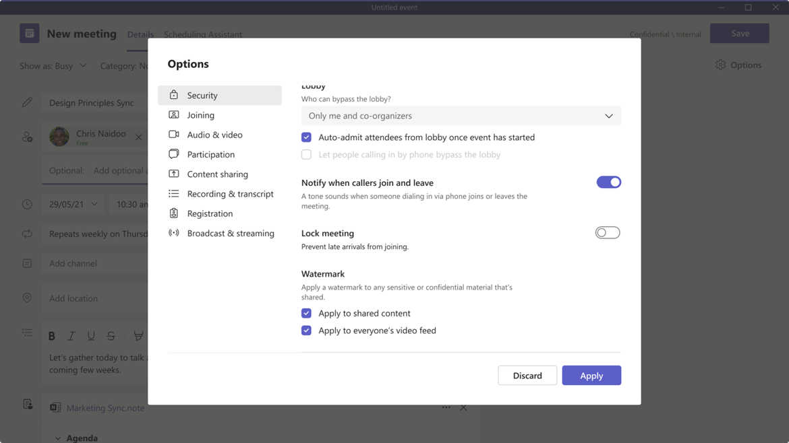
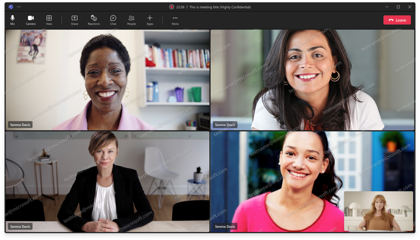

# Watermark meeting

Organizer can set the option for enabling watermark on different contents during scheduling. Based on the setting, the participant will see watermark on shared content or/and video feeds when meeting is in progress.

Organizer experience in meeting option:


In-meeting attendee experience:


### Code or REST operation examples

#### Create an online meeting with new meeting options.

Use Case 1: The organizer has Teams Enterprise license

```json
POST /me/onlineMeetings
{
  "subject": "meeting",
  "startDateTime": "2022-07-01T22:57:47.6388574Z",
  "endDateTime": "2022-07-01T23:57:47.6388574Z",
  "watermarkProtection": {
    "isEnabledForContentSharing": true,
    "isEnabledForVideo": false,
  }
}

HTTP/1.1 200 OK
```

Use Case 2: The organizer doesn't have TE license

```json
POST /me/onlineMeetings
{
  "subject": "meeting",
  "startDateTime": "2022-07-01T22:57:47.6388574Z",
  "endDateTime": "2022-07-01T23:57:47.6388574Z",
  "watermarkProtection": {
    "isEnabledForContentSharing": true,
    "isEnabledForVideo": false,
  }
}

```
Api returns an error

```json
{
"error": {
    "code": "Forbidden",
    "message": "You don't have Teams Enterprise license to update watermarkProtection."
    }
}
```


#### Update meeting options

Use Case 1: The organizer has TE license

```json
PATCH /me/onlineMeetings/{meetingId}
{
"watermarkProtection": {
    "isEnabledForContentSharing" : true,
    "isEnabledForVideo" : false,
  },
}

HTTP/1.1 200 OK
```

Use Case 2: The organizer doesn't have TE license

```json
PATCH /me/onlineMeetings/{meetingId}
{
"watermarkProtection": {
    "isEnabledForContentSharing" : true,
    "isEnabledForVideo" : false,
  },
}

```
Api returns an error

```json
{
"error": {
    "code": "Forbidden",
    "message": "You don't have Teams Enterprise license to update watermarkProtection."
    }
}
```

#### Get list of participants in a call

Gets list of all participants in a call. If the meeting has watermark applied to any of the contents, then all the participants who have joined the meeting from an unsupported client will have the field isAudioOnlyExperience true and will not be able to see the watermarked content.


````JSON
GET https://graph.microsoft.com/beta/communications/calls/d6a1a5a9-e1a5-456f-afd6-83f6ef949e51/participants

HTTP/1.1 200 OK
Content-Type: application/json
{
   "value":[
     {
         "@odata.type":"#microsoft.graph.participant",
         "info":{
            "@odata.type":"#microsoft.graph.participantInfo",
            "identity":{
               "@odata.type":"#microsoft.graph.identitySet",
               "user":{
                  "@odata.type":"#microsoft.graph.identity",
                  "id":"f2fa86af-3c51-4bc2-8fc0-475452d9764f",
                  "displayName":"Organizer"
               }
            },
         },
         "id":"14319a53-bae8-4129-9cf1-9619ab278b28",
         "metadata":null,
         "restrictedExperience": {
          "videoDisabled": "watermarkProtection"
         }
      },
      {
         "@odata.type":"#microsoft.graph.participant",
         "info":{
            "@odata.type":"#microsoft.graph.participantInfo",
            "identity":{
               "@odata.type":"#microsoft.graph.identitySet",
               "guest":{
                  "@odata.type":"#microsoft.graph.identity",
                  "id":"f2fa86af-3c51-4bc2-8fc0-475452d9764f",
                  "displayName":"AnonymousUser1"
               }
            },
         },
         "id":"a7ebfb2d-871e-419c-87af-27290b22e8db",
         "metadata":null,
          "restrictedExperience": {
          "videoDisabled": "watermarkProtection"
         }
      },
      {
         "@odata.type":"#microsoft.graph.participant",
         "info":{
            "@odata.type":"#microsoft.graph.participantInfo",
            "identity":{
               "@odata.type":"#microsoft.graph.identitySet",
               "guest":{
                  "@odata.type":"#microsoft.graph.identity",
                  "id":"38ef1c9d-6a01-4bc2-b5aa-5535952298f7",
                  "displayName":"AnonymousUser1"
               }
            },
         },
         "id":"b35e843e-7771-478a-9dde-2dfed177bfe0",
         "metadata":null,
          "restrictedExperience": {
            "videoDisabled": "watermarkProtection"
         }
      }
   ],
   "@odata.context":"https://graph.microsoft.com/beta/$metadata#communications/calls('d6a1a5a9-e1a5-456f-afd6-83f6ef949e51')/participants"
}
````
## Details and schema changes

### New or updated properties

#### Entity: graph.onlineMeeting

##### New/updated properties

New meeting options wil be added to `graph.onlineMeeting`.

| Property                   | Type                                      | Description                                                                  |
| ---------------------------| ----------------------------------------- | ---------------------------------------------------------------------------- |
| `watermarkProtection`   | `graph.watermarkProtectionValues` | Specifies if watermark is to be applied for different entities              |


##### ComplexType: graph.watermarkProtectionValues
###### New/updated properties
Specifies the entities for which the watermark is to be applied: contentSharing, videoFeed.

| Property               | Type                 | Description                              | Key | Required | ReadOnly |
|------------------------|----------------------|------------------------------------------|-----|----------|----------|
| `isEnabledForContentSharing`   | `Edm.Boolean` |  Specify the value to apply watermark to any shared content.  | No  | No       | No      |
| `isEnabledForVideo`  | `Edm.Boolean` |  Specify the value to apply watermark to everyone's video feed.  | No  | No       | No      |


#### Entity: graph.participant

##### New/updated properties

New meeting options wil be added to `graph.participant`.

| Property                   | Type                                      | Description                                                                  | Key | Required | ReadOnly  |
| ---------------------------| ----------------------------------------- | ---------------------------------------------------------------------------- | --- | -------- | --------- |
| `restrictedExperience`   | `graph.onlineMeetingRestricted` | Specifies the reasons if the participant is having a restricted experience.              | No  | No       | No        |


#### ComplexType: graph.onlineMeetingRestricted

##### New/updated properties

Specifies the reasons if the user is going to receive a restricted experience.

| Property              | Type              | Description                                             |
| ----------------------| ------------------| ------------------------------------------------------- |
| `videoDisabled`   | `graph.onlineMeetingVideoDisabledReason` | Specifies the reason if participant's video is disabled.  |
| `contentSharingDisabled`   | `graph.onlineMeetingContentSharingDisabledReason` | Specifies the reason if shared content from the participant is disabled.  |


##### New enums

###### onlineMeetingContentSharingDisabledReason values

Specifies the reasons due to which a user is going to receive an experience without shared content.

| Value                 | Description                              |
| ----------------------| -----------------------------------------|
| `watermarkProtection`  | The meeting content is marked watermarked but the user joined from an unsupported client.

###### onlineMeetingVideoDisabledReason values
Specifies the reasons due to which a user is going to receive an audio only experience.

| Value                 | Description                              |
| ----------------------| -----------------------------------------|
| `watermarkProtection`  | The meeting content is marked watermarked but the user joined from an unsupported client.  |
