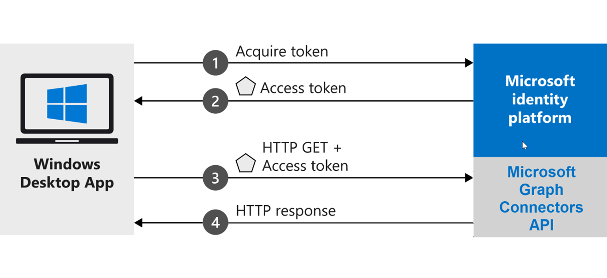

<!-- markdownlint-disable MD002 MD025 MD041 -->
<!--- # Introduction --->

Microsoft Graph connectors allow you to add your own data into Microsoft Graph and have it power various Microsoft 365 experiences.

This .NET Core application shows you how to use the Microsoft Graph connectors API to create a customer connector and use it to power Microsoft Search. This tutorial uses a sample data appliance parts inventory for the Contoso Appliance Repair organization.

## How does the sample work?

The sample creates a Windows desktop app that acquires a token from the Microsoft identity platform, and uses it to send requests to the Microsoft Graph connectors API. The connectors API will send its response after the access is validated.



## Prerequisites

* Install [Visual Studio 2019](https://visualstudio.microsoft.com/) with [.NET Core 3.1 SDK](https://www.microsoft.com/net/download/core) on your development computer.
* Make sure that you have a [personal Microsoft account](https://signup.live.com/), or a work or school account.
* Install the [Entity Framework Core Tools](/ef/core/miscellaneous/cli/dotnet) as a global tool using the following command:

    ```dotnetcli
    dotnet tool install --global dotnet-ef
    ```

* Install a tool to update a SQLite database. For example, the [DB Browser for SQLite](https://sqlitebrowser.org/).
* Download the **ApplianceParts.csv** file from the [Search connector sample repo](https://github.com/microsoftgraph/msgraph-search-connector-sample/blob/master/PartsInventoryConnector/ApplianceParts.csv).

> [!TIP]
> The best way to download files from GitHub is to go to the top level of the project. From the green **Code** download button on the right, choose **Download ZIP**. The ZIP file will contain the contents of the repository.
