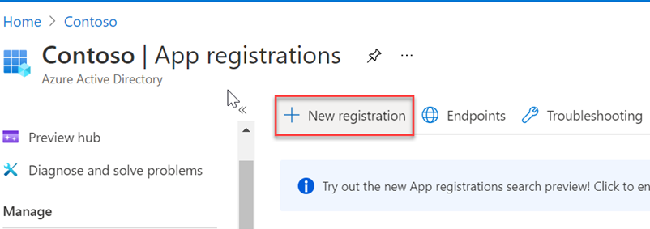
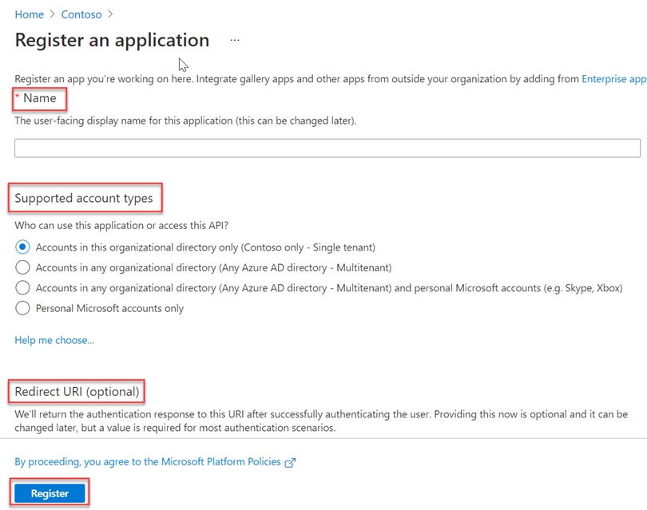
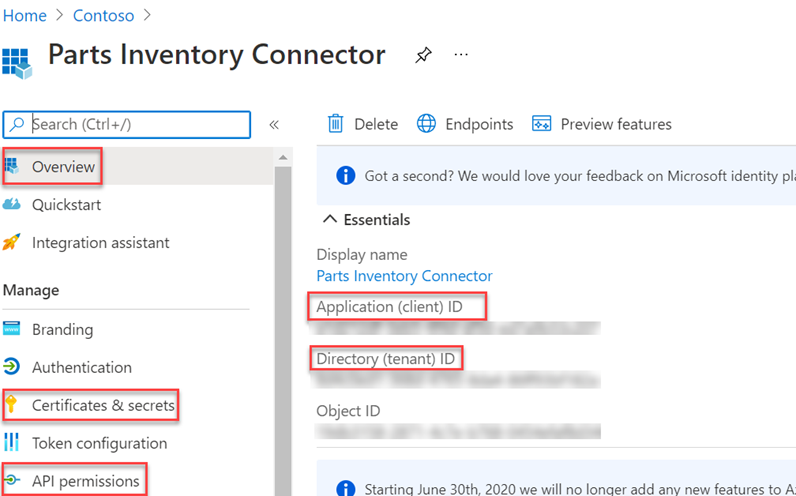
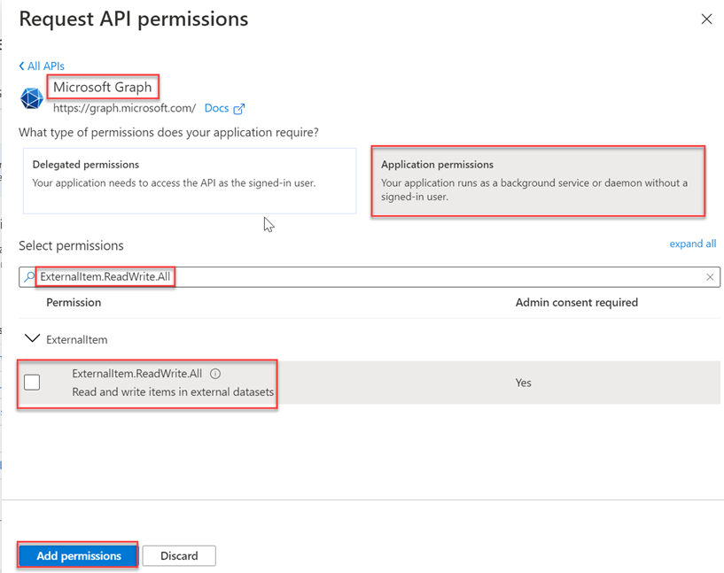
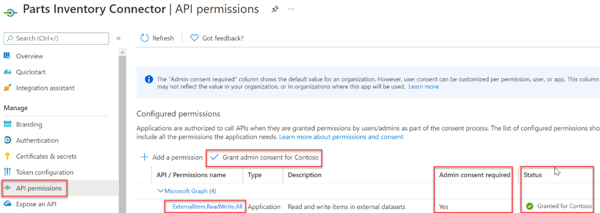
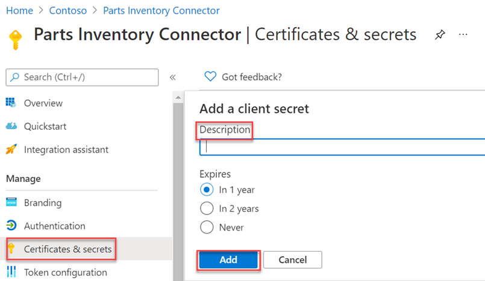

<!-- markdownlint-disable MD002 MD041 -->

After all the prerequisites are in place, you will be able to register an application in the Azure AD admin center. The registration is necessary in order to authenticate the application and use it to make calls to the Microsoft Graph connectors API.

1. Go to the [Azure Active Directory admin center](https://aad.portal.azure.com/) and sign in with an administrator account.
2. On the left pane, select **Azure Active Directory**, and under **Manage**, select **App registrations**.
3. Select **New registration**.

    

4. Complete the **Register an application** form with the following values, then select **Register**.

    a. **Name**: Parts Inventory Connector

    b. **Supported account types**: Accounts in this organizational directory only (Microsoft only - Single tenant)

    c. **Redirect URI**: Leave blank

    

5. On the Parts Inventory Connector overview page, copy the values of **Application (client) ID and Directory (tenant) ID**. You will need both in the following section.

    

6. Select **API Permissions** under **Manage**.
7. Select **Add a permission**, then select **Microsoft Graph**.
8. Select **Application permissions**, then select the **ExternalItem.ReadWrite.All** permission. Select **Add permissions**.

    

9. Select **Grant admin consent for {TENANT},** then select **Yes** when prompted.

    

10. Select **Certificates &amp; secrets** under **Manage** , then select **New client secret**.
11. Enter a description and choose an expiration time for the secret, then select **Add**.

    

12. Copy and save the new secret, you will need it in the following section.
