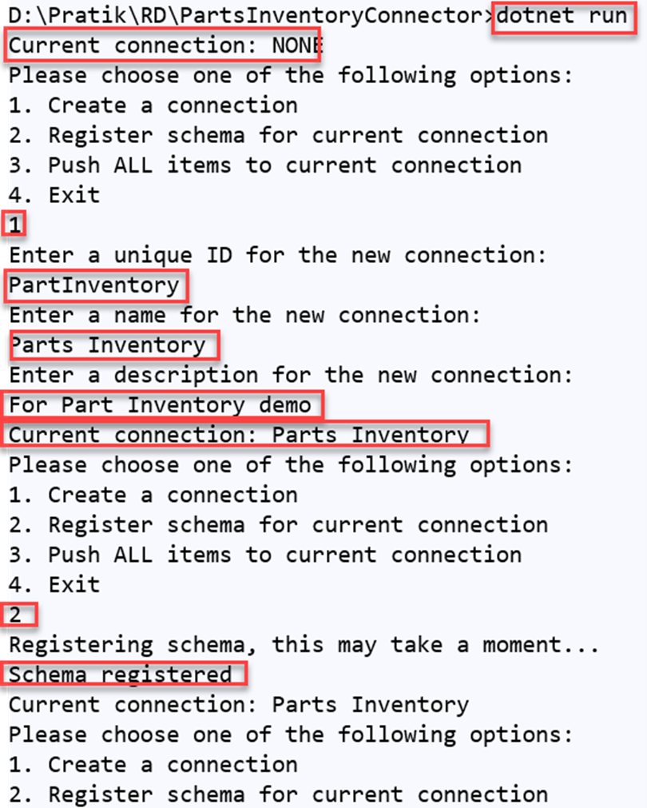
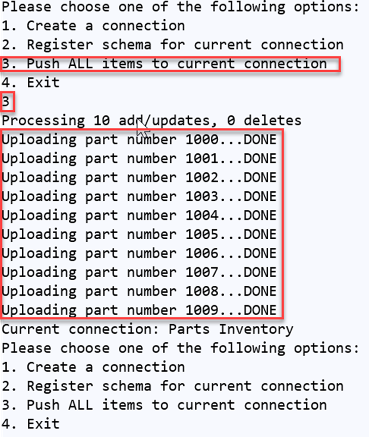

# Run the application

<!-- markdownlint-disable MD002 MD025 MD041 -->

In this step, you will build and run the sample. This code sample will create a new connection, register the schema, then push items from the [ApplianceParts.csv](https://github.com/microsoftgraph/msgraph-search-connector-sample/blob/master/ApplianceParts.csv) file into that connection.

1. Open your command-line interface (CLI) in the PartsInventoryConnector directory.
2. Use the dotnet **build** command to build the sample.
3. Use the dotnet **run** command to run the sample.
4. Select "**1. Create a connection**". Enter a unique identifier, name, and description for that connection.

The following screenshot shows the option to create a connection.

<!---Using html to adjust the size of the image --->
 

5. Select "**2. Register schema for the current connection option**" Then, wait for the operation to complete.

> [!NOTE]
> If this step results in an error, wait a few minutes and then, select "**3. Push all items to current connection**".

The following screenshot shows the option to push all items.

<!---Using html to adjust the size of the image --->
 
