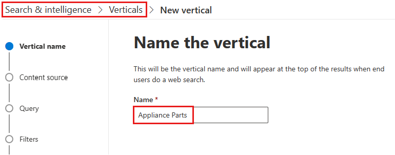
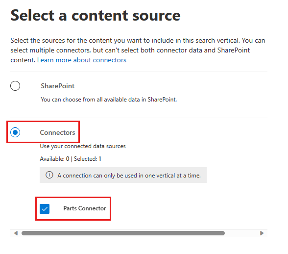
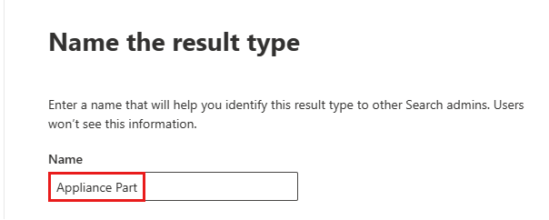
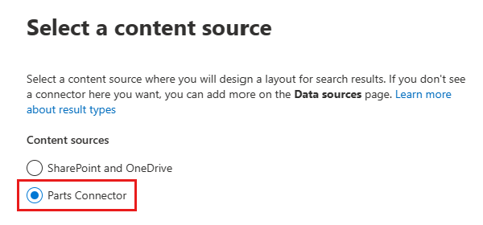

<!-- markdownlint-disable MD002 MD025 MD041 -->

Create search verticals and result types to customize the search results in Microsoft SharePoint, Microsoft Office, and Microsoft Search in Bing, to make it easier for users to find the information that they have permission to see.

## Create a vertical

To create and enable a search vertical at the organization level, sign in to the [Microsoft 365 Admin center](https://admin.microsoft.com/) using the global administrator role, and do the following:

1. Go to **Settings** > **Search & intelligence** > **Customizations**.
2. Go to **Vertical** and click the **Add** button.
3. Provide the following details:
  * **Name the vertical:** Appliance Parts.

   

  * **Content source**: The connector created with the app. (Parts Inventory)

   

  * **Add a query**: Leave blank.

   

  * **Filters**: Leave blank.

   

## Create a result type

To create a result type:

1. Go to **Settings** > **Search & intelligence** > **Customizations**.
2. Go to the **result type** tab and click the **Add** button.
3. Provide the following details:

  * **Name**: Appliance Part

   

  * **Content source**: The connector created in the app.

   

  * **Rules**: None

   

  * Paste contents of [result-type.json](https://github.com/microsoftgraph/msgraph-search-connector-sample/blob/master/result-type.json) into the layout designer textbox.

   
