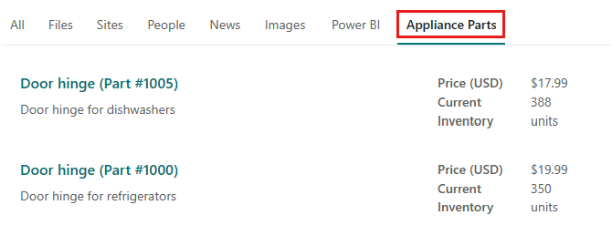

<!-- markdownlint-disable MD002 MD025 MD041 -->

In this step, you will search for parts in SharePoint.

1. Go to the root SharePoint site for your tenant.
2. Using the search box at the top of the page, search for **hinge**.

  

3. When the search completes with 0 results, select the **Appliance Parts** tab.
4. Results from the connector will be displayed.

  
