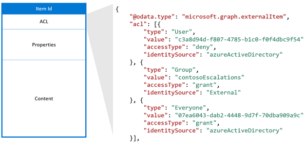
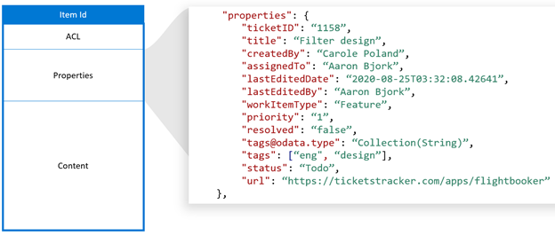
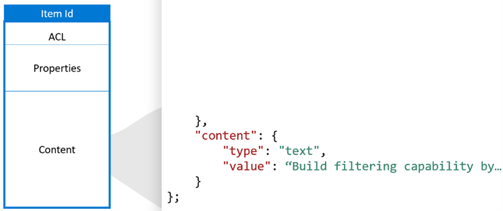

# Microsoft Graph connectors API overview

Microsoft Graph connectors offer a simple way to bring external data into the Microsoft Graph and enhance Microsoft 365 intelligent experiences. You may want to build a custom connector to integrate with services that aren't available as connectors built by Microsoft. To build custom connectors, you use the Microsoft Graph Connector REST APIs.


Graph Connector APIs help:

1. Create and manage external data connections.
2. Define and register the schema of the external data type(s).
3. Ingest external data items into Microsoft Graph.
4. Sync external groups.

In this topic, let's look at these APIs in detail.

## Connections API

Connections from external services are represented by the [externalConnection](https://docs.microsoft.com/graph/api/resources/externalconnection?view=graph-rest-beta&amp;preserve-view=true) resource in Microsoft Graph. A connection is a logical container for your external data that you can manage as a single unit.

Once you create a connection to an external data source such as an on-premises content source or an external SaaS service, you must register the schema and ingest the external content into Microsoft Graph. You can only view and manage connections you have created or are explicitly [authorized](https://docs.microsoft.com/graph/api/external-post-connections?view=graph-rest-beta&amp;preserve-view=true) to manage. Note that a search admin can view and manage all the connections in the tenant from the Microsoft 365 admin center.

You can model a connection anyway you want. For example, you can [set up multiple connections using the Microsoft Windows file share connector](https://docs.microsoft.com/microsoftsearch/configure-connector) to connect to different file shares. You can also create a single connection to add all items from your data source. For example, you can create a single connection to add all the tickets and incidents across multiple teams from your helpdesk system.

[Creating a connection](./connecting-external-content-manage-connections.md#create-a-connection) is the first step for an application to add items to Microsoft Graph. A connection allows your registered application to [define a schema](https://docs.microsoft.com/graph/api/externalconnection-post-schema?view=graph-rest-beta&amp;preserve-view=true) for items that will be ingested, and allows your service to add, update, or delete items from the external data source.

### Create a connection

You must create and configure a connection before an application can ingest external items into Microsoft Graph, using the following steps:

- [Create a connection](https://docs.microsoft.com/graph/api/external-post-connections?view=graph-rest-beta&amp;preserve-view=true) with a unique ID, display name, and description.
- [Register a schema](https://docs.microsoft.com/graph/api/externalconnection-post-schema?view=graph-rest-beta&amp;preserve-view=true) to define the fields that will be included in the index.

  **Important**

After a schema has been registered, it cannot be changed for an existing connection.

### Update a connection

You can change the display name or description of an existing connection by [updating the connection](https://docs.microsoft.com/graph/api/externalconnection-update?view=graph-rest-beta&amp;preserve-view=true).

### Delete a connection

You can [delete a connection](https://docs.microsoft.com/graph/api/externalconnection-delete?view=graph-rest-beta&amp;preserve-view=true). Deleting a connection removes all items that were indexed via that connection.<!--check this wording --->

### States and operations

Your connection can exist in one of the following states.

| **State**    | **Description**    |
|----------------------------------------------------------------|-----------------------------------------------------------------------------| 
| **Draft**           | An empty connection is provisioned. The data source, schema, or any settings have not been configured yet. |
| **Ready**           | The connection is provisioned with registered schema and is ready for ingestion. |
| **Obsolete**        | This occurs when a dependent feature, such as an API, has been deprecated. Deleting the connection is the only valid operation. |
| **LimitExceeded** | If you hit the maximum limit of a single connection or the tenant level quota across all connections, you cannot add more items until you exit the state. |
| | |

The following table specifies which operations are available in each state.


| **Operation** | **Draft** | **Ready** | **Obsolete** | **LimitExceeded** |
|---------------|-----------|-----------|--------------|-------------------|
| Create connection | ❌ | ✔️ | ❌ | ✔️ |
| Read connection | ✔️ | ✔️ | ✔️ | ✔️ |
| Update connection | ✔️ | ✔️ | ❌ | ✔️ |
| Delete connection | ✔️ | ✔️ | ✔️ | ✔️ |
| Create schema | ✔️ | ❌ | ❌ | ❌ |
| Read schema | ❌ | ✔️ | ✔️ | ✔️ |
| Update schema | ❌ | ❌ | ❌ | ❌ |
| Delete schema | ❌ | ❌ | ❌ | ❌ |
| Create item | ❌ | ✔️ | ❌ | ❌ |
| Read item | ❌ | ✔️ | ✔️ | ✔️ |
| Update item | ❌ | ✔️ | ❌ | ✔️ |
| Delete item | ❌ | ✔️ | ❌ | ✔️ |
| | | | | |

## Schema API

The connection [schema](https://docs.microsoft.com/graph/api/resources/schema?view=graph-rest-beta&amp;preserve-view=true) determines how your content will be used in various Microsoft 365 experiences. Schema is a flat list of all the properties you plan to add to the connection along with their attributes, labels, and aliases. You must register the schema before ingesting items into Microsoft Graph.

### Example schema

The following table represents an example of a possible schema for a work ticket system connector.

| **Property** | **Type** | **Searchable** | **Queryable** | **Retrievable** | **Refinable** | **Labels** |**Aliases** |
| --- | --- | --- | --- | --- | --- | --- | --- |
| ticketId | String | | | | | | ID |
| title | String | ✔️ | ✔️ | ✔️ | | title | |
| createdBy | String | ✔️ | ✔️ | | | createdBy | creator |
| assignedTo | String | ✔️ | ✔️ | | | | |
| lastEditedDate | DateTime | | ✔️ | ✔️ | ✔️ | lastModifiedDateTime | editedDate |
| lastEditedBy | String | ✔️ | ✔️ | ✔️ | | lastModifiedBy | edited |
| workItemType | String | | ✔️ | ✔️ | | | ticketType |
| priority | Int64 | ✔️ | | | | | |
| tags | StringCollection | | ✔️ | ✔️ | ✔️ | | |
| status | String | | ✔️ | ✔️ | | | |
| url | String | | | | | url | |
| resolved | Boolean | | ✔️ | ✔️ | | | |
| | | | | | | | |

### Property attributes

#### Searchable

If a property is searchable, its value is added to the full text index. When a user performs a search, we return results if there is a search hit in one of the searchable fields or its [content](https://docs.microsoft.com/graph/search-index-manage-items#content).

\<Diagram\>

_A search for &quot;design&quot; displaying results for hits against properties ( __title__ ,  __tags__ ) and content_

#### Queryable

If a property is queryable, you can query against it using knowledge query language (KQL). KQL consists of 1 or more free text keywords (words or phrases) or property restrictions. The property name must be included in the query, either specified in the query itself or included in the query programmatically. You can use prefix matching with the wildcard operator(\*).

>[!NOTE]
>Suffix matching is not supported.

\<Diagram\>

_A search for &quot;search ba_&quot; displaying results that match this prefix\*

\<Diagram\>

_A search for &quot;tags:design&quot; scoping down results to items with &quot;design&quot; in the tags property_

#### Retrievable

If a property is retrievable, its value can be returned in search results. Any property that you want to be returned from the query and be relevant in search results must be retrievable. Marking large properties, such as editHistory, or too many properties as retrievable will increase search latency. Be selective and choose relevant properties.

_A set of retrievable properties ( __title__ ,  __lastEditedBy__  etc.) rendered as a result_

#### Refinable

If a property is refinable, an admin can configure it as a custom filter in the Microsoft Search results page.

\<Diagram\>

_Refine results by  __tags__ , a refinable property_

### Labels

A label is a well-known tag published by Microsoft that you can add against a property in your schema. Adding a label helps various Microsoft products understand the property and provides a better experience.

| **Label** | **Description** |
| --- | --- |
| title | The title of the item that you want shown in search &amp; other experiences |
| url | The target URL of the item in the data source |
| createdBy | Name of the person who created the item in the data source |
| lastModifiedBy | Name of the person who most recently edited the item in the data source |
| authors | Name of all the people who participated/collaborated on the item in the data source |
| createdDateTime | Date &amp; time that the item was created in the data source |
| lastModifiedDateTime | Date &amp; time the item was last modified in the data source |
| fileName | In case of a file, the name of the file in the data source |
| fileExtension | In case of a file, the extension of the file in the data source |
| | |

For example, the connection property _lastEditedBy_ has the same meaning as the Microsoft label _lastModifiedBy_.

Add as many labels as you can, but ensure that they are accurately mapped to properties. Do not add a label to a property if it doesn't make sense. Incorrect mappings will deteriorate the experience.

  **Important**

All properties that you map to labels must be retrievable.

#### Relevance

By applying as many accurately mapped labels as possible, you can also improve the discovery of your content through search. We highly recommend defining as many of the below labels as possible, listed by potential impact on discovery in descending order:

- title
- lastModifiedDateTime
- lastModifiedBy
- url
- filename
- fileExtension

For discovery, i.e. search scenarios, please note:

- Ensure that your mappings are accurate.
- When you use a property as label that contains large content, you might increase search latency and have to wait longer for search to return results.
- Especially in the scenario where you configure a custom vertical that allows search over more than one connection, the search outcomes greatly benefit from appointing as many labels as possible.

#### Default result types

Labels also affect how default result types are generated. Adding the title and content labels at a minimum will ensure that a result type is created for your connection.

\<Diagram\>

_A default result type with  __title__  and a result snippet_

Your default result type will provide a better experience when you define these labels, when applicable, listed by ascending order:

- title
- url
- lastModifiedBy
- lastModifiedDateTime
- fileName
- fileExtension

Finally, when assigning labels, ensure the following:

- The properties that you select to function as labels need to be marked retrievable.
- The properties and their assigned labels must have the same datatype.
- You can map exactly one label to exactly one property.

### Aliases

Aliases are friendly names for properties that you assign. These will be used in queries and selections in refinable property filters.

### External item API

External items added by your application to Microsoft Graph are represented by the [externalItem](https://docs.microsoft.com/graph/api/resources/externalitem?view=graph-rest-beta&amp;preserve-view=true) resource.

Once you have created a connection, you can add your content. Each item from your data source must be represented as an [externalItem](https://docs.microsoft.com/graph/api/resources/externalitem?view=graph-rest-beta&amp;preserve-view=true) in Microsoft Graph with a unique item id. This id is used to create, update or delete the item from Microsoft Graph. You can use the primary key from your data source as the itemId or derive it from one or more fields.

An [externalItem](https://docs.microsoft.com/graph/api/resources/externalitem?view=graph-rest-beta&amp;preserve-view=true) has three key components: access control list, properties, and content.

### Access control list

The access control list (ACL) is used to specify whether the given roles are granted or denied access to view items in Microsoft experiences. It is an array of access control entries, each representing an Azure Active Directory user or group. There is a third access control entry type Everyone that represents all the users in the tenant.



The accessType value deny takes precedence over grant. For example, in the item shown above, while Everyone is granted access and a specific user is denied access, the effective permission for this user is deny.

If your data source has non Azure Active Directory groups, such as teams within your helpdesk system, used to set permissions for the item, you can create external groups in Microsoft Graph using the group sync APIs to replicate the allow or deny permissions. Avoid expanding the membership of your external groups directly into the access control lists of individual items since each group membership update could lead to a storm of item updates.

External groups can consist of another external group, Azure Active Directory users, and Azure Active Directory groups. If you have non-Azure Active Directory users, you must translate them to Azure Active Directory users in your access control list.

### Properties

The properties component is used to add item metadata that is useful in Microsoft Graph experiences. You must [register the schema](https://docs.microsoft.com/graph/search-index-manage-schema) for the connection before adding items into it and convert datatypes into [supported datatypes](https://docs.microsoft.com/graph/api/resources/property?view=graph-rest-beta&amp;preserve-view=true).



### Content

The content component is used to add the bulk of the item that needs to be full text indexed. Examples include ticket description, parsed text from a file body, or a wiki page body.

Content is one of the key fields influencing [relevance](https://docs.microsoft.com/graph/search-index-manage-schema#relevance) across Microsoft experiences. <!--We support content of the type text and HTML.--> If your data source has binary files, you can parse them to text before adding them to Microsoft Graph.



Content cannot be directly added into a search result template, but you can use a generated result snippet which is a dynamically generated preview of the relevant sections within content.

When content in your data source changes, you must sync it with your connection items. You can either update the entire item or update one or more of its components.

Once your content has been added to Microsoft Graph, you can search for it through the Microsoft Search experience after setting up [verticals and result types](https://docs.microsoft.com/MicrosoftSearch/customize-search-page) or using the [Microsoft Graph Search API](https://docs.microsoft.com/graph/api/resources/search-api-overview?view=graph-rest-beta&amp;preserve-view=true). Integration with many other Microsoft 365 experiences is coming soon.

### Add an item

You can add an item to the index by [creating an externalItem](https://docs.microsoft.com/graph/api/externalconnection-put-items?view=graph-rest-beta&amp;preserve-view=true). When you create an item, you assign a unique identifier in the URL.

For example, your application may index helpdesk tickets using the ticket number. If a ticket has the ticket number SR00145, the request may look like the following.

```http
PUT /external/connections/contosohelpdesk/items/SR00145
Content-Type: application/json

{
&quot;title&quot;: &quot;WiFi outage in Conference Room A&quot;,
&quot;status&quot;: &quot;New&quot;,
&quot;assignee&quot;: &quot;meganb@contoso.com&quot;
}
```

>[!NOTE]
>Before indexed items can be found in the Microsoft Search UI, an administrator must [customize the search results page](https://docs.microsoft.com/MicrosoftSearch/configure-connector#next-steps-customize-the-search-results-page) for the corresponding connection.

### Update an item

When an item is updated in the external service (helpdesk ticket is reassigned, or a product description is updated), you can update its entry in Microsoft Graph by [updating the externalItem](https://docs.microsoft.com/graph/api/externalitem-update?view=graph-rest-beta&amp;preserve-view=true), using the unique identifier assigned to the item when you created it.

```http
PATCH /external/connections/contosohelpdesk/items/SR00145
Content-Type: application/json

{
&quot;assignee&quot;: &quot;alexw@contoso.com&quot;
}
```

### Delete an item

You can remove items from the index by [deleting the externalItem](https://docs.microsoft.com/graph/api/externalitem-delete?view=graph-rest-beta&amp;preserve-view=true), using the unique identifier assigned to the item when you created it.

```http
DELETE /external/connections/contosohelpdesk/items/SR00145
```

## External groups API

Items in the external service can be granted or denied access via ACL to different types of non- Azure Active Directory groups. For example, Salesforce items might have permission sets and profiles. ServiceNow items might have local groups. When we ingest these items into Microsoft Graph, we need to honor these ACLs.

You can use the External groups API to set permissions on external items ingested into Microsoft Graph. An [externalGroup](https://docs.microsoft.com/graph/api/externalgroup-post-members?view=graph-rest-beta&amp;tabs=http) represents a non-Azure Active Directory group or group-like construct (such as Business units, Teams, and so on) and determines permissions on the content in your external data source.