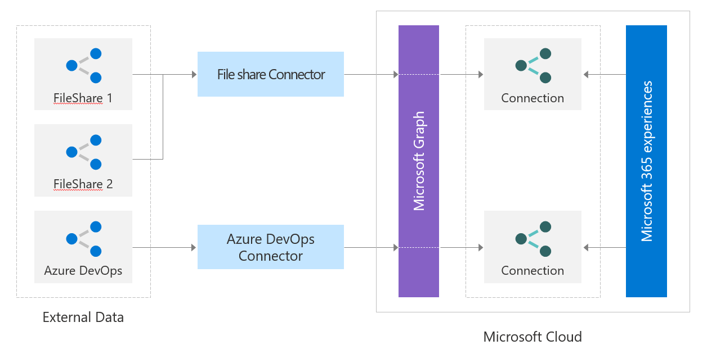

# Working with the connectors API

Microsoft Graph connectors offer a simple way to bring external data into Microsoft Graph and enhance Microsoft 365 intelligent experiences. You might want to build a custom connector to integrate with services that aren't available as connectors built by Microsoft. To build custom connectors, you use the Microsoft Graph connector REST APIs.

You can use the Microsoft Graph connectors API to:

1. Create and manage external data connections.
2. Define and register the schema of the external data type(s).
3. Ingest external data items into Microsoft Graph.
4. Sync external groups.

To learn more details about these APIs, you can visit the documentation suggested next.

## Connections API

A connection is a logical container for your external data that you can manage as a single unit.
To learn more about how to create, update, and delete connections in the Microsoft Graph, visit the [Manage connection](connecting-external-content-manage-connections.md) section.

## Schema API

The connection [schema](/graph/api/resources/schema?view=graph-rest-beta&amp;preserve-view=true) determines how your content will be used in various Microsoft 365 experiences. Schema is a flat list of all the properties you plan to add to the connection along with their attributes, labels, and aliases. You must register the schema before ingesting items into Microsoft Graph.

To learn more about how to register the schema for the Microsoft Graph connection, and its properties, visit the [Manage schema](connecting-external-content-manage-schema.md) section.

## Ingest external data items

Microsoft Graph connectors offer a simple way to bring external data into Microsoft Graph. Items added by your application to the Microsoft Search service are represented by the [externalItem](/graph/api/resources/externalitem?view=graph-rest-beta&preserve-view=true) resource in Microsoft Graph.

To learn more about how to create, update, and delete items added by your application via Microsoft Graph connectors, visit the [Manage items](connecting-external-content-manage-items.md) section.

## External groups API

Items in the external service can be granted or denied access via ACL to different types of non-Azure Active Directory groups. For example, Salesforce items might have permission sets and profiles. ServiceNow items might have local groups. When you ingest these items into Microsoft Graph, you need to honor these ACLs.

You can use the External groups API to set permissions on external items ingested into Microsoft Graph. An [externalGroup](/graph/api/externalgroup-post-members?view=graph-rest-beta&amp;preserve-view=true) represents a non-Azure Active Directory group or group-like construct (such as Business units, Teams, and so on) and determines permissions on the content in your external data source.
