# Use Postman with the Microsoft Graph connectors API

This topic describes how you can use the Microsoft Graph connector APIs with Postman.

## Prerequisites

* Either a Microsoft account or work or school account.
* Access to a Microsoft 365 developer tenant. If you don't have one, you can sign up for the [Microsoft 365 Developer Program] to get a free developer subscription.

## Step 1 - Import the Microsoft Graph Postman collection

To use the Postman collection, you need to import it into your Postman workspace. Do this from a web browser.

1. Go to [Postman](https://identity.getpostman.com/signup) and sign up. If you already have a Postman account, you can [sign in](https://identity.getpostman.com/login).

2. After you sign in, go to **My workspace**.

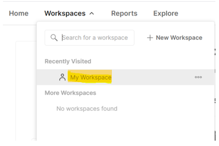

3. After you go into **My workspace**, select the **Import** button.

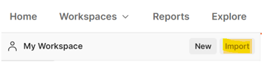

4. In the dialog that opens, select **Link** tab and enter the following URL - in the textbox:  `https://www.postman.com/collections/61bfc772fe030514b062`.

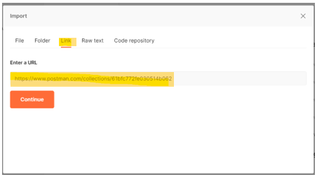

5. Select **Continue**.
6. Select **Import**.

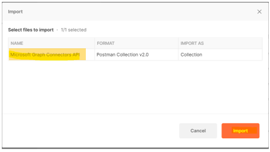

You should now see the Microsoft Graph connectors API collection inside Postman.

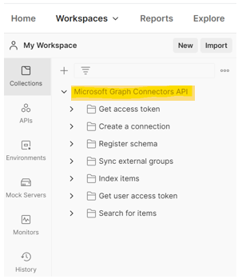

> [!NOTE]
> The Microsoft Graph connector API was recently added into the [Microsoft Graph postman collection](https://www.postman.com/microsoftgraph/workspace/microsoft-graph/overview).
This document will be edited soon to use that collection instead.

## Step 2 - Download the Postman Agent (Optional - Postman Web browser only)

To use this Postman collection in your web browser, download the [Postman Desktop Agent](https://www.postman.com/downloads). You can't use Postman for the web without this due to CORS restrictions in the web browser.
"The maximum number of [connection](/graph/api-reference/resources/externalconnection?view=graph-rest-beta&preserve-view=true) resources per Microsoft 365 tenant."

> [!NOTE]
> You don't need the agent if you're using the Postman for Windows app. If you open Postman for Windows, you will see this collection in your workspace.

## Step 3 - Create an Azure AD application

To use this collection in your own developer tenant, create an Azure AD application and give it the appropriate permissions for the requests you want to call.

1. Go to [portal.azure.com](https://portal.azure.com/) and **Sign in** with your developer tenant administrator account.
2. Under Azure Services, select **Azure Active Directory**.
3. On the left menu, select **App registrations**.
4. On the horizontal menu, select **New registration**.
5. Set the Application name to "Parts Inventory".
6. Set the Redirect URI to https://oauth.pstmn.io/v1/browser-callback.
7. Select **Register**.
8. On the left menu, select **API Permissions**.
9. In the horizontal menu, select **Add a permission** > **Microsoft Graph** > **Delegated Permissions**.
10. Start typing `ExternalItem.ReadWrite.All` and check `ExternalItem.ReadWrite.All`.
11. Select **Application permissions**, type "User"., and check **Application Permissions**.
12. Expand the **User options** and check **`ExternalItem.ReadWrite.All`**.
13. Select **Add permissions**.
14. In the horizontal menu, select **Grant admin consent for**, and select **Yes**.
15. In the left menu, select **Overview**. From here, you can get the Application (client) ID and Directory (tenant) ID. You will need these in step 4.
16. In the left menu, select **Certificates and secrets**.
17. Select **New client secret**, enter a description, and select **Add**. Copy the new client secret value, you will need this in step 4.

The Azure AD application now has permissions to make requests on behalf of a user to call `ExternalItem.ReadWrite.All`, and as an application for `ExternalItem.ReadWrite.All`.

## Step 4 – Configure authentication

Set up the variables in Postman. This information is used to generate the access token.

1. Select the **Microsoft Graph connectors API** tab and go to the **Variables** section.

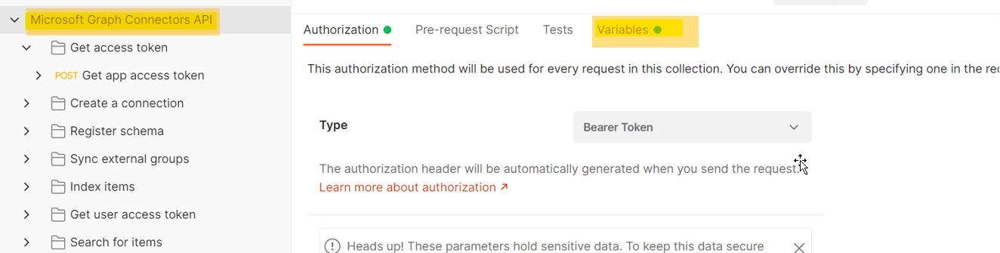

2. In the Variables section, provide the required information using the information from step 3.

- Set the  **Current value**  of **client\_id** to the Application (client) ID value from step 3.15.
- Set the  **Current value** of **client\_secret** to the Client Secret value from step 3.17.
- Set the  **Current value**  of **tenant** to the Directory (tenant) ID value from step 3.15.
- Set the  **Current value**  of **username** to `admin@xxxxxxx.onmicrosoft.com`
- Set the  **Current value**  of **password** to tenant admin password.

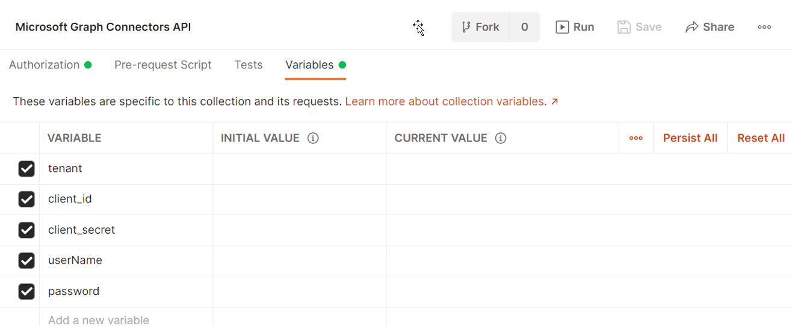

3. Select  **Save** / **Update**.

## Step 5 - Get an authentication token

You need to get an access token because this is the first time you are running a request as an application authentication flow. Get the app access token by making the following POST request:

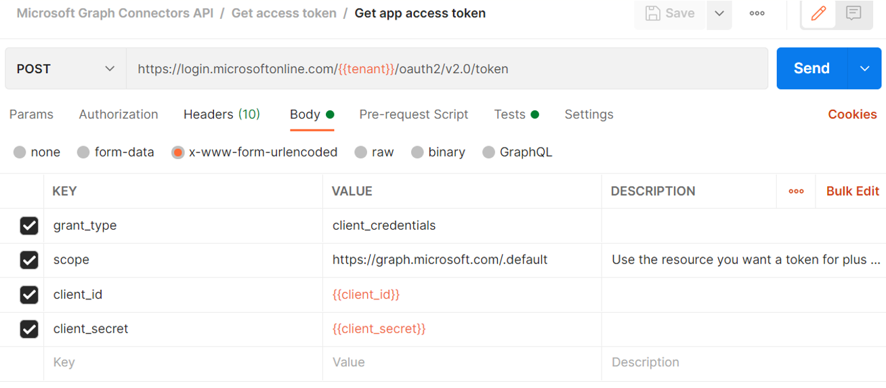


The following example shows how to get an access token with a shared secret:
```html
POST /{{tenant}}/oauth2/v2.0/token HTTP/1.1 //Line breaks for clarity
Host: login.microsoftonline.com
Content-Type: application/x-www-form-urlencoded

client_id={{client_id}} 
&scope=https%3A%2F%2Fgraph.microsoft.com%2F.default 
&client_secret={{client_secret}} 
&grant_type=client_credentials 
```
The following example shows a successful response:
```html
{ 
    "token_type": "Bearer", 
    "expires_in": 3599, 
    "ext_expires_in": 3599, 
    "access_token": "eyJ0eXAiOiJKV1QiLCJu… " 
} 
```

Note that you are using the [client credential flow](/azure/active-directory/develop/v2-oauth2-client-creds-grant-flow) here. Be sure to get an app access token and not a user access token.

## Step 6 – Create a new connection

A [connection](/concepts/connecting-external-content-manage-connections.md) is a logical container for your external data that you can manage as a single unit. Choose a connection name, id, and description. Get the necessary details from the admin to connect to the data source and provide a mechanism to authorize against the content source when setting up the connection. You can use the [Microsoft Graph SDK](/graph/sdks/sdks-overview) and APIs to program your connector setup. If you want to store credentials, you can use Azure Key Vault.

```http
POST /external/connections
```

The following is an example of the request.

```http
POST https://graph.microsoft.com/beta/external/connections 
Content-type: application/json 

{ 
  "id": "contosotasks", 
  "name": "Contoso Tasks", 
  "description": "Connection to index Contoso task management system" 
} 
```

The following is an example of the response.

```http
HTTP/1.1 201 Created 
Content-type: application/json 
 
{ 
    "@odata.context": "https://graph.microsoft.com/beta/$metadata#connections/$entity", 
    "id": "contosotasks", 
    "name": "Contoso Tasks", 
    "description": "Connection to index Contoso task management system", 
    "state": null, 
    "configuration": { 
        "authorizedApps": [ 
            "a47b35b7-6271-4e6d-9e27-2450a8b9c6b6" 
        ] 
    } 
} 
```

The following is a screenshot of the **Create connection** section.

 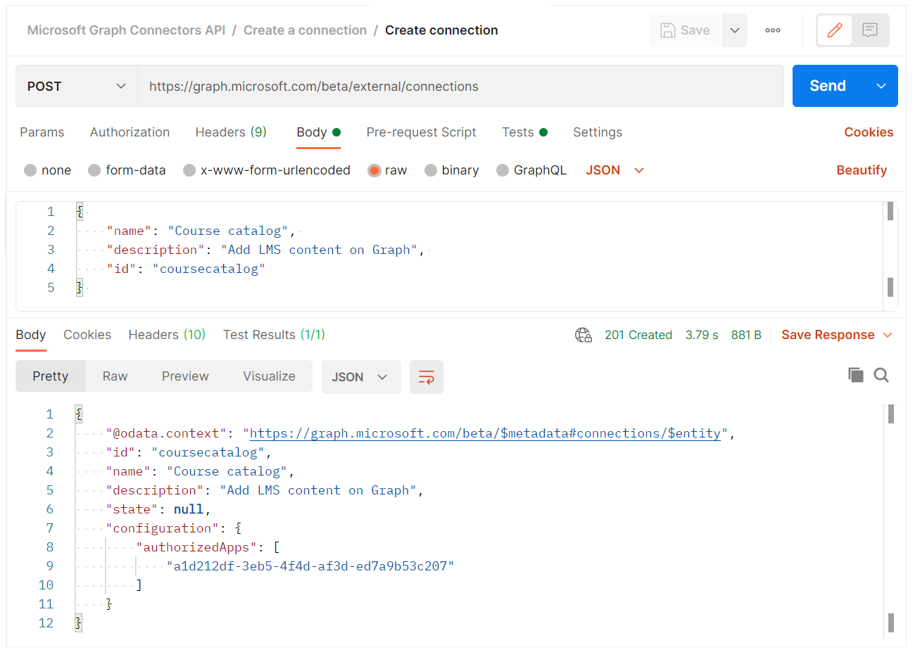

## Step 7 - Register connection schema

The connection schema determines how your content will be used in various Microsoft Graph experiences. Schema is a flat list of all the properties that you plan to add to the connection along with their attributes, labels, and aliases. You must register the schema before adding items into the connection.

```http
POST /external/connections/{id}/schema 
```

The following is an example of the request.

```http
POST https://graph.microsoft.com/beta/external/connections/contosotasks/schema 
Content-type: application/json 
Prefer: respond-async 

{ 
  "baseType": "microsoft.graph.externalItem", 
  "properties": [ 
    { 
"name": "title", 
      "type": "String", 
      "isSearchable": "true", 
"isQueryable": "true", 
      "isRetrievable": "true", 
      "labels": [ 
        "title" 
      ] 
    }, 
    { 
"aliases": "creator", 
      "name": "createdBy", 
      "type": "String", 
      "isSearchable": "true", 
"isQueryable": "true", 
      "isRetrievable": "false", 
"isRefinable": "false", 
      "labels": [ 
        "createdBy" 
      ] 
    }, 
    { 
"aliases": "editedDate", 
      "name": "lastEditedDate", 
      "type": "DateTime", 
      "isSearchable": "false", 
"isQueryable": "true", 
      "isRetrievable": "true", 
"isRefinable": "true", 
      "labels": [ 
   "lastModifiedDateTime" 
] 
    } 
  ] 
} 
```

The following is an example of the response.

```http
HTTP/1.1 202 Accepted 
Location: https://graph.microsoft.com/beta/external/connections/contosotasks/operations/616bfeed-666f-4ce0-8cd9-058939010bfc 
```

> [!NOTE]
> Registering connection schema is an asynchronous operation, so do not ingest items into the connection until the connection schema is in the Completed state. 
>To check connection schema status, execute the following request:
> ```http
> GET /external/connections/contosotasks/operations/616bfeed-666f-4ce0-8cd9-058939010bfc 
> ```

The following is another example of request.
```http
Request 
GET https://graph.microsoft.com/beta/external/connections/operations/616bfeed-666f-4ce0-8cd9-058939010bfc 
```

And next the respective example of response.

```http
HTTP/1.1 200 OK 
Content-type: application/json 

{
    @odata.context":"https://graph.microsoft.com/beta/$metadata#external/connections('coursecatalog')/operations/$entity", 
    "id": "aa9186d2-893c-4361-ca51-431d88fa45d8", 
    "name": "Contoso Tasks", 
    "status": "inprogress", 
    "error": null  
}
```

The following is a screenshot of the **Get operation status** section.

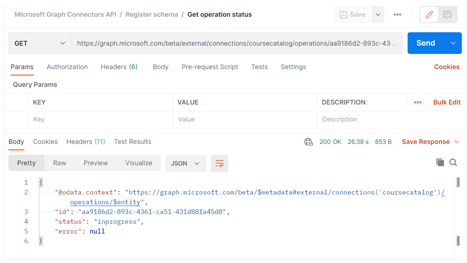

After the connection schema operation status changes from **InProgress** to **Completed,** you can ingest items for the connection.

The following screenshot shows the status as "completed".

 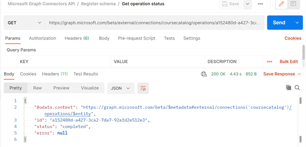

The following screenshot shows the state as "draft".

 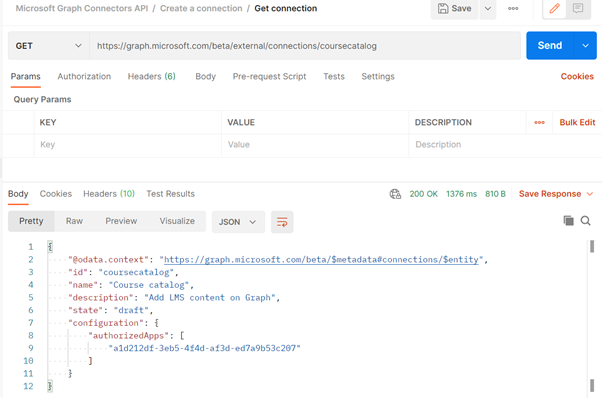

After the connection state changes from **draft** to **ready**, as showed in the next screenshot, you can ingest items into current connection.

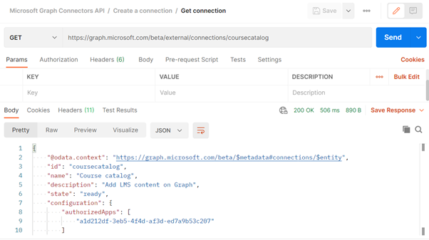

## Step 8 - Add external group member (optional)

If your external service uses non-Azure AD ACLs, sync those permissions.  

External groups (along with Azure Active Directory users and groups) are used to set permissions on `externalItems` added to a Microsoft Graph connection. For details see [externalGroups](/graph/api/resources/externalgroup?view=graph-rest-beta).

This is an example of a request.

```http
POST https://graph.microsoft.com/beta/external/connections/contosotasks/groups/31bea3d537902000/members 
Content-Type: application/json 
 
{ 
  "@odata.type": "#microsoft.graph.externalGroupMember", 
  "id": "1431b9c38ee647f6a", 
  "type": "group", 
  "identitySource": "external" 
} 
```

And next is an example of the response.

```http
HTTP/1.1 201 Created 
Content-Type: application/json 

{ 
  "@odata.type": "#microsoft.graph.externalGroupMember", 
  "id": "14m1b9c38qe647f6a", 
  "type": "group", 
  "identitySource": "external" 
} 
```

The following screenshot shows the **Create external group** section.

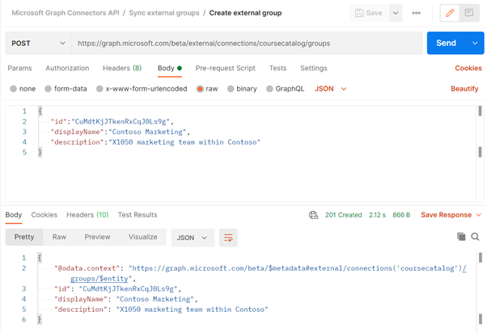

## Step 9 - Ingest Items

After you created a connection, you can add your content. Each item from your data source must be represented as an `externalItem` in Microsoft Graph with a unique item id. This ID is used to create, update or delete the item from Microsoft Graph. You can use the primary key from your data source as the `itemId` or derive it from one or more fields. An `externalItem` has three key components: access control list, properties, and content.

If you have binary files, you must parse to get the metadata and a text version of the content. If you have non-text content such as a PDF or BMP file, you must use object character recognition to convert content to text.  

You are responsible for converting your source permissions to grant or deny. Deny takes higher precedence over grant.

The following is an example of request.

```http
PUT https://graph.microsoft.com/beta/connections/contosohr/items/TSP228082938 
Content-type: application/json 

{ 
  "@odata.type": "microsoft.graph.externalItem", 
  "acl": [ 
    { 
      "type": "user", 
      "value": "e811976d-83df-4cbd-8b9b-5215b18aa874", 
      "accessType": "grant", 
      "identitySource": "azureActiveDirectory" 
    }, 
    { 
      "type": "group", 
      "value": "14m1b9c38qe647f6a", 
      "accessType": "deny", 
      "identitySource": "external" 
    } 
  ], 
  "properties": { 
    "ticketID": "1158", 
    "priority": 1, 
    "title": "Filter design", 
  }, 
  "content": { 
    "value": "Build filtering capability by...", 
    "type": "text" 
  } 
} 
```

The following is an example of a successful response.

```http
HTTP/1.1 200 OK
```

## Error handling

For details about how to resolve errors, see [Microsoft Graph authorization errors](/graph/resolve-auth-errors).
