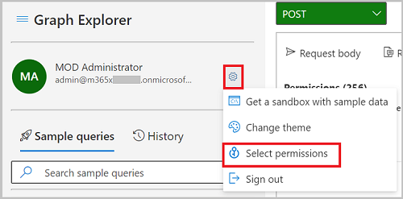
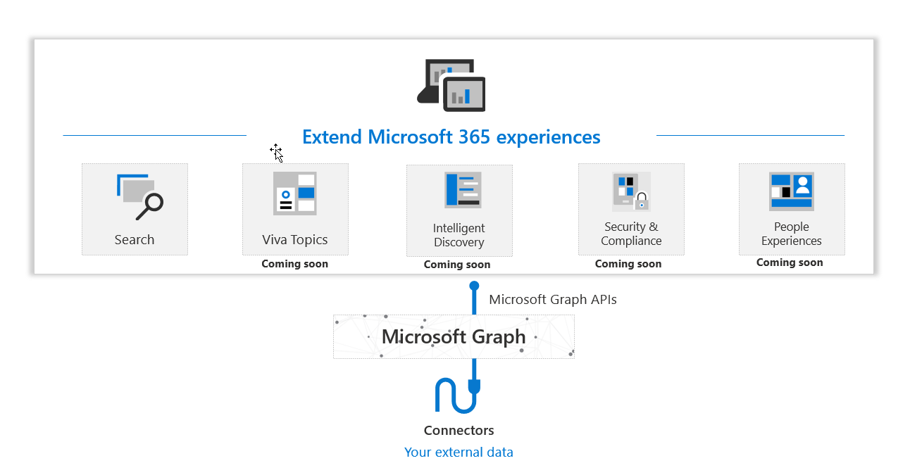

# Microsoft Graph connectors overview

[Microsoft 365](https://www.microsoft.com/microsoft-365) is a complete, intelligent solution that empowers users and organizations with innovative productivity experiences and rich insights to increase efficiency and drive business growth. Microsoft Graph is the data fabric that powers these intelligent experiences, and the Microsoft Graph API provides access to this data and intelligence.

Although most information workers spend much of their work time within productivity applications such as [Microsoft 365](https://www.microsoft.com/microsoft-365), they also need a way to integrate that environment with the enterprise applications and other on-premises and SaaS cloud software and services they use. For example, enterprise resource planning (ERP) applications, customer resource management (CRM) applications, intranet applications, wikis, blogs, and social networking sites.

Microsoft Graph connectors offer a simple and intuitive way to bring content from external services into Microsoft Graph, enabling external data to power Microsoft 365 intelligent experiences like Microsoft Search (currently GA) and many more coming soon like Viva Topics.

Today, with Microsoft Graph connectors, the data you bring in from your organization can appear in Microsoft Search results. This feature expands the types of content sources that are searchable in your Microsoft 365 productivity apps and the broader Microsoft ecosystem. Soon, connectors will power many other Microsoft 365 intelligent experiences.
The following diagram provides a high-level overview of Microsoft Graph connectors.

<!---Insert image reference here --->
<!---        --->

## Build your own custom connector

The 100+ connectors currently available from Microsoft and partners enable you to connect to popular Microsoft and non-Microsoft services. Examples of existing connectors include Azure services, Box, ServiceNow, Salesforce, Google services, MediaWiki, and more.

To learn more about the existing Microsoft Graph connectors, visit the [Microsoft Graph connectors gallery](/microsoftsearch/connectors-gallery).

While these connectors help connect to popular services, you may want to integrate with services that aren't available in the existing [connectors gallery](/microsoftsearch/connectors-gallery). You can use the Microsoft Graph connectors API to build custom connectors to bring your external data into Microsoft 365 experiences, including Microsoft Search, Viva Topics and more (coming soon), within your organization.

## Get started with custom Graph connectors:
* [Working with the connectors API](connecting-external-content-connectors-api-overview.md)
* [Use Postman with the Microsoft Graph connectors API](connecting-external-content-connectors-api-postman.md)
<!---**(Articles coming next)**
* [Build your first custom connector with Microsoft Graph]()
--->

