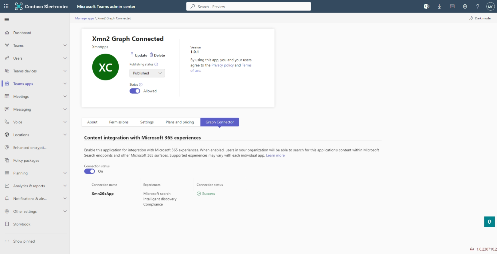
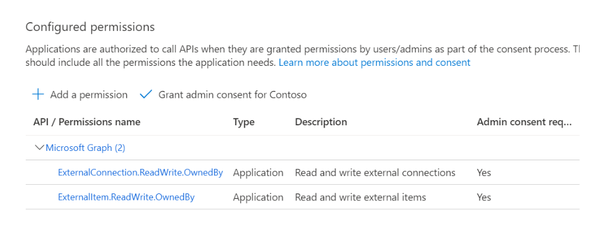
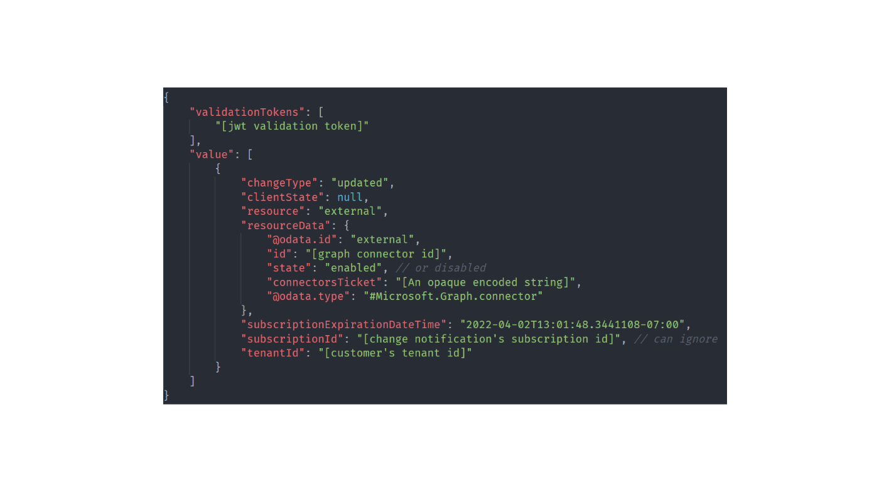

# Enable the simplified admin experience for your Microsoft Graph connector in the Teams admin center

This article describes how to enable the simplified admin experience for your Microsoft Graph connector in the Teams admin center. When you enable this experience, Teams admins and Global admins can enable or disable your custom Microsoft Graph connector seamlessly in the Teams admin center.



To enable the simplified admin experience in the Teams admin center:
1. Update the Teams app manifest.
2. Update Azure Active Directory permissions.
3. Handle Microsoft Graph webhook notifications.
4. Create or delete Microsoft Graph connections.
5. Validate the experience by enabling the Microsoft Graph Connector in the Teams admin center.

## Update the Teams app manifest
In the Teams app manifest, at the root, at the same level as properties like **name**, **description**, and **icons**, add the **graphConnector** property (introduced in [v1.11](https://developer.microsoft.com/en-us/json-schemas/teams/v1.11/MicrosoftTeams.schema.json) of the app manifest) with a **notificationUrl**. This field contains the URL to which Microsoft Graph connector notifications for the application are sent.

Ensure that the **webApplicationInfo** property is added to the manifest. After you update the manifest, upload it by sideloading the app or publishing the app to the store.

```JSON
{
 "$schema":"https://developer.microsoft.com/json-schemas/teams/v1.11/MicrosoftTeams.schema.json",
  "manifestVersion": "1.11",
  ...
  "webApplicationInfo": {
    "id": "<AAD_APP_ID>",  // e.g. "7e47846e-4bef-4c42-9817-a14e92287f28"
    "resource": "<AAD_APP_RESOURCE>" // e.g. "api://xmngc.loca.lt/7e47846e-4bef-4c42-9817-a14e92287f28"

  },
  "graphConnector": {
    "notificationUrl": "<AAD_APP_NOTIFICATION_URL>"
  }
}
```
	
## Update Azure Active Directory permissions
In the Azure portal, go to the app registration and update the app permissions to include the Microsoft Graph permissions `ExternalConnection.ReadWrite.OwnedBy` and `ExternalItem.ReadWrite.OwnedBy`, as shown in the following example.


## Handle Microsoft Graph webhook notifications
When the admin turns **on** or **off** the Microsoft Graph connector from the Teams admin center, Microsoft Graph sends a change notification to the URL specified in the **notificationUrl** property in the manifest. Your app needs to manage these Microsoft Graph connections accordingly.

### Change notifications
For details about how to set up change notifications, see [Set up notifications for changes in resource data](/graph/webhooks#change-notifications). The following is an example of a payload.



To understand how to validate the inbound change notification, see [Validating the authenticity of notifications](/graph/webhooks-with-resource-data#validating-the-authenticity-of-notifications).

Keep the following tips in mind:
* You can ignore **SubscriptionExpirationDateTime** and **SubscriptionId**.
* The change notification is for Microsoft Graph connector management only when the @odata.type of the resource data matches the one in the sample payload.
* The **tenantId** identified is the customer's tenant ID. When calling the Microsoft Graph API to [manage Microsoft Graph connections](/graph/connecting-external-content-manage-connections), you must generate the app token on behalf of this customer's tenant ID. 
* Within **resourceData**, use **state** to determine whether to create or delete connections. **connectorsTicket** are needed when creating the connections.

### Handling "connector enable" notification

To handle "connector enable" notifications:

* Determine which Microsoft Graph connections to create (how many connections and which schema for each connection) by using the [External connection List API](/graph/api/externalconnectors-externalconnection-list?view=graph-rest-beta&tabs=http) to query for all connections. Determine whether to create all connections from scratch, resume creation of connections (in resiliency flow), or no-op (when all desired connections are already in the **ready** state).
* The [connection](/graph/api/externalconnectors-external-post-connections) is created in a **draft** state. Pass the **connectorsTicket** opaque encoded string to the connection creation API in the `GraphConnectors-Ticket` HTTP header.
* [Register the schema](/graph/api/externalconnectors-externalconnection-post-schema?view=graph-rest-beta&tabs=http). 
* After a successful schema creation or update, the connection should reach a **ready** state.

### Handling "connector disable" notification

To handle "connector disable" notifications:

* Determine which Microsoft Graph connections to delete by using the [External connection List API](/graph/api/externalconnectors-externalconnection-list) to query for all connections.
* Delete all connections by using the [External connection Delete API](/graph/api/externalconnectors-externalconnection-delete?view=graph-rest-beta&tabs=http).
* We recommend that you build resiliency logic to retry the deleted connection to verify that it is deleted.

#### Request
```
POST https://example.com/notificationEndpoint
Content-type: application/json
Content-length: 100
 
{
  "value": [
    {
      "changeType": "updated",
      "subscriptionId": "79f3b611-7f15-4bdd-9422-9606a24e49f3",
      "resource": "external",
      "clientState": null,
      "resourceData": {
        "@odata.type": "#Microsoft.Graph.connector",
        "@odata.id": "external",
        "id": "{{connectorId}}",
        "state": "enabled" //e.g. enabled or disabled
        "connectorsTicket":"eyJhbGciOiJIUzI1…"
      },
      "subscriptionExpirationDateTime": "2021-06-26T12:40:26.4436785-07:00",
      "tenantId": "9f4ebab6-520d-49c0-85cc-7b25c78d4a93"
    }
  ],
  "validationTokens": [ "eyJ0eXAiOiJKV…" ]
}
```

#### Response
```
HTTP/1.1 202 Accepted
Content-type: application/json
Content-length: 0
```
You need to send a `202 - Accepted` status code in your response to Microsoft Graph. If Microsoft Graph doesn't receive a 2xx class code, it will try to publish the change notification a number of times for a period of about 4 hours. After that, the change notification will be dropped and won't be delivered.

>[!NOTE]
>Send the `202 - Accepted` status code as soon as you receive the change notification, even before you validate its authenticity. You are acknowledging the receipt of the change notification and preventing unnecessary retries. 
>The current timeout is 30 seconds, but it might be reduced in the future to optimize service performance. 
>If the notification URL doesn't reply within 30 seconds for more than 10% of the requests from Microsoft Graph over a 10-minute period, all subsequent notifications will be delayed and retried for a period of 4 hours. 
>If a notification URL doesn't reply within 30 seconds for more than 20% of the requests from Microsoft Graph over a 10-minute period, all subsequent notifications will be dropped.

To validate the authenticity of **validatonToken**: 
- Verify that the token has not expired.
- Verify that the token has not been tampered with and was issued by the Microsoft identity platform.
- Verify that the **appId** claim in the **validationToken** is 0bf30f3b-4a52-48df-9a82-234910c4a086.
- Verify the **aud** claim in the **validationToken** is the same as the "{{Teams-appid}}" you specified.

For details, see [Validating the authenticity of notification](/graph/webhooks-with-resource-data?tabs=csharp#validating-the-authenticity-of-notifications).

The following example shows a validation token.
```
{ "typ": "JWT", "alg": "RS256", "x5t": "nOo3ZDrODXEK1jKWhXslHR_KXEg", "kid": "nOo3ZDrODXEK1jKWhXslHR_KXEg" }.{ "aud": "e478830d-8f49-4c26-80c6-58f68e0f064b", "iss": "https://sts.windows.net/9f4ebab6-520d-49c0-85cc-7b25c78d4a93/", "iat": 1624649764, "nbf": 1624649764, "exp": 1624736464, "aio": "E2ZgYGjnuFglnX7mtjJzwR5lYaWvAA==", "appid": "0bf30f3b-4a52-48df-9a82-234910c4a086", "appidacr": "2", "idp": "https://sts.windows.net/9f4ebab6-520d-49c0-85cc-7b25c78d4a93/", "oid": "1e7d79fa-7893-4d50-bdde-164260d9c5ba", "rh": "0.AX0AtrpOnw1SwEmFzHslx41KkzsP8wtSSt9ImoIjSRDEoIZ9AAA.", "sub": "1e7d79fa-7893-4d50-bdde-164260d9c5ba", "tid": "9f4ebab6-520d-49c0-85cc-7b25c78d4a93", "uti": "mIB4QKCeZE6hK71XUHJ3AA", "ver": "1.0" }.[Signature]
```

## Create or delete Microsoft Graph connections 
You will need to send the **connectorTickets** from the payload you received as a `GraphConnectors-Ticket` header while initiating the creation of the Teams app connection, as shown in the following example.

### Request
```
POST https://graph.microsoft.com/v1.0/external/connectors
GraphConnectors-Ticket: {{connectorsTicket}}
Content-type: application/json
Authorization: bearer {{accessToken}}

{ 
    "id": "{{connectionId}}",
    "name": "Contoso HR", 
    "description": "Connection to index Contoso HR system",
    "connectorId": "{{connectorId}}",
    "enabledContentExperiences": "MicrosoftSearch, Compliance, …",
    "searchSettings": { … },
    "complianceSettings": { … },
    …
} 
```

>[!NOTE]
>- {{connectorId}} is the value of the **id** property in the manifest. For details, see [App manifest schema for Teams](/microsoftteams/platform/resources/schema/manifest-schema).
>- You should acquire the {{accessToken}} from the [Microsoft identity platform (Azure Active Directory)](/azure/active-directory/develop/v2-app-types) for the tenant that is being notified.

### Response
```
HTTP/1.1 200 Accepted
Content-type: application/json
Content-length: 0
```

>[!NOTE]
>Various Microsoft 365 experiences can be enabled for the connections created. For details, see [Microsoft Graph connectors overview](/graph/connecting-external-content-connectors-overview).

To learn how to ingest external items into a working Microsoft Graph connection, see [Create, update, and delete items added by your application via Microsoft Graph connectors](/graph/connecting-external-content-manage-items).

## Validate the experience by enabling the Microsoft Graph connector in the Teams admin center

To validate the experience:
* Sign in to the [Teams admin center](https://admin.teams.microsoft.com) as a Teams admin or Global admin of the tenant.
* Select the **Manage apps** blade in the left rail.
* Go to your Teams application.
* On the detail page of the Teams app, you will notice a new **Graph Connector** tab that allows an admin to enable or disable the Microsoft Graph connector.
* Select the toggle button to send the enable or disable notifications to the notification endpoint of the app, as specified by the **graphConnector.notificationUrl** property in the app manifest.

