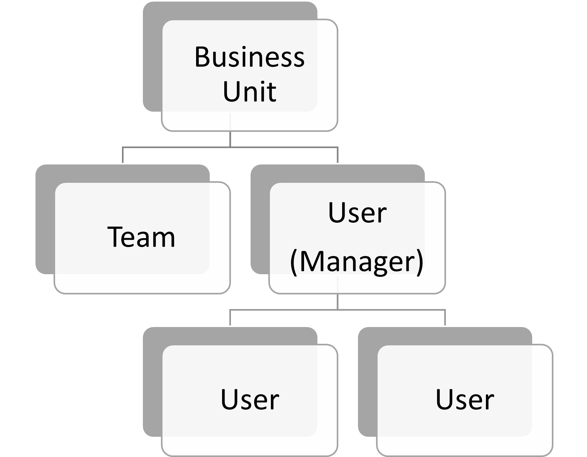
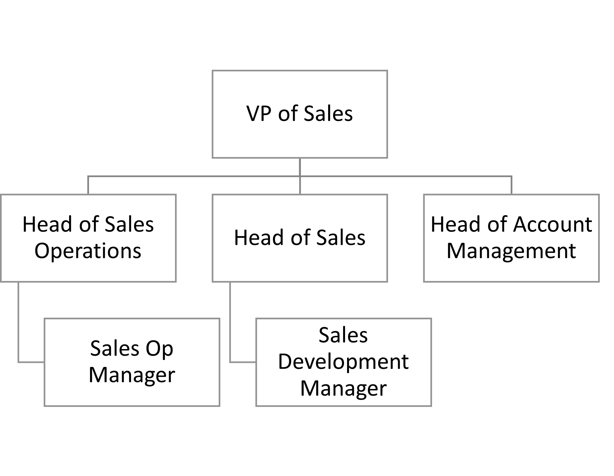

# Use external groups to manage permissions to Microsoft Graph connectors data sources

[External groups](/graph/api/resources/externalconnectors-externalgroup) let you manage permissions to view [external items](/graph/api/resources/externalconnectors-externalitem) in a Microsoft Graph connection and connect to data sources outside Azure Active Directory (Azure AD) groups.

For data sources that rely on Azure AD users and groups, you set permissions on external items by associating an access control list (ACL) with an Azure AD user and group ID when [creating](/graph/api/externalconnectors-externalconnection-put-items) or updating the external items.

However, for data sources that use non-Azure AD groups or group-like constructs such as Salesforce Profiles, Dynamics Business Units, SharePoint groups, ServiceNow local groups, or Confluence local groups, we recommend that you use *external groups*.

## Common external group scenarios

The following are common non-Azure AD application-specific group examples.

Microsoft Dynamics 365 allows customers to structure their CRMs with business units and teams. The membership information for these business units and teams is not stored in Azure AD.

The following image shows the structure of the business units and teams.

<!---Using html to adjust the size of the image --->
<br><p align="center"></p>

Salesforce uses profiles, roles, and permission sets for authorization. These are specific to Salesforce, and the membership information is not available in Azure AD.

The following image shows the structure of the membership information in Salesforce.

<!---Using html to adjust the size of the image --->
<br><p align="center"></p>

## Using external groups in your connection

To use external groups in your connection, follow these steps:

1. For each non-Azure AD group, use the groups API to create an external group in Microsoft Graph.
2. Use the external group when defining the ACL for your external items as necessary.
3. Keep the membership of the external groups up to date and in sync.

### Create an external group

External groups belong to a connection. To create external groups in your connections, follow these steps:

1. Use the [groups API](/graph/api/resources/group) in Microsoft Graph, as shown in the following example.

    > [!NOTE]
    > The [displayName](/graph/api/resources/externalconnectors-externalgroup#properties) and **description** are optional fields.

    ```http
    POST /external/connections/{connectionId}/groups

    { 
      "id": "contosoEscalations", 
      "displayName": "Contoso Escalations", 
      "description": "Tier-1 escalations within Contoso"
    } 
    ```

2. Provide either an identifier or a name in the ID field. Use this value to call the external group in subsequent requests.

    > [!NOTE]
    > The ID field allows you to use URL and filename-safe Base64 character sets. It has a limit of 128 characters.

    An external group can contain one or more of the following:
    * An Azure AD user.
    * An Azure AD group.
    * Another external group, including nested external groups.

3. After you create the group, you can add members to the group, as shown in the following examples.
    
    ```http
    POST https://graph.microsoft.com/beta/external/connections/{connectionId}/groups/{groupId}/members
    
    {
      "id": "contosoSupport",
      "type": "group",
      "identitySource": "external"
    }
    ```
    ```http
    POST https://graph.microsoft.com/beta/external/connections/{connectionId}/groups/{groupId}/members
    
    {
      "id": "25f143de-be82-4afb-8a57-e032b9315752",
      "type": "user",
      "identitySource": "azureActiveDirectory"
    }
    ```
    ```http
    POST https://graph.microsoft.com/beta/external/connections/{connectionId}/groups/{groupId}/members
    
    {
      "id": "99a3b3d6-71ee-4d21-b08b-4b6f22e3ae4b",
      "type": "group",
      "identitySource": "azureActiveDirectory"
    }
    ```

### Use external groups in the ACL

You can use external groups when defining [ACLs](connecting-external-content-manage-items.md#access-control-list) for external items, as shown in the following example. In addition to Azure AD users and groups, an external item can have external groups in its access control entries.

```http
PUT https://graph.microsoft.com/beta/external/connections/{id}/items/{id} 

Content-type: application/json 
{ 
  "@odata.type": "microsoft.graph.externalItem", 
  "acl": [ 
    { 
      "type": "group", 
      "value": "contosEscalations", 
      "accessType": "grant", 
      "identitySource": "External" 
    }, 
    { 
      "type": "user", 
      "value": "87e9089a-08d5-4d9e-9524-b7bd6be580d5", 
      "accessType": "grant", 
      "identitySource": "azureActiveDirectory" 
    }, 
    { 
      "type": "group", 
      "value": "96fbeb4f-f71c-4405-9f0b-1d6988eda2d2", 
      "accessType": "deny", 
      "identitySource": "azureActiveDirectory" 
    } 
  ], 
  "properties": { 
    "title": "Error in the payment gateway", 
    "priority": 1, 
    "assignee": "john@contoso.com" 
  }, 
  "content": { 
    "value": "<h1>Error in payment gateway</h1><p>Error details...</p>", 
    "type": "html" 
  } 
} 
```

> [!NOTE]
> You can use external groups in ACLs even before the groups are created.

### Keep external group memberships in sync

Keep the membership of your external group up to date in Microsoft Graph. When memberships change in your custom group, make sure that the change is reflected in the external group at a time that works for your needs.

### Manage external groups and membership

You can use the groups API to manage your external groups and group membership. For details, see [externalGroup](/graph/api/resources/externalconnectors-externalgroup) and [externalGroupMember](/graph/api/resources/externalconnectors-externalgroupmember).


> [!NOTE]
> A user should have less than 2,049 external security group memberships, including direct and indirect memberships. When this limit is exceeded, search results become unpredictable. Queries from users with more than 10,000 external security groups will fail with a `400` response.


## Next steps

- [Learn about Microsoft Graph connectors API limits](connecting-external-content-api-limits.md)
- [Work with the Microsoft Graph connectors API](connecting-external-content-connectors-api-overview.md)
- [Use Postman with the Microsoft Graph connectors API](connecting-external-content-connectors-api-postman.md)
