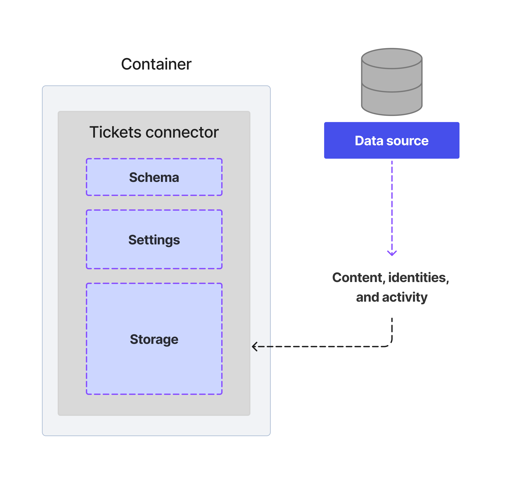
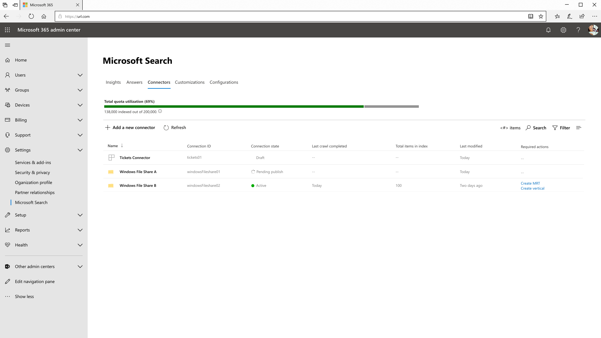
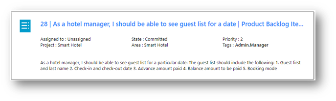
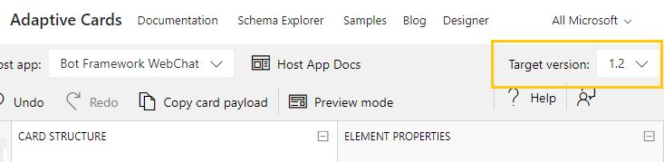
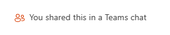

<!---<author of this doc: rsamai>--->

# Create, update, and delete connections in Microsoft Graph

The Microsoft Graph connectors platform offers an intuitive way to add your external data into Microsoft Graph. A connection is a logical container for your external data that an administrator can manage as a single unit.

After a connection has been created, you can add your content from any external data source such as an on-premises content source or an external SaaS service. You can only view and manage the connections that you [created](/graph/api/externalconnectors-external-post-connections) or were explicitly authorized to manage. A search admin can view and manage all the connections in the tenant from the Modern Admin Center.

<!-- markdownlint-disable MD036 -->


*Sample custom helpdesk system Tickets Connector structure.*



*Admin view of connections including the custom Tickets Connector.*

<!-- markdownlint-enable MD036 -->

You can model a connection any way you want, but creating one connection for every instance of your connector is the most common model. For example, each time that you [set up the Microsoft Windows file share connector](/en-us/microsoftsearch/configure-connector), a new connection is created. You can also create a single connection to add all items from your data source. For example, you can create a single connection to add all the tickets and incidents across multiple teams from your helpdesk system.

## States and operations

Your connection can exist in one of the following states.

| State             | Description                |
|-------------------|----------------------------|
| **Draft**         | An empty connection is provisioned. The data source, schema, or any settings have not been configured yet. |
| **Ready**         | The connection is provisioned with registered schema and is ready for ingestion. |
| **Obsolete**      | This occurs when a dependent feature, such as an API, has been deprecated. Deleting the connection is the only valid operation. |
| **LimitExceeded** | If you reach the maximum limit of a single connection or the tenant level quota across all connections, you cannot add more items until you exit the state. |

The following table specifies which operations are available in each state.

| Operation         | Draft              | Ready              | Obsolete           | LimitExceeded      |
|-------------------|--------------------|--------------------|--------------------|--------------------|
| Create connection | :x:                | :heavy_check_mark: | :x:                | :heavy_check_mark: |
| Read connection   | :heavy_check_mark: | :heavy_check_mark: | :heavy_check_mark: | :heavy_check_mark: |
| Update connection | :heavy_check_mark: | :heavy_check_mark: | :x:                | :heavy_check_mark: |
| Delete connection | :heavy_check_mark: | :heavy_check_mark: | :heavy_check_mark: | :heavy_check_mark: |
| Create schema     | :heavy_check_mark: | :x:                | :x:                | :x:                |
| Read schema       | :x:                | :heavy_check_mark: | :heavy_check_mark: | :heavy_check_mark: |
| Update schema     | :x:                | :x:                | :x:                | :x:                |
| Delete schema     | :x:                | :x:                | :x:                | :x:                |
| Create item       | :x:                | :heavy_check_mark: | :x:                | :x:                |
| Read item         | :x:                | :heavy_check_mark: | :heavy_check_mark: | :heavy_check_mark: |
| Update item       | :x:                | :heavy_check_mark: | :x:                | :heavy_check_mark: |
| Delete item       | :x:                | :heavy_check_mark: | :x:                | :heavy_check_mark: |

A connection allows your application to [define a schema](/graph/api/externalconnectors-externalconnection-post-schema) for items that will be indexed, and it provides an endpoint for your service to add, update, or delete items from the index. 

The first step for an application to add items to the search index is to create a connection.

## Create a connection

Before an application can add items to the search index, it must create and configure a connection:

1. [Create a connection](/graph/api/externalconnectors-external-post-connections) with a unique ID, display name, and description.
1. [Register a schema](/graph/api/externalconnectors-externalconnection-post-schema) to define the fields that will be included in the index.
   > **Note:** For information about updating the schema for an existing connection, see [Schema update capabilities](/graph/connecting-external-content-manage-schema#schema-update-capabilities).

## Enable content experiences
A Microsoft Graph connector can integrate with Microsoft 365 experiences beyond Microsoft Search.

To enable one or more content experiences, set the value of the **enabledContentExperiences** property to the values that represent those content experiences when you create the connection. The supported values are listed in the following table.

| enabledContentExperiences value | Description |
|-|-|
| search | Allows your content to appear in Microsoft search results. The format of these results is consistent across different search canvases, such as SharePoint and Microsoft Bing. |
| compliance | Allows your content to be visible to the Microsoft Purview advanced eDiscovery solution. For details about advanced eDiscovery solution & licensing requirements, see [Microsoft Purview solutions](/microsoft-365/compliance/ediscovery).|

The following example shows how to update a connection to enable both the search and compliance content experiences.

```http
PATCH https://graph.microsoft.com/beta/external/connections/contosohelpdesk
Content-Type: application/json

{
	"enabledContentExperiences": "search, compliance"
}
```

## Connection settings
You can configure the default connection settings for each enabled content experience. When enabled, these settings affect the content experiences.

### Search settings
You can define how search results are displayed in the Microsoft Search results page by supplying the default search display templates for your content. A set of search display templates can be used to display distinct kinds of search results differently. A search display template has a result layout built using Adaptive Cards and rules that specify one or more conditions. When these conditions are met, the layout will be applied to the search result and displayed on the results page.

### Compliance settings
Similar to enterprise search settings, you need to define how to display advanced eDiscovery search results by supplying result types for your content. This enables the eDiscovery manager to visualize the content when reviewing the datasets. The following example shows the results of an eDiscovery search review of an Azure DevOps item.



> [!IMPORTANT]
> The Adaptive Card format is used to render results in eDiscovery. Unlike the search experience, the eDiscovery experience only supports Adaptive Card elements up to version 1.2. 

When you configure the eDiscovery result template in the [Adaptive Card Designer](https://adaptivecards.io/designer/), select 1.2 as the target version.



Note that the following limitations apply to Adaptive Cards in the eDiscovery result templates:
- Markdown is not supported. 
- Data binding expressions with `${}` are not supported. For example, `"text": "Hello {name}"` is supported, but `"text": "Hello ${name}"` is not.
- Only data binding expressions for single-valued properties are supported. For example, `"text": "Hello {name}"` is supported, but `"text": "Hello {employee.Name}"` is not.

### Activity settings
In activity settings, you can provide a way for Microsoft 365 apps to detect **share activity**, which will enable your content to be recommended to users who interact with that content the most. The way to do this is to add a [urlToItemResolver](/graph/api/resources/externalconnectors-urltoitemresolverbase), which will allow a given URL detected within Microsoft 365 apps to be resolved to its respective item ID on the [externalItem](/graph/api/resources/externalconnectors-externalitem). 

The following image shows how your item might appear within recommendation experiences across the Microsoft 365 suite. 



## Update a connection

To change the display name, description, or enabled content experiences for an existing connection, you can [update the connection](/graph/api/externalconnectors-externalconnection-update).

## Delete a connection

To remove all items that were indexed via a connection, you can [delete a connection](/graph/api/resources/externalconnectors-externalconnection-delete).

## Next steps

- [Register the connection schema](connecting-external-content-manage-schema.md)
- [Review the Microsoft Graph connectors API reference](/graph/api/resources/indexing-api-overview)
- [Download the sample search connector from GitHub](https://github.com/microsoftgraph/msgraph-search-connector-sample)
