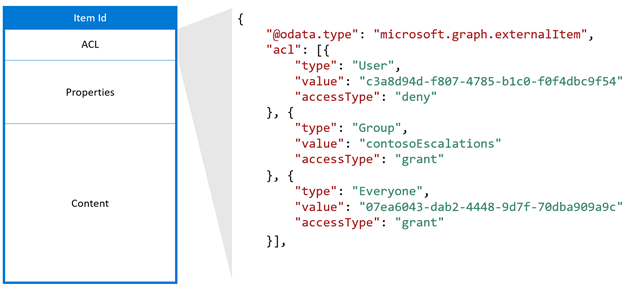
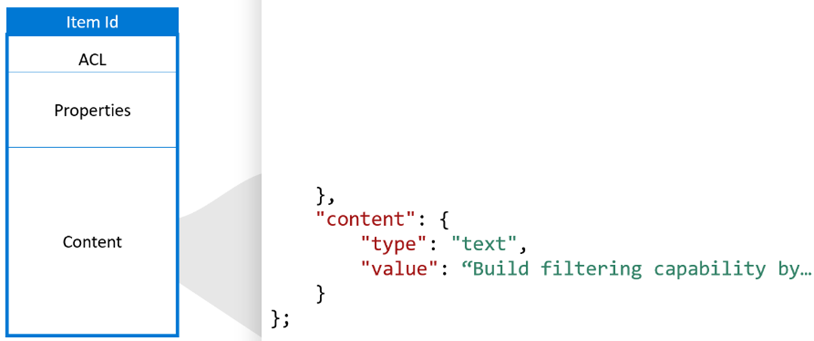
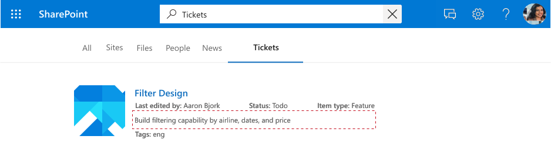

<!---<author of this doc: rsamai>--->

# Create, update, and delete items added by your application via Microsoft Graph connectors

Microsoft Graph connectors offer an intuitive way to bring external data into Microsoft Graph. Items added by your application to the Microsoft Search service are represented by the [externalItem](/graph/api/resources/externalconnectors-externalitem) resource in Microsoft Graph.

After you [create a connection](/graph/api/externalconnectors-external-post-connections), you can add your content. Each item from your data source must be represented as an **externalItem** in Microsoft Graph with a unique item ID. This ID is used to create, update, or delete the item from Microsoft Graph. You can use the primary key from your data source as the item ID or derive it from one or more fields. 

## Key components

An **externalItem** has three key components: access control list, properties, and content.

### Access control list

The access control list (ACL) is used to specify whether the given roles are granted or denied access to view items in Microsoft experiences. The ACL is an array of access control entries, each representing an Azure Active Directory (Azure AD) user or group. A third access control entry type `Everyone` represents all the users in the tenant.



*An example access control list.*

The **accessType** value `deny` takes precedence over `grant`. For example, in the item shown earlier, while `Everyone` is granted access and a specific user is denied access, the effective permission for this user is `deny`.

If your data source has non-Azure AD groups (such as teams within your helpdesk system) that are used to set permissions for the item, you can create external groups in Microsoft Graph by using the group sync APIs to replicate the `allow` or `deny` permissions. Avoid expanding the membership of your external groups directly into the ACLs of individual items because each group membership can lead to a high volume of item updates.

External groups can consist of another external group, Azure AD users, and Azure AD groups. If you have non-Azure AD users, you must translate them to Azure AD users in your ACL.

### Properties

The properties component is used to add item metadata that is useful in Microsoft Graph experiences. You must [register the schema](connecting-external-content-manage-schema.md) for the connection before adding items into it and convert **datatypes** into [supported datatypes](/graph/api/resources/externalconnectors-property).


*An example property component.*

### Content

The content component is used to add the bulk of the item that needs to be full text indexed. Examples include a ticket description, parsed text from a file body, or a wiki page body.

Content is one of the key fields influencing [relevance](connecting-external-content-manage-schema.md#relevance) across Microsoft experiences. The content types `text` and `html` are supported. If your data source has other content types, such as binary files, videos, or images, you can parse them to text before adding them to Microsoft Graph. For example, you can use optical character recognition to extract searchable text from images.

 > [!IMPORTANT]
> The compliance solution only supports `text` for the content type. If you enable the connection for compliance by setting the **enabledContentExperience** property to `compliance`, you should ingest content in plain text format and set the content type to `text`.



*An example of a content component.*

Content cannot be directly added into a search result template, but you can use a generated result snippet, which is a dynamically generated preview of the relevant sections within content.



*A search result template.*

When content in your data source changes, you must sync it with your connection items. You can either update the entire item or update one or more of its components. After your content has been added to Microsoft Graph, you can search for it through the Microsoft Search experience after setting up [search verticals](/en-us/microsoftsearch/manage-verticals) and [result types](/en-us/microsoftsearch/manage-result-types) or by using the [Microsoft Graph Search API](/graph/api/resources/search-api-overview).

### Activities

The activities component is a transient property that is used to send [activities](/graph/api/resources/externalconnectors-externalactivity) on the item. You can **only** write to this property. 

An activity consists of an actor (who performed the activity), a time (when the activity was performed), and an activity type (what type of activity was performed). The activity types that are currently supported can be found in the **Description** section of the **type** property for an [externalActivity](/graph/api/resources/externalconnectors-externalactivity). 

Sending activities on the item powers intelligent recommendation experiences across Microsoft 365. End users will be able to receive content tailored to them based on the activities that are sent. 

## Add an item

To add an item to the index, you [create an externalItem](/graph/api/externalconnectors-externalconnection-put-items). When you create an item, you assign a unique identifier in the URL.

For example, your application may index helpdesk tickets by using the ticket number. If a ticket has the ticket number `SR00145`, the request might look like the following:

```http
PUT /external/connections/contosohelpdesk/items/SR00145
Content-Type: application/json

{
  "title": "WiFi outage in Conference Room A",
  "status": "New",
  "assignee": "meganb@contoso.com"
}
```
> [!NOTE]
> Before indexed items can be found in the Microsoft Search UI, an administrator must [customize the search results page](/en-us/microsoftsearch/configure-connector#next-steps-customize-the-search-results-page) for the corresponding connection.


## Add activities to an item
To add activities to an item, you call the [addActivities](/graph/api/externalconnectors-externalitem-addactivities) endpoint, with the same unique identifier for that item in the URL.

For example, if Joe Bloggs with Azure AD ID `18948b93-d3ed-4307-9981-10fc36a08a52` commented on the helpdesk ticket with ticket number `SR00145` on April 11, 2022 at 4:25PM, the request to send that activity might look like the following.

```http
POST /external/connections/contosohelpdesk/items/SR00145/addActivities
Content-Type: application/json

"activities": [
 {
   "type": "commented",
   "startDateTime": "2022-04-11T16:25:34.3202005Z",
   "performedBy": {
       "id": "18948b93-d3ed-4307-9981-10fc36a08a52",
       "type": "user"
    }
  }
]
```

## Update an item

When an item is updated in the external service (the helpdesk ticket is reassigned or a product description is updated), you can update its entry in the index by [updating the externalItem](/graph/api/externalconnectors-externalitem-update), using the unique identifier assigned to the item when you created it.

```http
PATCH /external/connections/contosohelpdesk/items/SR00145
Content-Type: application/json

{
  "assignee": "alexw@contoso.com"
}
```

## Delete an item

To remove items from the index, you [delete the externalItem](/graph/api/externalconnectors-externalitem-delete), using the unique identifier assigned to the item when you created it.

```http
DELETE /external/connections/contosohelpdesk/items/SR00145
```

## Next steps

- [Use external groups to manage permissions](connecting-external-content-external-groups.md)
- [Query using the Microsoft Search API](search-concept-overview.md#why-use-the-microsoft-search-api)
- [Review the Microsoft Graph connectors API reference](/graph/api/resources/indexing-api-overview)
- [Search custom types (externalItem)](search-concept-custom-types.md)
- [Download the sample search connector from GitHub](https://github.com/microsoftgraph/msgraph-search-connector-sample)
