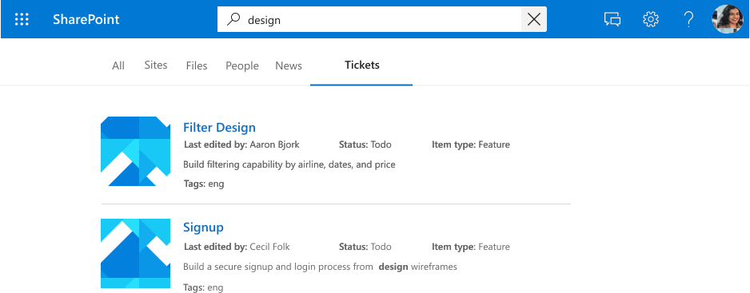

<!---<author of this doc: rsamai>--->

# Register and update schema for the Microsoft Graph connection

The connection [schema](/graph/api/resources/schema?view=graph-rest-beta&preserve-view=true) determines how your content will be used in various Microsoft Graph experiences. Schema is a flat list of all the properties that you plan to add to the connection along with their attributes, labels, and aliases. You must register the schema before adding items into the connection.

## Example schema

The following table represents an example of a possible schema for a work ticket system connector.

| Property       | Type             | Searchable         | Queryable          | Retrievable        | Refinable          | Labels               | Aliases    |
|----------------|------------------|--------------------|--------------------|--------------------|--------------------|----------------------|------------|
| ticketId       | String           |                    |                    |                    |                    |                      | ID         |
| title          | String           | :heavy_check_mark: | :heavy_check_mark: | :heavy_check_mark: |                    | title                |            |
| createdBy      | String           | :heavy_check_mark: | :heavy_check_mark: |                    |                    | createdBy            | creator    |
| assignedTo     | String           | :heavy_check_mark: | :heavy_check_mark: |                    |                    |                      |            |
| lastEditedDate | DateTime         |                    | :heavy_check_mark: | :heavy_check_mark: | :heavy_check_mark: | lastModifiedDateTime | editedDate |
| lastEditedBy   | String           | :heavy_check_mark: | :heavy_check_mark: | :heavy_check_mark: |                    | lastModifiedBy       | edited     |
| workItemType   | String           |                    | :heavy_check_mark: | :heavy_check_mark: |                    |                      | ticketType |
| priority       | Int64            | :heavy_check_mark: |                    |                    |                    |                      |            |
| tags           | StringCollection |                    | :heavy_check_mark: | :heavy_check_mark: | :heavy_check_mark: |                      |            |
| status         | String           |                    | :heavy_check_mark: | :heavy_check_mark: |                    |                      |            |
| url            | String           |                    |                    |                    |                    | url                  |            |
| resolved       | Boolean          |                    | :heavy_check_mark: | :heavy_check_mark: |                    |                      |            |

## Property attributes

### Searchable

If a property is searchable, its value is added to the full text index. When a user performs a search, we return results if there is a search hit in one of the searchable fields or its [content](connecting-external-content-manage-items.md#content).

<!-- markdownlint-disable MD036 -->

*A search for "design" displaying results for hits against properties ( `tags`)*

### Queryable

If a property is queryable, you can query against it using knowledge query language (KQL). KQL consists of 1 or more free text keywords (words or phrases) or property restrictions. The property name must be included in the query, either specified in the query itself or included in the query programmatically. You can use prefix matching with the wildcard operator(*).

> [!NOTE]
> Suffix matching is not supported.

*A search for "search ba*" displaying results that match this prefix*

*A search for "tags:design" scoping down results to items with "design" in the tags property*

### Retrievable

If a property is retrievable, its value can be returned in search results. Any property that you want to add in the display template or be returned from the query and be relevant in search results must be retrievable. Marking large properties, such as `editHistory`, or too many properties as retrievable will increase search latency. Be selective and choose relevant properties.

*A set of retrievable properties (`title`, `lastEditedBy` etc.) rendered as a result*

### Refinable

If a property is refinable, an admin can configure it as a custom filter in the Microsoft Search results page.

*Refine results by `tags`, a refinable property*

## Semantic labels

A semantic label is a well known tag published by Microsoft that you can add against a property in your schema. Adding a semantic label helps various Microsoft products understand the property and provide a better experience.
Semantic Labels provide a domain independent approach of assigning properties from different content domains to a set of well-known classes. They find applications in many different content experiences, and provide automated support for tasks like:

* Data integration in heterogenous experiences
* Building common Knowledge Graphs (e.g. Cortex, Suggestions & QF)
* Default templates for user experiences

You can assign semantic labels to your source properties on the "Assign property labels" page. Labels provide semantic meaning, and allow to integrate your connector data into Microsoft 365 experiences.  

| Label                 | Description                                                                          |
|---------------------- |------------------------------------------------------------------------------------- |
| title                 | The title of the item that you want shown in search & other experiences              |
| url                   | The target URL of the item in the data source                                        |
| createdBy             | Name of the person who created the item in the data source                           |
| lastModifiedBy        | Name of the person who most recently edited the item in the data source              |
| authors               | Name of all the people who participated/collaborated on the item in the data source  |
| createdDateTime       | Date & time that the item was created in the data source                             |
| lastModifiedDateTime  | Date & time the item was last modified in the data source                            |
| fileName              | In case of a file, the name of the file in the data source                           |
| fileExtension         | In case of a file, the extension of the file in the data source                      |
| iconUrl               | The URL of an icon|
| containerName         | Name of the container|
| containerUrl          | The URL of the container|

For example, the connection property *lastEditedBy* has the same meaning as the Microsoft label *lastModifiedBy*.

Add as many labels as you can, but ensure that they are accurately mapped to properties. Do not add a label to a property if it doesn't make sense. Incorrect mappings will deteriorate the experience.

> [!IMPORTANT]
> All properties that you map to labels must be retrievable.

The label **title** is the most important label. Make sure you assign a property to this label to allow your connection to participate in the result cluster experience.
Incorrectly mapping labels will cause a deteriorated search experience. It's okay for some labels not to have a property assigned to them.

### Relevance

By applying as many accurately mapped labels as possible, you can also improve the discovery of your content through search. We highly recommend defining as many of the below labels as possible, listed by potential impact on discovery in descending order:

- title
- lastModifiedDateTime
- lastModifiedBy
- url
- filename
- fileExtension

For discovery, i.e. search scenarios, please note:

- Ensure that your mappings are accurate.
- When you use a property as label that contains large content, you might increase search latency and have to wait longer for search to return results.
- Especially in the scenario where you configure a custom vertical that allows search over more than one connection, the search outcomes greatly benefit from appointing as many labels as possible.

### Default result types

Labels also affect how default result types are generated. Adding the title and content labels at a minimum will ensure that a result type is created for your connection.

*A default result type with `title` and a result snippet*

Your default result type will provide a better experience when you define these labels, when applicable, listed by ascending order:

- title
- url
- lastModifiedBy
- lastModifiedDateTime
- fileName
- fileExtension

Finally, when assigning labels, ensure the following:

- The properties that you select to function as labels need to be marked retrievable.
- The properties and their assigned labels must have the same datatype.
- You can map exactly one label to exactly one property.

## Aliases

Aliases are friendly names for properties that you assign. These will be used in queries and selections in refinable property filters.

## Schema update capabilities

This section includes information about the update capabilities for the Schema API.

> [!NOTE]
> It is strongly recommended to re-ingest items after an update, to bring them to te latest schema. Without re-ingestion the behavior of the items will be inconsistent.

### Adding a property

Adding a property does not require re-ingestion, but it is recommended.
When you add a property, you can include all the search attributes that you need.

### Adding/removing a search capability

Adding a search capability requires re-ingestion.
You can add specific search attributes to a property, however you cannot add a refiner search attribute as a schema change. Also it is not possible to use refinable attributes as searchable capabilities.

Deletion of search attributes from a property
Deletion of a search attribute from a property would lead to inconsistent behavior as the backward and forward looking items differ in the returned result set.

### Adding/removing an alias

It does not require re-ingestion

The connection admins and 1st party schema owners will be allowed to add or remove aliases.  The behavior on backward and forward-looking items for a search using this alias will be the same.
The one caveat to this is that the schema owner will be unable to remove the original alias of a refinable property that was auto-created by the system.

### Adding/removing a semantic label

Requires re-ingestion
Adding a semantic label can affect experiences like Working Set, Relevance, and Project Cortex. If a re-ingestion occurs, these experiences will be fixed.

## Next steps

- [Add items to the connection](./connecting-external-content-manage-items.md)
- [Review the Microsoft Graph connectors API reference](/graph/api/resources/indexing-api-overview?view=graph-rest-beta&preserve-view=true)
- [Search custom types (externalItem)](search-concept-custom-types.md)
- Download the [sample search connector](https://github.com/microsoftgraph/msgraph-search-connector-sample) from GitHub
- [Build your first custom connector with Microsoft Graph](/graph/connecting-external-content-build-quickstart&preserve-view=true)