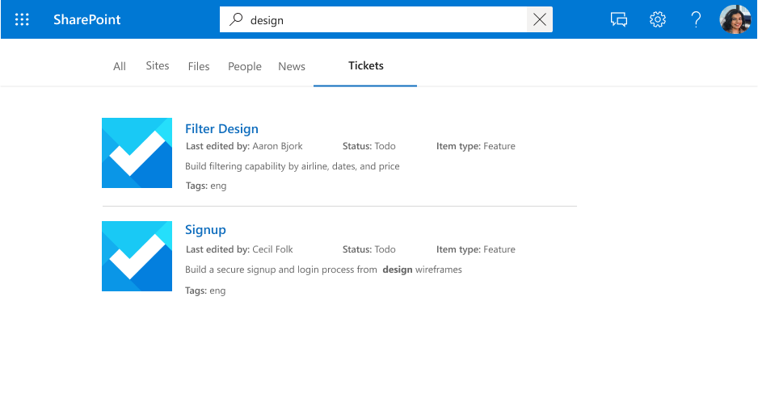
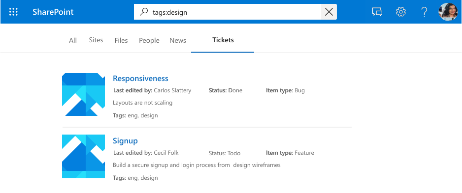
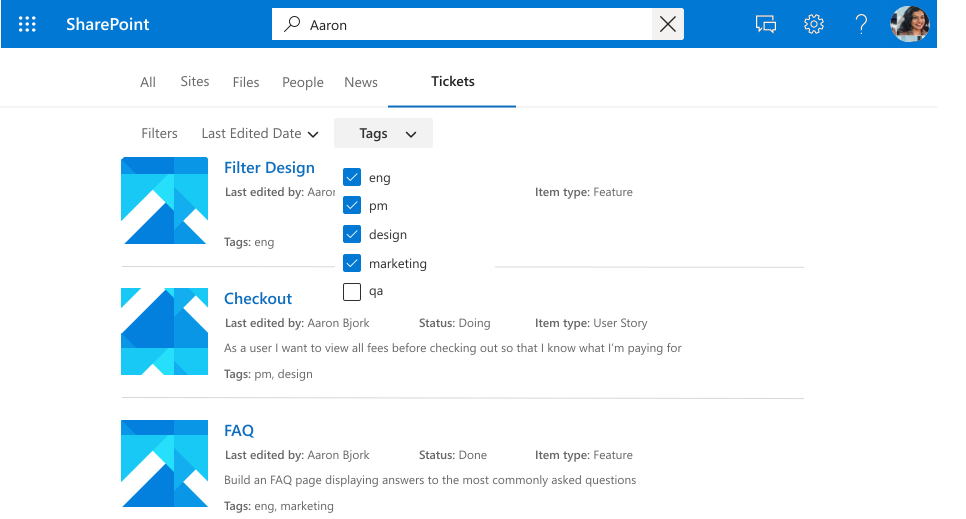

<!---<author of this doc: rsamai>--->

# Register and update schema for the Microsoft Graph connection

The connection [schema](/graph/api/resources/externalconnectors-schema) determines how your content is used in various Microsoft Graph experiences. The schema is a flat list of all the properties that you plan to add to the connection along with their attributes, labels, and aliases. You must register the schema before adding items into the connection.

## Example schema

The following table represents an example of a possible schema for a work ticket system connector.

| Property       | Type             | Searchable         | Queryable          | Retrievable        | Refinable          | Exact Match Required | Labels               | Aliases    |
|----------------|------------------|--------------------|--------------------|--------------------|--------------------|----------------------|----------------------|------------|
| ticketId       | String           |                    | :heavy_check_mark: |                    |                    | :heavy_check_mark:   |                      | ID         |
| title          | String           | :heavy_check_mark: | :heavy_check_mark: | :heavy_check_mark: |                    |                      | title                |            |
| createdBy      | String           | :heavy_check_mark: | :heavy_check_mark: |                    |                    |                      | createdBy            | creator    |
| assignedTo     | String           | :heavy_check_mark: | :heavy_check_mark: |                    |                    |                      |                      |            |
| lastEditedDate | DateTime         |                    | :heavy_check_mark: | :heavy_check_mark: | :heavy_check_mark: |                      | lastModifiedDateTime | editedDate |
| lastEditedBy   | String           | :heavy_check_mark: | :heavy_check_mark: | :heavy_check_mark: |                    |                      | lastModifiedBy       | edited     |
| workItemType   | String           |                    | :heavy_check_mark: | :heavy_check_mark: |                    |                      |                      | ticketType |
| priority       | Int64            | :heavy_check_mark: |                    |                    |                    |                      |                      |            |
| tags           | StringCollection |                    | :heavy_check_mark: | :heavy_check_mark: | :heavy_check_mark: | :heavy_check_mark:   |                      |            |
| status         | String           |                    | :heavy_check_mark: | :heavy_check_mark: |                    |                      |                      |            |
| url            | String           |                    |                    |                    |                    |                      | url                  |            |
| resolved       | Boolean          |                    | :heavy_check_mark: | :heavy_check_mark: |                    |                      |                      |            |

## Property attributes

### Searchable

If a property is searchable, its value is added to the full text index. When a user performs a search, we return results if there is a search hit in one of the searchable fields or its [content](connecting-external-content-manage-items.md#content).

<!-- markdownlint-disable MD036 -->

*A search for "design" displaying results for hits against the property (`title`) and content.*

### Queryable

If a property is queryable, you can query against it using knowledge query language (KQL). KQL consists of one or more free text keywords (words or phrases) or property restrictions. The property name must be included in the query, either specified in the query itself or included in the query programmatically. You can use prefix matching with the wildcard operator(*).

> [!NOTE]
> Suffix matching is not supported.

*A search for "search ba\*" displaying results that match this prefix.*

*A search for "tags:design" scoping down results to items with "design" in the `tags` property.*

### Retrievable

If a property is retrievable, its value can be returned in search results. Any property that you want to add in the display template or be returned from the query and be relevant in search results must be retrievable. Marking large or too many properties as retrievable increases search latency. Be selective and choose relevant properties.

*A set of retrievable properties (`title` and `lastEditedBy`) rendered as a result.*

### Refinable

If a property is refinable, an admin can configure it as a custom filter in the Microsoft Search results page. A `refinable` property cannot be `searchable`.

*Refine results by `tags`, a refinable property.*

### Exact match required

If **isExactMatchRequired** is `true` for a property, the full string value will be indexed. **isExactMatchRequired** can only be set to `true` for non-searchable properties.

For example, the **ticketId** property is both queryable and specifies exact matching.
- Querying `ticketId:CTS-ce913b61` will return the item with a ticket ID property **CTS-ce913b61**.
- Querying `ticketId:CTS` will NOT return the item with ticket ID **CTS-ce913b61**.

Similarly, the **tags** property also specifies exact matching.
- Querying `tags:contoso` will return any item with the tag **contoso**.
- Querying `tags:contoso` will NOT return items with the tag **contoso ticket**.

For example, there might be a scenario where the item property is a GUID-formatted string. If this property must be matched exactly for item queries, specify that **isExactMatchRequired** is `true`.

The **title** property does not specify exact matching. If nothing is specified, then **isExactMatchRequired** is `false`. The **title** property will be tokenized based on the tokenization rules of the language of the item content.
- Querying `title:Contoso Title` will return any item containing "Contoso" or "Title" in the **title** property.

## Semantic labels

A semantic label is a well-known tag published by Microsoft that you can add against a property in your schema. Adding a semantic label helps various Microsoft products understand the property and provide a better experience.

Semantic labels provide a domain-independent approach to assigning properties from different content domains to a set of well-known classes. They find applications in many different content experiences, and provide automated support for tasks such as:

* Data integration in heterogenous experiences
* Building common knowledge graphs (for example, Viva Topics)
* Default templates for user experiences

You can assign semantic labels to your source properties on the **Assign property labels** page. Labels provide semantic meaning, and let you integrate your connector data into Microsoft 365 experiences.  

| Label                 | Description                                                                               |
|---------------------- |------------------------------------------------------------------------------------------ |
| title                 | The title of the item that you want shown in search and other experiences.                |
| url                   | The target URL of the item in the data source.                                            |
| createdBy             | The name of the person who created the item in the data source.                           |
| lastModifiedBy        | The name of the person who most recently edited the item in the data source.              |
| authors               | The names of all the people who participated/collaborated on the item in the data source. |
| createdDateTime       | The date and time that the item was created in the data source.                           |
| lastModifiedDateTime  | The date and time that the item was last modified in the data source.                     |
| fileName              | In case of a file, the name of the file in the data source.                               |
| fileExtension         | In case of a file, the extension of the file in the data source.                          |
| iconUrl               | The URL of an icon.                                                                       |
| containerName         | The name of the container.                                                                |
| containerUrl          | The URL of the container.                                                                 |

For example, the connection property **lastEditedBy** has the same meaning as the Microsoft label *lastModifiedBy*.

Add as many labels as you can, but ensure that they are accurately mapped to properties. Do not add a label to a property if it doesn't make sense. Incorrect mappings degrade the experience.

> [!IMPORTANT]
> All properties that you map to labels must be retrievable.

The label **title** is the most important label. Make sure that you assign a property to this label to allow your connection to participate in the result cluster experience. Incorrectly mapping labels degrades the search experience. It's okay for some labels to not have a property assigned to them.

### Relevance

By applying as many accurately mapped labels as possible, you can also improve the discovery of your content through search. We highly recommend defining as many of the following labels as possible, listed by potential impact on discovery in descending order:

- title
- lastModifiedDateTime
- lastModifiedBy
- url
- fileName
- fileExtension

For discovery (search scenarios), note the following:

- Ensure that your mappings are accurate.
- When you use a property as a label that contains large content, you might increase search latency and have to wait longer for search to return results.
- Especially in the scenario where you configure a custom vertical that allows search over more than one connection, the search results greatly benefit from appointing as many labels as possible.

### Default result types

Labels also affect how default result types are generated. Adding the title and content labels at a minimum ensures that a result type is created for your connection.

*A default result type with `title` and a result snippet.*

Your default result type provides a better experience when you define these labels, when applicable, listed by ascending order:

- title
- url
- lastModifiedBy
- lastModifiedDateTime
- fileName
- fileExtension

Finally, when assigning labels, ensure the following:

- The properties that you select to function as labels need to be marked retrievable.
- The properties and their assigned labels must have the same datatype.
- You can map exactly one label to exactly one property.

## Aliases

Aliases are friendly names for properties that you assign. These are used in queries and selections in refinable property filters.

## Schema update capabilities

This section includes information about the update capabilities for the [schema](/graph/api/resources/externalconnectors-schema) API.

> [!NOTE]
> We recommend that you reingest items after an update to bring them to the latest schema. Without reingestion, the behavior of the items will be inconsistent.

### Add a property

You can add a property to your schema; doing so does not require reingestion, but we recommend it.

When you add a property, you can include all the search attributes that you need.

### Add/remove a search capability

You can add specific search attributes to a property, but keep in mind that you cannot add a refiner search attribute as a schema change. Also, it is not possible to use refinable attributes as searchable capabilities.

Adding a search capability requires reingestion.

### Add/remove an alias

You can add or remove aliases, and use them for your search queries.

Consider that you cannot remove the original alias of a refinable property that was autocreated by the system.

### Add/remove a semantic label

Adding a semantic label can affect experiences like Relevance and Viva Topics.

## Next steps

- [Add items to the connection](connecting-external-content-manage-items.md)
- [Review the Microsoft Graph connectors API reference](/graph/api/resources/indexing-api-overview)
- [Search custom types (externalItem)](search-concept-custom-types.md)
- [Build your first custom Microsoft Graph connector](/graph/connecting-external-content-build-quickstart)

