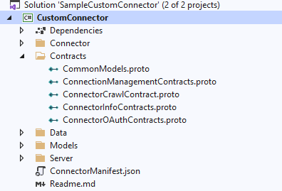

# Build a Microsoft Graph connector using other languages

You can develop your custom Microsoft Graph connector in languages other than C\#. To do so, use the following steps:

1. Install the Microsoft Graph connector agent and register it. For details, see [Microsoft Graph connector agent](/MicrosoftSearch/graph-connector-agent).

2. Download the protocol buffer files with gRPC contracts from the [Contracts](https://github.com/microsoftgraph/msgraph-connectors-sdk/tree/main/Contracts) folder.

3. Download the protobuf compiler from the [protobuf repo](https://github.com/protocolbuffers/protobuf/releases) and extract it.

    * Update the environment path with the bin folder in the extracted root.
    * Compile contracts to create **server-side stubs** in the language of your choice. For details, see [supported languages](https://grpc.io/docs/languages/).

4. Create a project in your integrated development environment (IDE) and place all the protocol files in a folder named **Contracts**.

    The following image shows an example of a project structure.

    

5. Implement methods in the stubs generated by the compiler.

6. Create a server, run the application, and generate the executable/output binaries.

7. Test the connector code using the [TestApp utility](/graph/custom-connector-sdk-testapp).

8. [Publish a connection](/graph/custom-connector-sdk-publish) for your custom connector on the [Microsoft 365 admin center](https://admin.microsoft.com/adminportal/home#/MicrosoftSearch/Connectors/add).

## See also

* [Best practices](/graph/custom-connector-sdk-best-practices)
* [Troubleshooting](/graph/custom-connector-sdk-troubleshooting)
