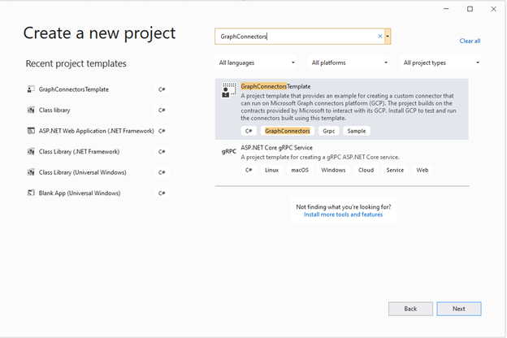
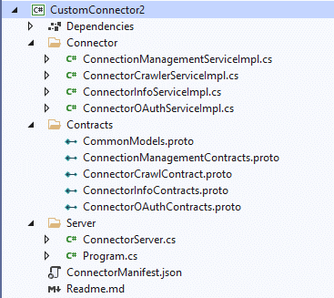

# Build a custom Microsoft Graph connector in C#

This article describes how to use the Microsoft Graph connector SDK to build a custom connector in C#.

## Prerequisites

1. Download, install, and complete the setup for the [Microsoft Graph connector agent](/microsoftsearch/graph-connector-agent).
2. Install [Visual Studio](https://visualstudio.microsoft.com/) 2019 or later with the [.NET Core 3.1 SDK](https://dotnet.microsoft.com/en-us/download).
3. Download the ApplianceParts.csv file from the [custom connector sample repo](https://github.com/microsoftgraph/msgraph-connectors-sdk/blob/main/C%23%20sample/CustomConnector/ApplianceParts.csv).

## Install the extension

1. Open Visual Studio and go to **Extensions** > **Manage extensions**.
2. Search for the **GraphConnectorsTemplate** extension and download it.
3. Close and relaunch Visual Studio to install the template.
4. Go to **File** > **New** > **Project** and search for **GraphConnectorsTemplate**. Select the template and choose **Next**.
    
5. Provide a name for the project and choose **Next**.
6. Choose .NET Core 3.1, name the connector **CustomConnector**, and choose **Create**.
7. The custom connector template project is now created.

    
    
## Create the custom connector

Before you build the connector, use the following steps to install NuGet packages and create the data models that will be used.

### Install NuGet packages

1. Right-click the project and choose **Open in Terminal**.
2. Run the following command.

    ```dotnetcli
    dotnet add package CsvHelper --version 27.2.1
    ```

### Create data models

1. Create a folder called **Models** under **CustomConnector** and create a file named AppliancePart.cs under the folder.
2. Paste the following code in AppliancePart.cs.

    ```csharp
    using System;
    using System.Collections.Generic;
    using System.ComponentModel.DataAnnotations;
    using System.Text;
    
    namespace CustomConnector.Models
    {
        public class AppliancePart
        {
            [Key]
            public int PartNumber { get; set; }
            public string Name { get; set; }
            public string Description { get; set; }
            public double Price { get; set; }
            public int Inventory { get; set; }
            public List<string> Appliances { get; set; }
        }
    }
    
    ```

### Update ConnectionManagementServiceImpl.cs

You will implement three methods in ConnectionManagementServiceImpl.cs.

#### ValidateAuthentication

The **ValidateAuthentication** method is used to validate the credentials and the data source URL provided. You need to connect to the data source URL using the credentials provided and return success if the connection succeeds or auth failure status if the connection fails.

1. Create a folder called **Data** under CustomConnector and create a file CsvDataLoader.cs in the folder.

2. Copy the following code to CsvDataLoader.cs:

    ```csharp
    using CsvHelper;
    using CsvHelper.Configuration;
    using CsvHelper.TypeConversion;
    
    using CustomConnector.Models;
    
    using System.Collections.Generic;
    using System.Globalization;
    using System.IO;
    
    namespace CustomConnector.Data
    {
        public static class CsvDataLoader
        {
            public static void ReadRecordFromCsv(string filePath)
            {
                using (var reader = new StreamReader(filePath))
                using (var csv = new CsvReader(reader, CultureInfo.InvariantCulture))
                {
                    csv.Context.RegisterClassMap<AppliancePartMap>();
                    csv.Read();
                }
            }
        }
    
        public class ApplianceListConverter : DefaultTypeConverter
        {
            public override object ConvertFromString(string text, IReaderRow row, MemberMapData memberMapData)
            {
                var appliances = text.Split(';');
                return new List<string>(appliances);
            }
        }
    
        public class AppliancePartMap : ClassMap<AppliancePart>
        {
            public AppliancePartMap()
            {
                Map(m => m.PartNumber);
                Map(m => m.Name);
                Map(m => m.Description);
                Map(m => m.Price);
                Map(m => m.Inventory);
                Map(m => m.Appliances).TypeConverter<ApplianceListConverter>();
            }
        }
    }
    
    ```

    The ReadRecordFromCsv method will open the CSV file and read the first record from the file. We can Use this method to validate that the provided data source URL (path of the CSV file) is valid. This connector is using anonymous auth; therefore, credentials are not validated. If the connector uses any other auth type, the connection to the data source must be made using the credentials provided to validate the authentication.

3. Add the following using directive in ConnectionManagementServiceImpl.cs.

    ```csharp
    using CustomConnector.Data;
    ```

4. Update the **ValidateAuthentication** method in ConnectionManagementServiceImpl.cs with the following code to call the **ReadRecordFromCsv** method of the **CsvDataLoader** class.

    ```csharp
    public override Task<ValidateAuthenticationResponse> ValidateAuthentication(ValidateAuthenticationRequest request, ServerCallContext context)
            {
                try
                {
                    Log.Information("Validating authentication");
                    CsvDataLoader.ReadRecordFromCsv(request.AuthenticationData.DatasourceUrl);
                    return this.BuildAuthValidationResponse(true);
                }
                catch (Exception ex)
                {
                    Log.Error(ex.ToString());
                    return this.BuildAuthValidationResponse(false, "Could not read the provided CSV file with the provided credentials");
                }
            }
    
    ```

#### ValidateCustomConfiguration

The **ValidateCustomConfiguration** method is used to validate any other parameters required for the connection. The connector you're building doesn't require any extra parameters; therefore, the method will validate that the extra parameters are empty.

1. Update the **alidateCustomConfiguration** method in ConnectionManagementServiceImpl.cs with the following code.

    ```csharp
    public override Task<ValidateCustomConfigurationResponse> ValidateCustomConfiguration(ValidateCustomConfigurationRequest request, ServerCallContext context)
        {
            Log.Information("Validating custom configuration");
            ValidateCustomConfigurationResponse response;

            if (!string.IsNullOrWhiteSpace(request.CustomConfiguration.Configuration))
            {
                response = new ValidateCustomConfigurationResponse()
                {
                    Status = new OperationStatus()
                    {
                        Result = OperationResult.ValidationFailure,
                        StatusMessage = "No additional parameters are required for this connector"
                    },
                };
            }
            else
            {
                response = new ValidateCustomConfigurationResponse()
                {
                    Status = new OperationStatus()
                    {
                        Result = OperationResult.Success,
                    },
                };
            }

            return Task.FromResult(response);
        }

    ```

#### GetDataSourceSchema

The **GetDataSourceSchema** method is used to fetch the schema for the connector.

1. Add the following using directives in AppliancePart.cs.

    ```csharp
    using Microsoft.Graph.Connectors.Contracts.Grpc;
    using static Microsoft.Graph.Connectors.Contracts.Grpc.SourcePropertyDefinition.Types;

    ```

2. Add the following **GetSchema** method in the AppliancePart.cs class.

     ```csharp
      public static DataSourceSchema GetSchema()
        {
            DataSourceSchema schema = new DataSourceSchema();

            schema.PropertyList.Add(
                new SourcePropertyDefinition
                {
                    Name = nameof(PartNumber),
                    Type = SourcePropertyType.Int64,
                    DefaultSearchAnnotations = (uint)(SearchAnnotations.IsQueryable | SearchAnnotations.IsRetrievable),
                    RequiredSearchAnnotations = (uint)(SearchAnnotations.IsQueryable | SearchAnnotations.IsRetrievable),
                });

            schema.PropertyList.Add(
                new SourcePropertyDefinition
                {
                    Name = nameof(Name),
                    Type = SourcePropertyType.String,
                    DefaultSearchAnnotations = (uint)(SearchAnnotations.IsSearchable | SearchAnnotations.IsRetrievable),
                    RequiredSearchAnnotations = (uint)(SearchAnnotations.IsSearchable | SearchAnnotations.IsRetrievable),
                });

            schema.PropertyList.Add(
                new SourcePropertyDefinition
                {
                    Name = nameof(Price),
                    Type = SourcePropertyType.Double,
                    DefaultSearchAnnotations = (uint)(SearchAnnotations.IsRetrievable),
                    RequiredSearchAnnotations = (uint)(SearchAnnotations.IsRetrievable),
                });

            schema.PropertyList.Add(
                new SourcePropertyDefinition
                {
                    Name = nameof(Inventory),
                    Type = SourcePropertyType.Int64,
                    DefaultSearchAnnotations = (uint)(SearchAnnotations.IsQueryable | SearchAnnotations.IsRetrievable),
                    RequiredSearchAnnotations = (uint)(SearchAnnotations.IsQueryable | SearchAnnotations.IsRetrievable),
                });

            schema.PropertyList.Add(
                new SourcePropertyDefinition
                {
                    Name = nameof(Appliances),
                    Type = SourcePropertyType.StringCollection,
                    DefaultSearchAnnotations = (uint)(SearchAnnotations.IsSearchable | SearchAnnotations.IsRetrievable),
                    RequiredSearchAnnotations = (uint)(SearchAnnotations.IsSearchable | SearchAnnotations.IsRetrievable),
                });

            schema.PropertyList.Add(
                new SourcePropertyDefinition
                {
                    Name = nameof(Description),
                    Type = SourcePropertyType.String,
                    DefaultSearchAnnotations = (uint)(SearchAnnotations.IsSearchable | SearchAnnotations.IsRetrievable),
                    RequiredSearchAnnotations = (uint)(SearchAnnotations.IsSearchable | SearchAnnotations.IsRetrievable),
                });

            return schema;
        }
  
     ```

3. Add the following using directive in ConnectionManagementServiceImpl.cs.

    ```csharp
    using CustomConnector.Models;
    ```

4. Update the **GetDataSourceSchema** method in ConnectionManagementServiceImpl.cs with the following code.

    ```csharp
    public override Task<GetDataSourceSchemaResponse> GetDataSourceSchema(GetDataSourceSchemaRequest request, ServerCallContext context)
        {
            Log.Information("Trying to fetch datasource schema");

            var opStatus = new OperationStatus()
            {
                Result = OperationResult.Success,
            };

            GetDataSourceSchemaResponse response = new GetDataSourceSchemaResponse()
            {
                DataSourceSchema = AppliancePart.GetSchema(),
                Status = opStatus,
            };

            return Task.FromResult(response);
        }

    ```

### Update ConnectorCrawlerServiceImpl.cs

This class has the methods that will be called by the platform during the crawls.

The **GetCrawlStream** method will be called during the full or periodic full crawls.

1. Add the following using directive in AppliancePart.cs.

    ```csharp
    using System.Globalization;
    ```

2. Add the following methods in AppliancePart.cs to convert the **AppliancePart** record to **CrawlItem**.

    ```csharp
    public CrawlItem ToCrawlItem()
        {
            return new CrawlItem
            {
                ItemType = CrawlItem.Types.ItemType.ContentItem,
                ItemId = this.PartNumber.ToString(CultureInfo.InvariantCulture),
                ContentItem = this.GetContentItem(),
            };
        }

        private ContentItem GetContentItem()
        {
            return new ContentItem
            {
                AccessList = this.GetAccessControlList(),
                PropertyValues = this.GetSourcePropertyValueMap()
            };
        }

        private AccessControlList GetAccessControlList()
        {
            AccessControlList accessControlList = new AccessControlList();
            accessControlList.Entries.Add(this.GetAllowEveryoneAccessControlEntry());
            return accessControlList;
        }

        private AccessControlEntry GetAllowEveryoneAccessControlEntry()
        {
            return new AccessControlEntry
            {
                AccessType = AccessControlEntry.Types.AclAccessType.Grant,
                Principal = new Principal
                {
                    Type = Principal.Types.PrincipalType.Everyone,
                    IdentitySource = Principal.Types.IdentitySource.AzureActiveDirectory,
                    IdentityType = Principal.Types.IdentityType.AadId,
                    Value = "EVERYONE",
                }
            };
        }

        private SourcePropertyValueMap GetSourcePropertyValueMap()
        {
            SourcePropertyValueMap sourcePropertyValueMap = new SourcePropertyValueMap();

            sourcePropertyValueMap.Values.Add(
                nameof(this.PartNumber),
                new GenericType
                {
                    IntValue = this.PartNumber,
                });
            
            sourcePropertyValueMap.Values.Add(
                nameof(this.Name),
                new GenericType
                {
                    StringValue = this.Name,
                });
            
            sourcePropertyValueMap.Values.Add(
                nameof(this.Price),
                new GenericType
                {
                    DoubleValue = this.Price,
                });
            
            sourcePropertyValueMap.Values.Add(
                nameof(this.Inventory),
                new GenericType
                {
                    IntValue = this.Inventory,
                });
            
            var appliancesPropertyValue = new StringCollectionType();
            foreach(var property in this.Appliances)
            {
                appliancesPropertyValue.Values.Add(property);
            }
            sourcePropertyValueMap.Values.Add(
                nameof(this.Appliances),
                new GenericType
                {
                    StringCollectionValue = appliancesPropertyValue,
                });
            
            sourcePropertyValueMap.Values.Add(
                nameof(this.Description),
                new GenericType
                {
                    StringValue = Description,
                });

            return sourcePropertyValueMap;
        }

    ```

3. Add the following using directive in CsvDataLoader.cs.

    ```csharp
    using Microsoft.Graph.Connectors.Contracts.Grpc;
    ```

4. Add the following method in CsvDataLoader.cs.

    ```csharp
    public static IEnumerable<CrawlItem> GetCrawlItemsFromCsv(string filePath)
        {
            using (var reader = new StreamReader(filePath))
            using (var csv = new CsvReader(reader, CultureInfo.InvariantCulture))
            {
                csv.Context.RegisterClassMap<AppliancePartMap>();

                // The GetRecords<T> method will return an IEnumerable<T> that will yield records. This means that only one record is returned at a time as you iterate the records.
                foreach (var record in csv.GetRecords<AppliancePart>())
                {
                    yield return record.ToCrawlItem();
                }
            }
        }

    ```

5. Add the following using directive in ConnectorCrawlerServiceImpl.cs.

    ```csharp
    using CustomConnector.Data;
    ```

6. Add the following method in ConnectorCrawlerServiceImpl.cs.

    ```csharp
    private CrawlStreamBit GetCrawlStreamBit(CrawlItem crawlItem)
        {
            return new CrawlStreamBit
            {
                Status = new OperationStatus
                {
                    Result = OperationResult.Success,
                },
                CrawlItem = crawlItem,
                CrawlProgressMarker = new CrawlCheckpoint
                {
                    CustomMarkerData = crawlItem.ItemId,
                },
            };
        }

    ```

7. Update the **GetCrawlStream** method to the following.

    ```csharp
    public override async Task GetCrawlStream(GetCrawlStreamRequest request, IServerStreamWriter<CrawlStreamBit> responseStream, ServerCallContext context)
        {
            try
            {
                Log.Information("GetCrawlStream Entry");
                var crawlItems = CsvDataLoader.GetCrawlItemsFromCsv(request.AuthenticationData.DatasourceUrl);
                foreach (var crawlItem in crawlItems)
                {
                    CrawlStreamBit crawlStreamBit = this.GetCrawlStreamBit(crawlItem);
                    await responseStream.WriteAsync(crawlStreamBit).ConfigureAwait(false);
                }
            }
            catch (Exception ex)
            {
                Log.Error(ex.ToString());
                CrawlStreamBit crawlStreamBit = new CrawlStreamBit
                {
                    Status = new OperationStatus
                    {
                        Result = OperationResult.DatasourceError,
                        StatusMessage = "Fetching items from datasource failed",
                        RetryInfo = new RetryDetails
                        {
                            Type = RetryDetails.Types.RetryType.Standard,
                        },
                    },
                };
                await responseStream.WriteAsync(crawlStreamBit).ConfigureAwait(false);
            }

        }

    ```

Now the connector is created and you can build and run the project.

## Next steps

* [Test your connector](/graph/custom-connector-sdk-sample-test)
