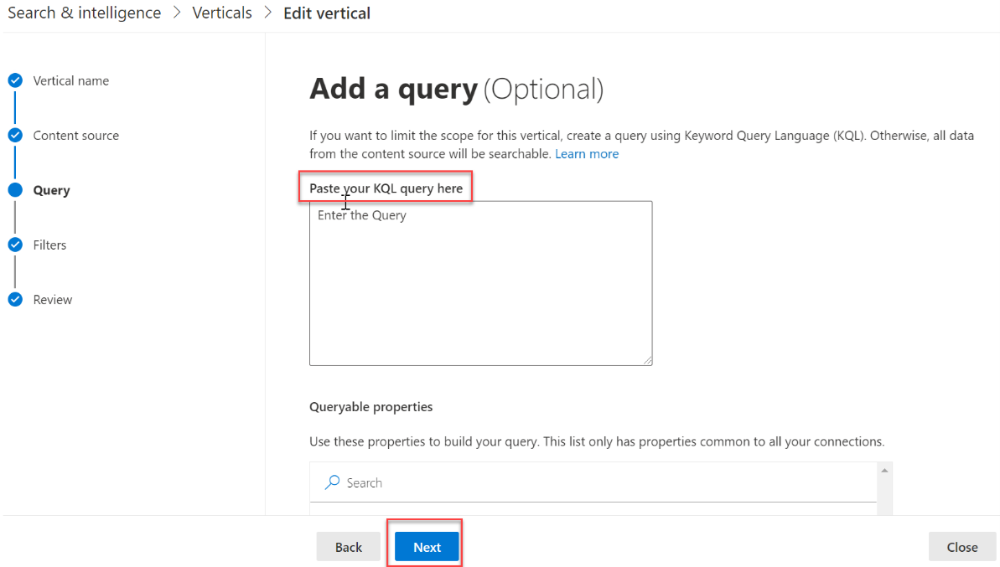
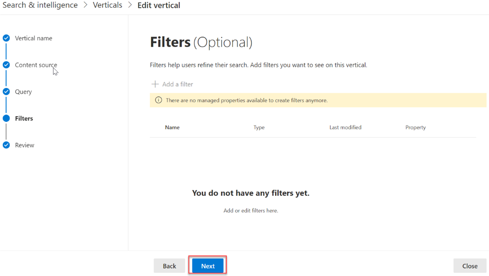
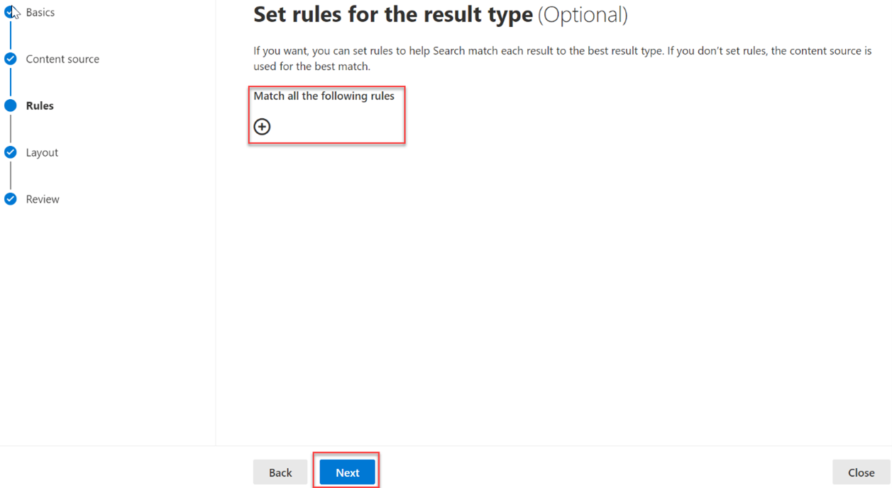

# Surface the data in Microsoft Search

To make it easier for users to find the information that they have permission to see, create search verticals and result types to customize the search results in Microsoft SharePoint, Microsoft Office, and Microsoft Search in Bing.

To create and enable a search vertical at the organization level, sign in to the [Microsoft 365 admin center](https://admin.microsoft.com/) by using the global administrator role, and do the following:

1. Go to **Settings** > **Search & intelligence** > **Customizations**.
2. Go to **Vertical**, and then select **Add**.
3. Provide the following details:
   * **Name the vertical:** Appliance Parts.

     

   * **Content source**: The connector created with the app (Parts Inventory).

     

   * **Add a query**: Leave blank.

     

   * **Filters**: Leave blank.

     

## Create a result type

To create a result type:

1. Go to **Settings** > **Search & intelligence** > **Customizations**.
2. Go to the **Result type** tab, and then select **Add**.
3. Provide the following details:
   * **Name**: Appliance Part

     

   * **Content source**: The connector created in the app.

     

   * **Rules**: None

     

   * Paste contents of [result-type.json](https://github.com/microsoftgraph/msgraph-connectors-sdk/blob/main/C%23%20sample/ResultType.json) into the layout designer textbox.

     

## Search for results

In this step, you'll search for parts in SharePoint.

1. Go to the root SharePoint site for your tenant.
2. Using the search box at the top of the page, search for **hinge**.

   

3. When the search completes with 0 results, select the **Appliance Parts** tab. Results from the connector are displayed.

   

## Summary

You've successfully completed the custom Microsoft Graph connector tutorial. Now you've created a custom connector and used it to power Microsoft Search.

## See also

* [Best practices to follow while developing your connector](/graph/custom-connector-sdk-best-practices)

* [Troubleshooting issues with your connector](/graph/custom-connector-sdk-troubleshooting)
