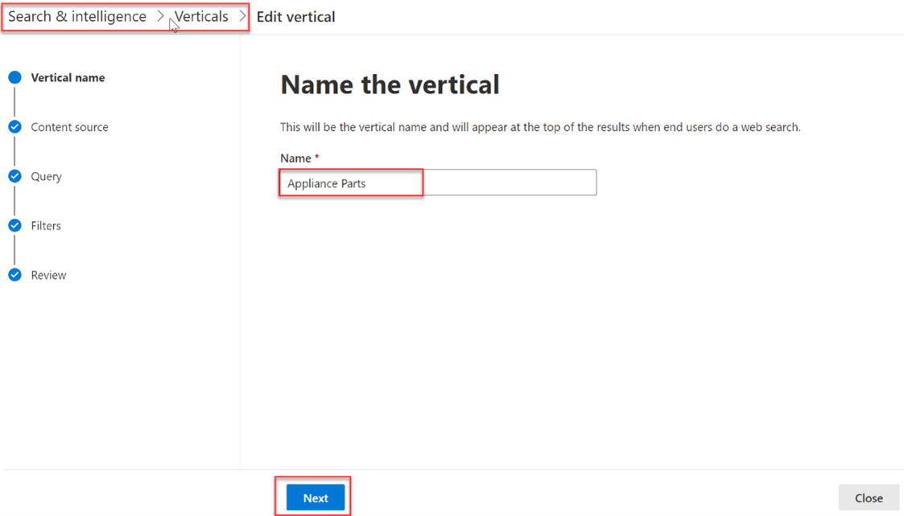
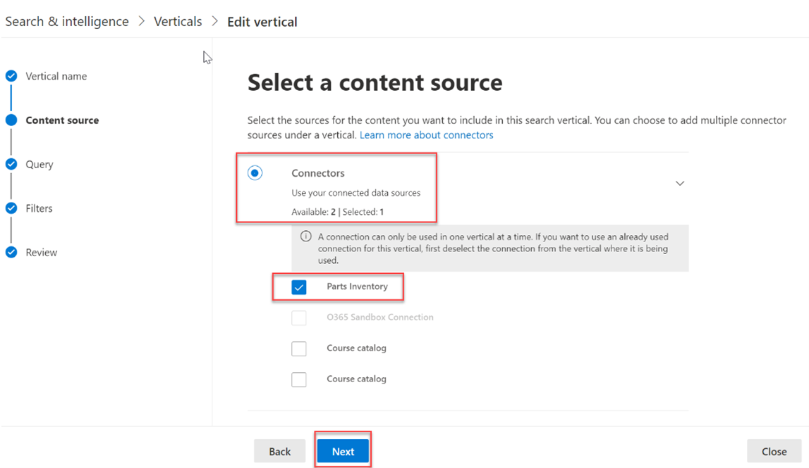
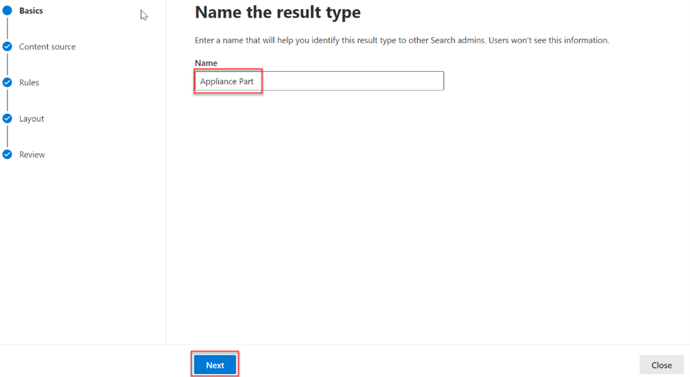
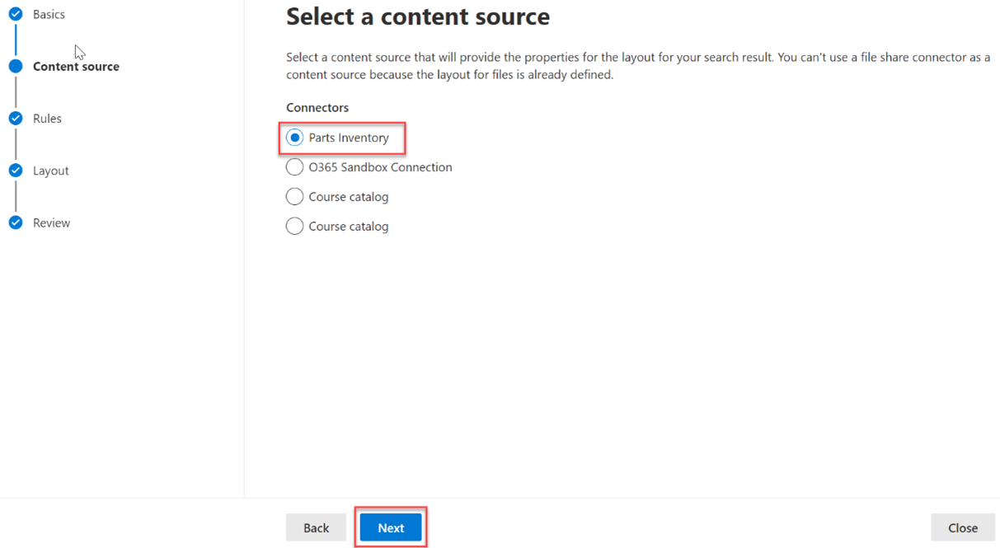
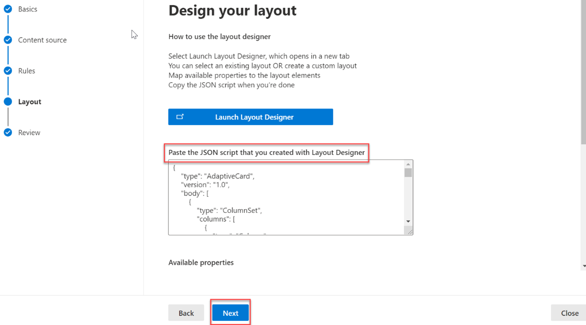
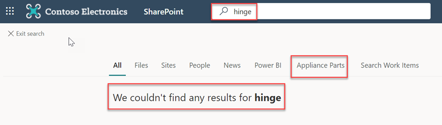

# Surface the data in Microsoft Search

To make it easier for users to find information that they have permission to see, you can create search verticals and result types to customize the search results in Microsoft SharePoint, Microsoft Office, and Microsoft Search in Bing.

To create and enable a search vertical at the organization level, sign in to the [Microsoft 365 admin center](https://admin.microsoft.com/) by using the global administrator role, and do the following:

1. Go to **Settings** > **Search & intelligence** > **Customizations**.
2. Go to **Vertical**, and then select **Add**.
3. Provide the following details:
   * **Name the vertical:** Appliance Parts.

     

   * **Content source**: The custom connector created with the sample code (Parts Inventory).

     

   * **Add a query**: Leave blank.

   * **Filters**: Leave blank.

## Create a result type

To create a result type:

1. Go to **Settings** > **Search & intelligence** > **Customizations**.
2. Go to the **Result type** tab, and then select **Add**.
3. Provide the following details:
   * **Name**: Appliance Part

     

   * **Content source**: The custom connector created with the sample code.

     

   * **Rules**: None

   * Paste contents of [result-type.json](https://github.com/microsoftgraph/msgraph-connectors-sdk/blob/main/C%23%20sample/ResultType.json) into the layout designer textbox.

     

## Test the results in a search

In this step, you'll verify that you've successfully added your data to Microsoft Graph by searching for parts in SharePoint. To verify your data:

1. Go to the root SharePoint site for your tenant.
2. Using the search box at the top of the page, search for **hinge**.

   

3. When the search completes with 0 results, select the **Appliance Parts** tab. Results from the connector are displayed.

   

## See also

* [Best practices](/graph/custom-connector-sdk-best-practices)
* [Troubleshooting issues](/graph/custom-connector-sdk-troubleshooting)
