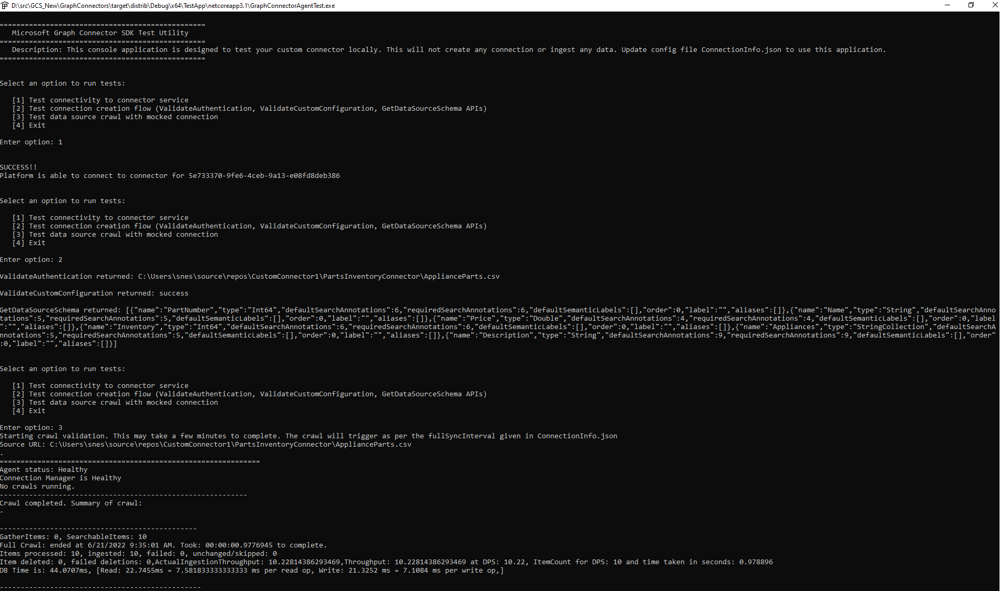

# Test the Microsoft Graph connector

The connector can be tested using the [TestApp utility](/graph/custom-connector-sdk-testapp). This is a console application for testing the connector before taking it to production. It will not create any connections or ingest any data.

1. Update the ConnectionInfo.json file with the connector id, data source path and set AuthenticationKind as null. This file is found under C:\Program Files\Graph connector agent\TestApp\Config

    a. The provider id is generated uniquely for each project and can be found in the ConnectorInfoServiceImpl.cs file
    

    b. The datasource path is the path where you downloaded the ApplianceParts.csv file.

    c. AuthenticationKind can be set to null as the connector is using anonymous auth

    ```json
    {
      // All these configs are only required to test locally
      "id": "TestGrpcConnector", // ConnectionId. Must be unique for a tenant. Change this for each crawlTest
      "name": "TestGrpcConnector", // name of connection
      "description": "\<Connection description>",
      "configuration": {
        "providerId": "a1c127ed-29ce-47fb-ad4a-8836871922ea", //Enter your ConnectorUniqueId
        "scheduleSetting": {
          "fullSyncInterval": 30 // the value is in seconds. Decrease this to run consecutive tests on the same connectionId
        },
        "CredentialData": {
          "Path": "D:\\ApplianceParts.csv",
          "AuthenticationKind": "Anonymous", // Authentication kind which connector supports eg: basic, windows, anonymous
          "CredentialDetails": null
    
        },
        "ProviderParameters": null // This parameter will have the data/configuration given during connection creation time. Will be present in JSON serialized format
      }
    }

    ```

2. Update CustomConnectorPortMap.json file with the port mapping of the connector. This file is found under C:\Program Files\Graph connector agent. Update this file with an entry for the connector id (obtained in step above from ConnectorInfoServiceImpl.cs file) and the port which is defined under ConnectorServer.cs file


    ```json
    {
      "a1c127ed-29ce-47fb-ad4a-8836871922ea": "30303" //Update your ConnectorUniqueId and Port information
    }

    ```

3. Run the GraphConnectorAgentTest.exe present in C:\Program Files\Graph connector agent\TestApp

4. Make sure the connector is running

5. Test the connector using options 1, 2 and 3 from the GraphConnectorAgentTest.exe



## Next steps

* [Deploy your connector](/graph/custom-connector-sdk-sample-hosting)
