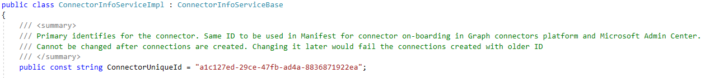
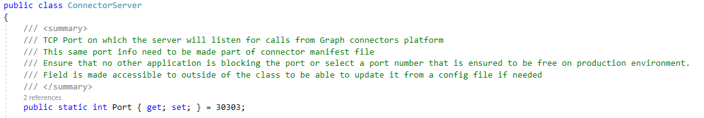

# Test your Microsoft Graph connector

You can use the [TestApp utility](/graph/custom-connector-sdk-testapp) to test your Microsoft Graph connector. This is a console application that is used to test connector before deployment. It will not create any connections or ingest any data.

Use the following steps to test your connector:

1. Update the ConnectionInfo.json file with the connector ID and data source path, and set **AuthenticationKind** to `null`. This file is located in the following folder: C:\Program Files\Graph connector agent\TestApp\Config.

    a. The provider ID is generated for each project and is located in the ConnectorInfoServiceImpl.cs file.
    
    

    b. The datasource path is the path where you downloaded the ApplianceParts.csv file.

    c. You can set **AuthenticationKind** to `null` because the connector is using anonymous auth.

    ```json
    {
      // All these configs are only required to test locally
      "id": "TestGrpcConnector", // ConnectionId. Must be unique for a tenant. Change this for each crawlTest
      "name": "TestGrpcConnector", // name of connection
      "description": "\<Connection description>",
      "configuration": {
        "providerId": "a1c127ed-29ce-47fb-ad4a-8836871922ea", //Enter your ConnectorUniqueId
        "scheduleSetting": {
          "fullSyncInterval": 30 // the value is in seconds. Decrease this to run consecutive tests on the same connectionId
        },
        "CredentialData": {
          "Path": "D:\\ApplianceParts.csv",
          "AuthenticationKind": "Anonymous", // Authentication kind which connector supports eg: basic, windows, anonymous
          "CredentialDetails": null
    
        },
        "ProviderParameters": null // This parameter will have the data/configuration given during connection creation time. Will be present in JSON serialized format
      }
    }

    ```

2. Update the CustomConnectorPortMap.json file with the port mapping of the connector. This file located in the following folder C:\Program Files\Graph connector agent. Update this file with an entry for the connector ID (which you identified in the ConnectorInfoServiceImpl.cs file in the previous step) and the port, which is defined in the ConnectorServer.cs file.



    ```json
    {
      "a1c127ed-29ce-47fb-ad4a-8836871922ea": "30303" //Update your ConnectorUniqueId and Port information
    }

    ```

3. Run GraphConnectorAgentTest.exe, which is located in the C:\Program Files\Graph connector agent\TestApp folder.

4. Make sure the connector is running.

5. Test the connector using options 1, 2, and 3 in GraphConnectorAgentTest.exe.

## Next steps

* [Deploy your connector](/graph/custom-connector-sdk-sample-hosting)
