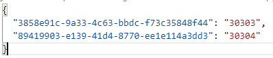
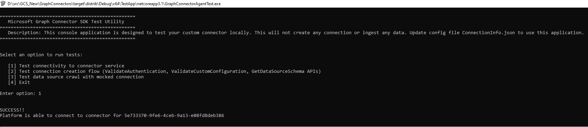
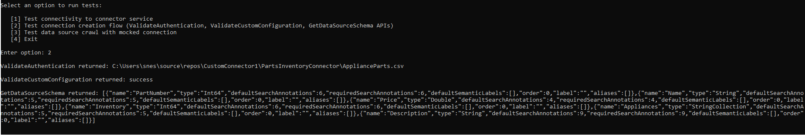
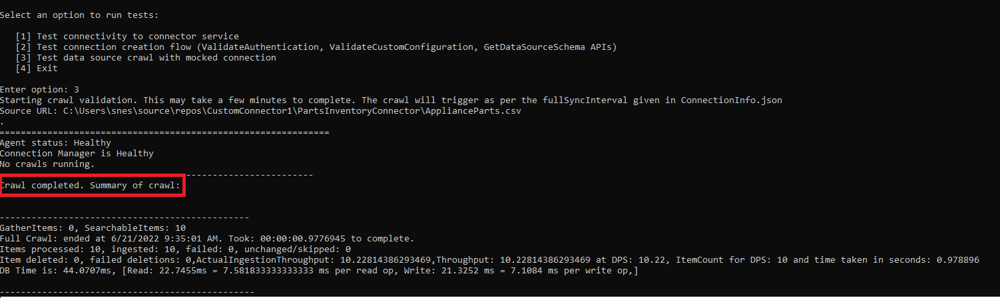

# Microsoft Graph connectors SDK (preview) test application

The GraphConnectorAgentTest executable file is a test utility for the custom connector. It doesn't create connections or add data into the Microsoft index. The test utility runs on the computer where you installed the agent and doesn't connect to external resources except for the data source that is part of the test.
You can find the test application in the TestApp folder in your Microsoft Graph connector agent installation folder.

Update the following configuration files to use this test utility:

- **ConnectionInfo.json**: This file contains all the information about the connection - the connector ID that identifies the custom connector for which this connection is being created, the data source URL, credentials to access the data source, the schema associated with the connection, and extra parameters for the connection. This configuration file is in the Config folder of the test application.
- **CustomConnectorPortMap.json**: After you create the custom connector, add the mapping of the connector ID and the port it's running on to this file. This file is in the Microsoft Graph connector agent installation folder.

  

  >[!Note]
  >You can add multiple connector IDs and their corresponding port information to this file using the \<Connector Id>:\<Port> format. Each unique connector should be running on a different port.

## Test scenarios

The test utility has three options:

- **Test connectivity to the connector service**: Verifies that the test utility can connect to the connector specified in ConnectionInfo.json over the port specified for that connector ID in CustomConnectorPortMap.json.

- **Test connection creation flow** (ValidateAuthentication, ValidateCustomConfiguration, GetDataSourceSchema APIs): Validates the methods specified in ConnectionManagementService. It invokes each of the methods and displays the results on the console.

- **Test data source crawl with simulated connection**: Tests the methods in ConnectorCrawlerService. It invokes the crawl with the schedule specified in ConnectionInfo.json and prints the status of the ongoing or last completed crawl every minute. When the first crawl finishes successfully, it displays the message that the crawl has completed, and the platform keeps running to trigger additional crawls at the interval specified in ConnectionInfo.json. If you specify an incremental crawl frequency in the ConnectionInfo.json file, it triggers the incremental crawl after the first full crawl.

To stop the utility from crawling the data source, close and restart the GraphConnectorAgentTest executable file. You can then choose a different test option, or retest an option after you update the connector code or the configuration files.

## How does the GraphConnectorAgentTest executable file work?

When you open the GraphConnectorAgentTest executable file, it reads the ConnectionInfo.json configuration file. After you select one of the test options, it will try to connect to the specified connector over the port indicated in the CustomConnectorPortMap configuration file. After it connects, the platform calls the relevant methods.

When you test the connection creation flow or the data source crawl, specify the credentials to access the data source in the ConnectionInfo.json configuration file. The platform reads the credentials and passes them to the connector to access the data source. As long as no one else has access to the ConnectionInfo.json configuration file, the credentials are secure.

## See also

* [Best practices](/graph/custom-connector-sdk-best-practices)
* [Troubleshooting](/graph/custom-connector-sdk-troubleshooting)
