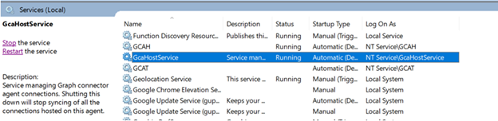
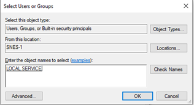
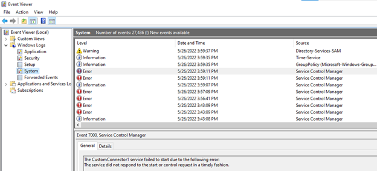

# Troubleshoot issues with the Microsoft Graph connectors SDK

This article describes some of the most common issues with the Microsoft Graph connectors SDK, and how to troubleshoot them.

## Items missing from the index

If items that previously existed are missing from the index, this might be due to the delete detection logic in the platform. Items missing from a success response in [OperationStatus](/graph/custom-connector-sdk-contracts-common#operationstatus) that are already in the index will be removed from the index.

If the connector sends transient failure responses, and more than 10% of the items resulted in crawl failures, items that aren't included in the last two crawls will be deleted.

## Handle connector port changes

When the connector needs to run on a different port, you need to update the port map configuration file with the new values. When you edit the port map configuration file, you must restart the GCA service for the changes to take effect. To restart the service, open services.msc and restart **GcaHostService**.



## Connection failure after GCA upgrade

If you notice connection failures after upgrading from a GCA version 1.8.0.0 or lower, follow the following steps:

1. Open the GCA Control panel. In **Programs and features**, select **Graph connector agent** from the list of programs, and choose **Repair**.
2. Update the new port map file configuration with the previous configurations.
3. Resume any failed connections from Microsoft 365 admin center.

## Connector service is unavailable

If the crawls are failing with a connector unavailable on specified port error, verify the following:  

1. The connector is indeed running on the specified port and hasn't crashed and isn't stuck.
2. The port specified in the port map configuration file is correct.
3. If the port map configuration file has been edited, be sure to restart **GcaHostService**.

## Handle RPC errors

If you see any RPC errors during the communication between the Microsoft Graph connector agent platform and the connector, you can look up the error codes on the [status codes](https://grpc.github.io/grpc/core/md_doc_statuscodes.html) page.

If the error code is **Unknown**, there's likely an unhandled exception in your connector code. Make sure that you send a response with success/failure operation status in all cases.

## Locating the log file for your custom connector

If you're using the [GraphConnectorsTemplate](https://marketplace.visualstudio.com/items?itemName=ms-graph-connectors.graphConnectors) to develop your custom connector, the **AppData** folder of the current user account is used to store logs by default. You can also provide an absolute path for storing logs in the **ConnectorServer.cs** file of the template. The user account should have access to the absolute path you've provided.

The following are the locations of the log path, depending on your use case:

- Connector not hosted as a Windows service:

    ``` Path
    C:\Users\{User Account}\AppData\Local\Microsoft\{Connector Name}\Logs\ConnectorLog.log
    ```

- Connector hosted as a Windows service under the LOCAL SYSTEM account:

    ``` Path
    C:\Windows\system32\config\systemprofile\AppData\Local\Microsoft\{Connector Name}\Logs\ConnectorLog.log
    ```

- Connector hosted as a Windows service under the virtual account:

    ``` Path
    C:\Windows\ServiceProfiles\{Network Service Name}\AppData\Local\Microsoft\{Connector Name}\Logs\ConnectorLog.log
    ```

- Connector hosted as a Windows service under the LOCAL SYSTEM account:

    ``` Path
    C:\Windows\ServiceProfiles\LocalService\AppData\Local\Microsoft\{Connector Name}\Logs\ConnectorLog.log
    ```

>[!Note]
>- **GraphConnectorsTemplate v2.1** and above supports storing logs for connectors hosted as a Windows service.
>- Make sure you provide a unique connector name in the **ConnectorServer.cs** file to ensure that logs for each unique connector are stored separately.

## Errors with hosting a connector as a Windows service

### Service failed to start due to access denied error

Use the following steps to make sure that the path of the executable is accessible to the LocalService account.

1. Right-click the folder that contains the executable and choose **Properties**.

2. Open the **Security** tab and under **Group or user names**, choose **Edit**.

3. Choose **Add**.

4. Enter 'LOCAL SERVICE' as the object name and choose **Check Names**.

    

5. Choose **OK** on each dialog box.

### Service fails to start with any error

If the service fails to start, check the event viewer error logs. Open the event viewer and go to **Windows logs > Application** and **Windows logs > System**.



## More help

If you need more help troubleshooting an issue, you can raise an [issue](https://github.com/microsoftgraph/msgraph-connectors-sdk/issues) or start a [discussion](https://github.com/microsoftgraph/msgraph-connectors-sdk/discussions) on relevant topics through our GitHub repository.

You can also reach out to the [Microsoft Graph Connectors team](mailto:MicrosoftGraphConnectorsFeedback@service.microsoft.com) for more help and troubleshooting.

## See also

- [Best practices](/graph/custom-connector-sdk-best-practices)
