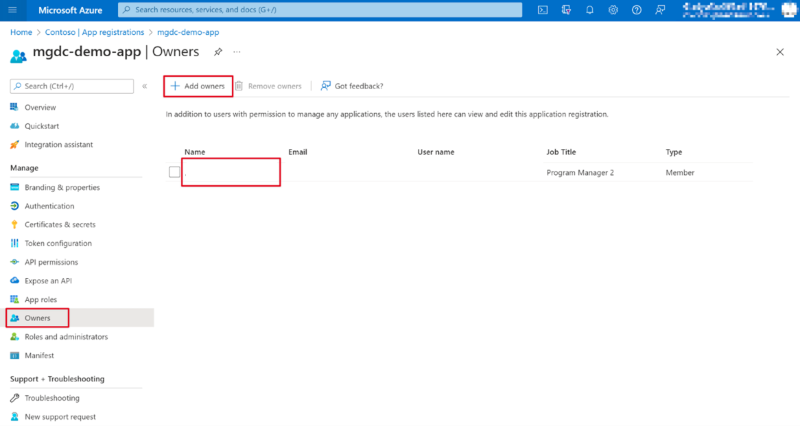

# Build your first Microsoft Graph Data Connect application

<!-- cSpell:ignore rimisra mgdc mgdcdemoap mgdcdemoapp tostorage synapsedatalstorage flsynapse mgdcm influencers -->

Microsoft Graph Data Connect (Data Connect) augments transactional APIs with an intelligent way to access rich data at scale. Data Connect is ideal for big data applications and machine learning as it allows you to develop applications for analytics, intelligence, and business process optimization by extending Microsoft 365 data into Microsoft Azure. Through this offering, you'll be able to take advantage of the vast suite of compute and storage in Azure while staying compliant with industry standards and keeping your data secure.

Data Connect uses Microsoft Fabric, Azure Synapse, or Azure Data Factory to copy Microsoft 365 data to your application's storage at configurable intervals. It also provides a set of tools to streamline the delivery of this data to Azure, letting you access the most applicable development and hosting tools available.

Data Connect also grants a more granular control and consent model: you can manage data, see who is accessing it, and request specific properties of an entity. This enhances the Microsoft Graph model, which grants or denies applications access to entire entities.

Additionally, you can use Data Connect to enable machine learning scenarios for your organization. In these scenarios, you can create applications that provide valuable information to your stakeholders, train machine learning models, and even perform forecasting based on large amounts of acquired data.

## Get started

In this tutorial, you'll create your first single-tenant Data Connect application. The following general flow explains the Data Connect onboarding process.

1. **Admin enables Data Connect:** The first step in onboarding is for your global administrator to [enable Data Connect](https://admin.microsoft.com/adminportal/home#/Settings/Services/:/Settings/L1/O365DataPlan).

2. **Developer creates a new Microsoft Entra application:** The developer needs to first create a new Microsoft Entra application.

3. **Developer registers the application with Data Connect:** Once the Microsoft Entra application is created, the developer needs to register the application with Data Connect using the new registration portal for [Microsoft Graph Data Connect applications](https://aka.ms/mgdcinazure). In this step, the developer specifies what data they require for their application.

4. **Admin approves the application:** After the developer has registered their application with Data Connect, the global administrator can use the new portal for [Data Connect application consent](https://admin.microsoft.com/adminportal/home#/Settings/MGDCAdminCenter) to review the registered application and approve it.

5. **Developer runs their pipelines:** After the administrator has consented to the application, the developer might run their pipelines without any stalling for runtime consent. The pipeline creation and run via Azure Data Factory or Azure Synapse remains the same.

> [!NOTE]
> If you're working in a new tenant that doesn't have Data Connect enabled, you don't need to take any action. If you have an existing tenant that already has Microsoft Graph Data Connect enabled, before you complete this tutorial, ask your global administrator to toggle Microsoft Graph Data Connect off and then on again in the [admin portal](https://admin.microsoft.com/adminportal/home#/Settings/Services/:/Settings/L1/O365DataPlan).

### Prerequisites

To complete this tutorial, you need the following subscriptions or licenses.

- For this tutorial, we strongly recommend that you use a Microsoft 365 developer tenant.
- Your Microsoft 365 and Azure tenants must be in the same Microsoft Entra tenancy.
- The Azure subscription must be in the same tenant as the Microsoft 365 tenant.
- One user in your Microsoft 365 tenant has the [Global Administrator](/entra/identity/role-based-access-control/permissions-reference#global-administrator) role enabled. Going forward, this tutorial refers to this user as the "admin". Only an "admin" user can approve the test application.
- A different user in your Microsoft 365 tenant with [Application Administrator](/entra/identity/role-based-access-control/permissions-reference#application-administrator) or [Application Developer](/entra/identity/role-based-access-control/permissions-reference#application-developer) role. Going forward, this tutorial refers to this user as the "developer". The developer user does the majority of this tutorial.

1. **Microsoft 365 tenancy**

   - If you don't have a Microsoft 365 tenant, you might qualify for one through the [Microsoft 365 Developer Program](https://developer.microsoft.com/microsoft-365/dev-program); for details, see the [FAQ](/office/developer-program/microsoft-365-developer-program-faq#who-qualifies-for-a-microsoft-365-e5-developer-subscription-). Alternatively, you can [sign up for a 1-month free trial or purchase a Microsoft 365 plan](https://www.microsoft.com/microsoft-365/try).

   > [!NOTE]
   > You can't approve your own test application using the same account. Make sure that you have another member (or account) in your tenant that acts as an admin.

1. **Microsoft Azure subscription**

   - If you don't have a Microsoft Azure subscription, visit the following link to get one (for free): [Create your Azure Free Account](https://azure.microsoft.com/pricing/purchase-options/azure-account?cid=msft_learn).
   - Your Azure subscription must be in the same tenant as your Microsoft 365 tenant and both must be in the same Microsoft Entra tenancy.
   - If your Azure subscription isn't in the same tenant as your Microsoft 365 tenant, you can associate your subscription with Microsoft Entra ID in your Microsoft 365 tenant by following the steps listed in [Associate or add an Azure subscription to your Microsoft Entra tenant](/azure/active-directory/fundamentals/active-directory-how-subscriptions-associated-directory).

   > [!NOTE]
   > The screenshots and examples used in this tutorial are from a Microsoft 365 developer tenant with a sample email from test users. You can use your own Microsoft 365 tenant to perform the same steps. No data is written to Microsoft 365. A copy of email data is extracted from all users in a Microsoft 365 tenant and copied to an Azure Blob Storage account. You maintain control over who has access to the data within the Azure Blob Storage.

## Set up your Microsoft 365 tenant and enable Microsoft Graph Data Connect

Before you use Microsoft Graph Data Connect (Data Connect) for the first time, please work with your Microsoft 365 tenant admin to enable the Data Connect service for your tenant.

For this tutorial, please ensure that you have an account with admin privileges available. You must complete this step to set up your first pipeline. We recommend having at least two users in your Microsoft 365 tenant with the **global administrator** role enabled.

- [Global Administrator built-in role](/entra/identity/role-based-access-control/permissions-reference#global-administrator).
- [Elevate access to gain the Global Administrator role](/azure/role-based-access-control/elevate-access-global-admin).

### Enable Microsoft Graph Data Connect in your Microsoft 365 tenant

Set up your Microsoft 365 tenant to enable the usage of Microsoft Graph Data Connect.

1. Open a browser, go to your [Microsoft 365 admin portal](https://admin.microsoft.com/), and sign in with your **admin** user.

1. Select **Settings > Org settings**. You might have to choose **Show all** before you're able to view **Settings**.

1. In the **Services** tab (which should be the default selection), select **Microsoft Graph Data Connect**.

1. Select the checkbox to **Turn Microsoft Graph Data Connect on or off for your entire organization** and choose **Save**.

    

Congratulations, you just enabled Microsoft Graph Data Connect for your organization!

## Set up your Microsoft Entra application

In this exercise, you learn how to create a Microsoft Entra application. This serves as the security principal to run the data extraction process with Microsoft Graph Data Connect.

1. Sign in to the [Microsoft Entra admin center](https://entra.microsoft.com) with at least the *Application Administrator* or*Application Developer* role.

1. Expand the **Identity** menu > select **Applications** > **App registrations** > **New registration**.

1. Use the following values to create a new Microsoft Entra application and select **Register**.

   - **Name**: Microsoft Graph Data Connect Data Transfer (provide the name of your choice).
   - **Supported account types**: Accounts in this organizational directory only.
   - **Redirect URI**: Leave the default values.

    

1. Locate the **Application (client) ID** and copy it as you need it later in this tutorial. Going forward, this is referred to as the service principal ID.

1. Locate the **Directory (tenant) ID** and copy it as you need it later in this tutorial. Going forward, this is referred to as the tenant ID.

    

1. On the left navigation pane, select **Certificates & secrets** under **Manage**.

1. Select the **New client secret** button. Set *Description* to any name, set *Expires* to any value in the dropdown, and choose **Add**.

    

    - After the client secret is created, make sure you save the **Value** somewhere safe, as it will no longer be available later; otherwise, you'll need to create a new one.
    - Going forward, the client secret is referred as the service principal key.

1. On the left navigation pane for the application, select **Owners**.

1. Ensure that your account (if you're using a developer tenant use the Global admin account) meets the following requirements to be an application owner:

    - Your user account corresponds to a valid user in the tenant who isn't a service principal name.
    - Your account must have an Exchange Online license assigned (must have a mailbox).
    - Alongside the Exchange Online license, your account must also have a working E5 subscription/license.

1. Verify that your account is listed as an application owner. If that isn't the case, add it to the list.

    

## Set up your Azure Storage resource

In this step you will create an Azure Storage account where Microsoft Graph Data Connect will store the data extracted from Microsoft 365 for further processing.

1. Open a browser and go to your [Azure portal](https://portal.azure.com/).

1. Sign in using an account with an **[Application developer](/entra/identity/role-based-access-control/permissions-reference#application-developer)** role to your Azure portal.

1. On the sidebar navigation, select **Create a resource**.

1. Find the **Storage account** resource type and use the following values to configure it. For **Performance**, **Redundancy**, and the **Advanced tab**, the values for these fields are an example.

    - **Subscription**: select your Azure subscription
    - **Resource group**: mgdc-app-resource (or select an existing resource group)
    - **Storage account name**: mgdcdemoap (or you can name and select your own storage account)
    - **Region**: [pick an Azure region in the same region as your Microsoft 365 region](/graph/data-connect-datasets#regions)
    - **Performance**: Standard
    - **Redundancy**: Geo-redundant storage
    - **Advanced tab**:
      - **Access tier**: Hot

    

1. After configuring the values for the **Basics** and **Advanced** tabs, leave the rest of the settings as default.

    > [!NOTE]
    > Ensure that within the **Networking** tab, the **Enable public access from all networks** is enabled. You can also select the second option **Enable public access from selected virtual networks and IP addresses**; however, additional steps outside of this tutorial need to be performed, which are highlighted in the [IP addresses section](../concepts/data-connect-troubleshooting.md#issues-adding-network-ip-address-to-allow-list-with-azure-integration-runtime).

    

1. Review that the settings match those shown in the previous steps and select **Create** to finalize.

1. After the Azure Storage account has been created, grant the Microsoft Entra application previously created the proper access to it.

    1. Select the **Azure Storage account**.
    1. On the sidebar menu, select **Access control (IAM)**.
    1. Select the **Add** button in the **Add a role assignment** block.
    1. Grant the **Storage Blob Data Contributor** role to the application you previously created.
        1. Select *Storage Blob Data Contributor* as the **Role**, and click **Next**.
        1. **Assign access to** *User, group or service principal*.
        1. Click **+ Select members**, and in the right pane that displays, search for the application (Microsoft Graph data connect Data Transfer) that you previously created, and click **Select**.
    1. Select **Review + assign**.

    

1. Create a new container in the **mgdcdemoap** Azure Storage account.

    1. Select the **mgdcdemoapp** Azure Storage account (or your account name from step 4).
    1. On the sidebar menu, select **Containers** under the **Data storage** service section.
    1. Select the **+Container** button at the top of the page and use the following values and then select **Create**.

        - **Name**: m365mails
        - **Public access level**: Private (no anonymous access)

        

## Register your Microsoft Entra application with Microsoft Graph Data Connect

As a prerequisite, you should enable Data Connect in your tenant. We recommend that you create a Microsoft Entra application and a storage destination resource; you can also set these up by using the wizard. The app registration process in Data Connect involves using a wizard with three tabs: Registration info, Datasets, and Review + create.

1. Access [Microsoft Graph Data Connect in the Azure portal](https://aka.ms/mgdcinazure). You can find it through the search bar in the [Azure portal](https://portal.azure.com/)

1. Choose **Add** or **Add a new application**.

    

1. Follow the **Add** wizard to provide the project details for registration. After you have completed the required fields, choose **Next: Datasets >**

    1. **Subscription:** Select a subscription to filter the next selections:
        - **Resource Group:**  Select the resource group you created previously.
        - **Destination Type:** Select Azure storage account.
        - **Storage Account:** Select the storage account you created previously.
        - **Storage Account Uri:** Select the option with **.blob.core.windows.net**
    1. **Application ID:** Select an existing Microsoft Entra tenant or create a new one.
    1. **Description:** Type **My first app**.
    1. **Publish Type:** **Single-Tenant** should be automatically chosen based on your Microsoft Entra app.

    

1. Select **Next : Datasets >**.

1. Select `BasicDataSet_v0.Message_v1` from the **Dataset** dropdown, and in the **Columns** dropdown, choose `All`. In the new row, select `BasicDataSet_v1` from the **Dataset** dropdown, and in the **Columns** dropdown, choose `All`.

    

1. Choose **Review + Create**, and then **Create**.

    

1. If all required fields are provided, the app registration appears in the landing page.

    

### Approve your application for Microsoft Graph Data Connect

1. Open a new browser window in private mode, go to your [Microsoft 365 admin center](https://admin.microsoft.com/), and sign in with your **admin** user.

 > [!NOTE]
 > If you are not in your **admin** account, there will be an error with the approval. You cannot self-approve your apps.

1. On the left navigation pane, select **Settings > Org settings**. You might have to choose **Show all** before you can view **Settings**.

1. Switch to the **Security & privacy** tab and select **Microsoft Graph Data Connect applications**.

    

1. In the Microsoft Graph Data Connect applications portal,  find the application you registered previously with Data Connect. It should have a **Pre-consent** status in the application summary table.

    

1. Select your application to open the application details view. Proceed through the wizard by choosing **Next** twice to review the two datasets.

1. On the final step, choose **Approve** to consent to your registered application accessing the specified data.

    

1. **Approve** the application summary table reloads with your app listed with the status **Approved**.

    

## Set up your Azure resource with Azure Synapse or Azure Data Factory

This exercise describes how to set up your Azure resources and connect Microsoft Graph Data Connect (Data Connect) to it. In this step, you can either choose Azure Synapse, Azure Data Factory, or Microsoft Fabric to create a pipeline to extract the data from Microsoft 365 to the Azure Storage account using Data Connect.

### Setting up your Azure resources

#### [Create an Azure Synapse Pipeline](#tab/AzureSynapsePipeline)

1. Open a browser and go to your [Azure portal](https://portal.azure.com/#home).

1. Sign in to the portal using an account with an [Application Administrator](/entra/identity/role-based-access-control/permissions-reference#application-administrator) or [Application Developer](/entra/identity/role-based-access-control/permissions-reference#application-developer) role. Ensure that you're signed-in with your developer account that has privileges to create Azure resources within your subscription.

1. On the left pane, select **Create a resource**.

1. Find the **Azure Synapse Analytics** resource type, input the following values, and select **Create**.
    - **Subscription:** Select your Azure subscription.
    - **Resource group:** Select the resource group you created previously, **mgdc-app-resource**.
    - **Region:** [Select an Azure region in the same region as your Microsoft 365 tenant](/graph/data-connect-datasets#regions).
    - **Workspace name:** m365tostorage
    - **Account name:** synapsedatalstorage
    - **File system name:** flsynapse

        

        

1. Select **Go to resource**, open the synapse workspace you've just created (for example, **m365tostorage**), and then select the **Open Synapse Studio** tile to launch the Azure Synapse workspace full-screen editor.

    

1. By default, Azure Synapse Analytics uses an integration runtime that automatically resolves the region. In this tutorial, we recommend using the default auto-resolve option in the developer tenant.

    1. Switch to **Manage (toolbox icon) > Integration runtimes > New**.

    1. Select **Azure, Self-Hosted**, and choose **Continue**.

        
    1. For the network environment, select **Azure**, and then choose **Continue**.

        

    1. Use the following details to complete the form on the final screen and then choose **Create**.
        - **Name**: Name of your integration runtime.
        - **Region**: Select the region that matches your Microsoft 365 region.

1. On the left pane, select **Integrate (tube icon)**.

1. To create a new pipeline, select the **Plus** icon, and then choose **Pipeline**.

    

    1. In the search box, enter *Copy data* and then drag the **Copy data** activity from the **Move & transform** section onto the design surface.

        

    1. Select the activity in the designer.

    1. Select the **General** tab and give it a name.
        - **Name:** CopyFromM365toStorage

    1. Select the **Source** tab, and then select **New**.

        

    1. Locate and select the dataset **Microsoft 365 (Office 365)**, and then choose **Continue**.

        

    1. Under **Linked service**, choose **Select**, and then choose **+New**.

        

    1. In the dialog box, from the **Connect via integration runtime** dropdown, select the integration runtime you created, enter the **Application ID** and **client secret value** of the Microsoft Entra application in the **Service principal ID** and **Service principal key** fields respectively, and choose **Create**.

        

    1. In the **Table name** field, select **BasicDataSet_v0.Message_v1**, and then choose **OK**.

        

    1. In the **Source** tab, locate the **Date filter** section and use the following values to configure it.
        - **Column name:** CreatedDateTime
        - **Start time (UTC):** Select a date sometime prior to the current date.
        - **End time (UTC):** Select the current date.
        - In the **Output columns** section, select **Import schema**.

            

    1. Select the **Sink** tab. Choose **New**, select **Azure Blob Storage**, and then choose **Continue**.

    

    

    1. For the format for the data, select **Binary**, and then choose **Continue**.
    1. Give the dataset the name **M365JsonFile** and follow the next steps to create a new linked service if it doesn't exist already.

        

        1. Under **Linked service**, choose **Select**, and then choose **+New**.
        1. In the dialog box, set the following values, and then choose **Create**.
            - **Authentication type:** Service Principal
            - **Azure subscription:** Select all.
            - **Storage account name:** mgdcm365datastore. This is the storage account created earlier in this exercise.
            - **Service principal ID:** Enter the ID of the Microsoft Entra application you created.
            - **Service principal key:** Enter the hashed key of the Microsoft Entra application you created.

        

    1. Next to the **File path** field, select **Browse**.

    1. Select the name of the storage container you created previously, choose **OK**, and then choose **OK** again.

        

1. With the pipeline created, at the top of the designer, choose **Validate all**.

1. After validating (and fixing any issues that were found), at the top of the designer, choose **Publish all**.

#### Run the Azure Synapse Analytics pipeline

Now that you've created the pipeline, it's time to run it.

> [!NOTE]
> It can take several minutes for the consent request to appear, and it's not uncommon for the entire process (start, requesting consent, and after approving the consent completing the pipeline run) to take over 40 minutes.

1. In the Azure Synapse Analytics designer, with the pipeline open, select **Add trigger > Trigger Now**, and then choose **OK**.

    

1. After starting the job, from the sidebar menu, select **Monitor** to view the current running jobs.

1. On the left pane, select the **Pipeline runs** tab. In the **Pipeline name** column, select the pipeline to view the **Activity runs**. This pipeline will show as *In Progress*.

    

1. After you're in the **Activity runs** view, go to the *Activity runs* section on the bottom side of the page.

1. Hover over the **Activity name** and select the goggles option. This will open the **Details** tab.

    

1. In the **Details** screen, look for the status of the pipeline activity as highlighted in the following image. The status should progress through Initializing, Consent Pending, Extracting Data, Persisting Data and Succeeded – no further action needed from you for this.

    

1. The request is sent to the global admin to be approved. For the context of this tutorial, we recommend opening another tab with your admin privileges enabled so you can approve the pipeline request.

#### [Create an Azure Data Factory Pipeline](#tab/AzureDataFactoryPipeline)

1. Open a browser and go to your [Azure portal](https://portal.azure.com/).

1. Sign in to the Azure portal with an account that has either the [Application administrator](/entra/identity/role-based-access-control/permissions-reference#application-administrator) or [Application developer](/entra/identity/role-based-access-control/permissions-reference#application-developer) role. Make sure you're using your **developer** account, which has the necessary privileges to create Azure resources within your subscription.

1. On the home page, select **Create a resource**.

1. Find the **Data Factory** resource type and use the following values to create it, then select **Create**.

    - **Subscription**: Select your Azure subscription.
    - **Resource group**:  Select the resource group you created previously.
    - **Region**: [pick an Azure region in the same region as your Microsoft 365 region](/graph/data-connect-datasets#regions)
    - **Name**: dM365toBlobStorage
    - **Version**: V2
    - Select **Review + create**, and then select **Create**.

1. After the Azure Data Factory resource is created, select **Go to resource**, and then select the **Launch studio** button to launch the Azure Data Factory full screen editor.

    

1. Switch from the **Overview** (home icon) to the **Manage** (toolbox icon) experience by selecting it from the left-hand navigation.

1. By default, the Azure Data Factory uses an integration runtime that is auto-resolving the region. We recommend for the context of this tutorial in the developer tenant, to use the default auto-resolve.
    1. Select **Integration runtimes** > **New**.
    2. Select **Azure, Self-Hosted** and select **Continue**.

        

    3. Select **Azure** for network environment and select **Continue**.

        

    4. Use the following details to complete the form on the final screen, and then select **Create**.

        - **Name**: Name of your integration runtime.
        - **Region**: Select the region that matches your Microsoft 365 region.
        - **Virtual network configuration (preview)**: Disabled

1. Switch from the **Manage** (toolbox icon) to the **Author** (pencil icon) experience by selecting it from the left-hand navigation.
1. Create a new pipeline by selecting the **plus** icon, then **pipeline**.

    

    1. In the search box, enter *Copy data* and then drag the **Copy data** activity from the **Move & transform** section onto the design surface.

        

    1. Select the activity in the designer.
    1. Select the **General** tab and give it a name.
        - **Name**: CopyFromM365toBlobStorage

    1. In the activity editor pane under the designer, select the **Source** tab, and then select **New**.

          

    1. Locate and select the dataset **Microsoft 365 (Office 365)**, and then select **Continue**.

        

    1. In the **Set properties** pane, click the **Linked service** dropdown, and then select **New**.

        

    1. In the dialog that appears, select the integration runtime you previously created in the **Connect via integration runtime** dropdown.
    1. Enter the previously created **Application ID** and **Client Secret Value** of the Microsoft Entra application in the **Service principal ID** and **Service principal key** fields respectively.
    1. Then click **Create**.

        

    1. After creating the Microsoft 365 connection, for the **Table name** field, select **BasicDataSet_v0.Message_v1**, and then select **OK**.

        

    1. In the **Source** tab, locate the **Date filter** section and use the following values to configure it.
        - **Column name**: CreatedDateTime
        - **Start time (UTC)**: Select a date sometime prior to the current date.
        - **End time (UTC)**: Select the current date.
        - Select **Import schema** in the *Output columns* section.

    1. Select the **Sink** tab.

        

        1. Click the **New** button, select **Azure Blob Storage**, and then select the **Continue** button.
        1. Select **Binary** as the format for the data, and then select the **Continue** button.

        1. In the **Set properties** pane, change the **Name** field to **M365JsonFile**
        1. Click **Select** under **Linked service**, and then click **+New**.
        1. Set the following values in the dialog, then select **Create**.

            - **Authentication type**: Service Principal
            - **Azure subscription**: Select all
            - **Storage account name**: Select the storage account you previously created
            - **Tenant**: Enter the ID of your Azure tenant
            - **Service principal ID**: Enter the ID of the Microsoft Entra application you previously created
            - **Service principal key**: Enter the client secret value of the Microsoft Entra application you previously created
        1. Click **Create**

    1. In the Set **properties** pane, next to the **File path** field, click the folder icon to Browse.
    1. Select the **m365mails** storage container you created previously, choose **OK**, and choose **OK** again.

      

1. With the pipeline created, select the **Validate all** button at the top of the designer.

      

1. After validating (and fixing any issues that were found), select the **Publish all** button at the top of the designer.

      

#### Run the Azure Data Factory pipeline

With the pipeline created, now it is time to run it.

> [!NOTE]
> It can take several minutes for the consent request to appear and it is not uncommon for the entire process (start, requesting consent and after approving the consent completing the pipeline run) to take over 40 minutes.

1. In the Azure Data Factory designer, with the pipeline open, select **Add trigger > Trigger Now** and then select **OK**.

    

1. After starting the job, from the sidebar menu, select **Monitor** to view current running jobs.

1. On the left-side navigation bar, locate the **Pipeline runs** tab and select it. Select the pipeline under the **Pipeline name** column to view the **Activity runs**. This pipeline will show as *In progress*.

    

1. After you're in the **Activity runs** view, go to the *Activity runs* section that is located in the bottom side of the page.

1. Hover over the **Activity name** and select the goggles option. This will bring up the **Details** tab.

    

1. In the **Details** screen, look for the status of the pipeline activity as highlighted in the following image. The status should progress through Initializing, Consent Pending, Extracting Data, Persisting Data, and Succeeded; this step doesn't require any further action from you.

    

1. The request is sent to the global admin to be approved. For the context of this tutorial, we recommend opening another tab with your admin privileges enabled so you can approve the pipeline request.

---

## (Optional) Visualize your Microsoft Graph Data Connect data in Microsoft Power BI

This exercise describes how to create a report in Microsoft Power BI to visualize your Microsoft 365 data from Microsoft Graph Data Connect.

### Verify JSON file in Azure Storage

1. Open a browser and go to your [Azure portal](https://portal.azure.com/#home).
1. Under **Azure Services**, choose **Storage accounts**.
1. Select the Azure Storage account you created previously in this tutorial.
1. On the left navigation pane, choose **Containers**.
1. Choose the **m365mails** container that you created previously in this tutorial.
1. You should see the file with a GUID name in your container.

### Configure Power BI

1. Open your Power BI desktop application. If you need to download Power BI, go to [Download Power BI tools and apps](https://powerbi.microsoft.com/downloads/).

1. Choose **Get Data**, select **Azure** and choose **Azure Blob Storage**.

1. Choose **Connect** to establish the connection between Power BI and your Azure Blob Storage account.

    

1. Enter the Azure Storage Account name and container name for the Azure Blob Storage account you want to connect to, and then choose **OK**.

    

    > [!NOTE]
    > You can find your Azure Storage URL in the Azure Storage Account. Search through your containers, choose the container you want to connect to, go to the Context menu (...), select **Container Properties**, and copy the URL.

1. Select **Transform Data**, and select the first line that says **Binary**.

    

1. To get a list with all the **Records**, go to the Column1 toggle option, select and hold (or right-click) to select **Transform**, then choose **JSON**.

    

1. Load all the columns, expand the **Records** from the Column1 toggle, and then choose **OK**.

    

1. The results are shown as `Column1.property`. To expand the columns with nested data, choose the toggle option on each column, and then choose **OK**.

    - Choose **Close & Apply** and wait for your query to load all the columns.

    

1. After all the columns load, you can build visuals with your data.

    - Under **Data**, select **Query1** to expand the columns and choose the properties you want to visualize.
    - Under **Visualizations**, select the **Key Influencers** option to visualize the data.

    > [!NOTE]
    > In this example, you can determine whether users read the messages sent by a department in your organization by analyzing every **toRecipientName** and the **isRead** property.

    

1. You can now see the JSON data from the Messages_v1 data set from Microsoft Graph Data Connect in a Power BI report.

    > [!NOTE]
    > You can choose the data connectivity mode (**DirectQuery** or **Import**) depending on your data size and query requirements. We recommend that you use **DirectQuery** in this tutorial.

For solution templates that use Microsoft Graph Data Connect built into Power BI, see the [Data Connect solutions](https://github.com/microsoftgraph/dataconnect-solutions/tree/main/solutions) repo in GitHub.

## Related content

- [Overview of Microsoft Graph Data Connect](/graph/data-connect-concept-overview)
