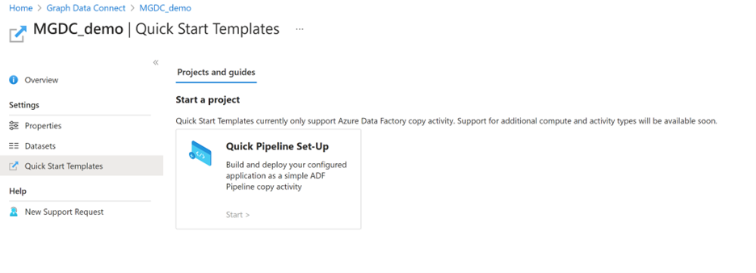
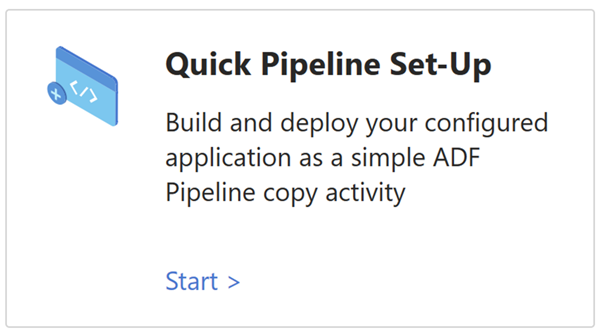
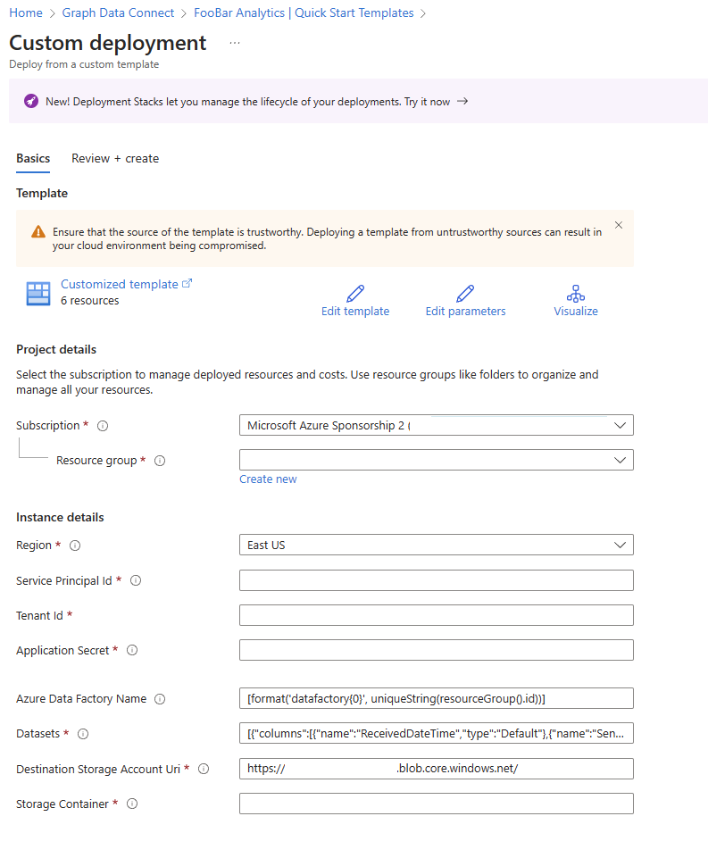
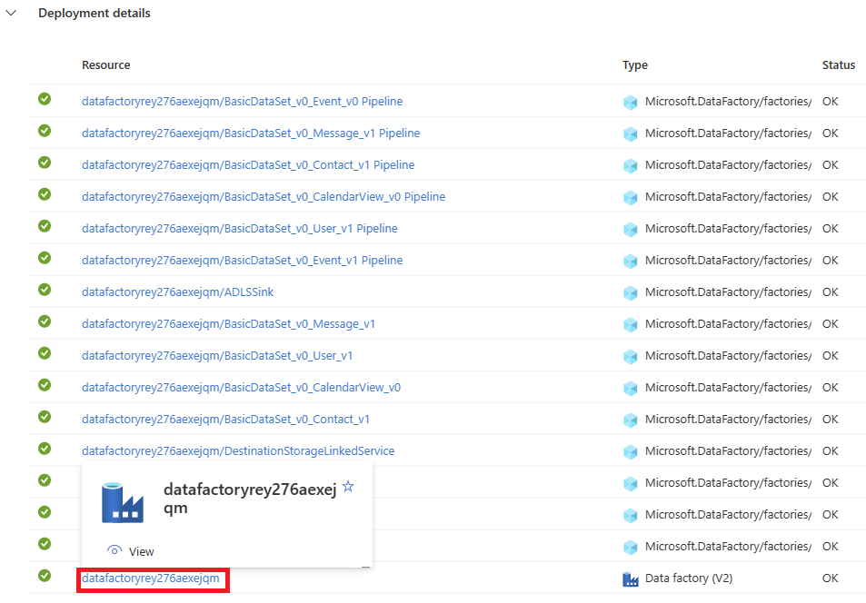
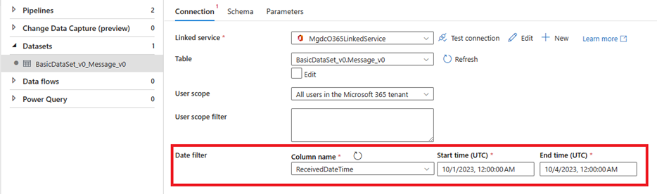
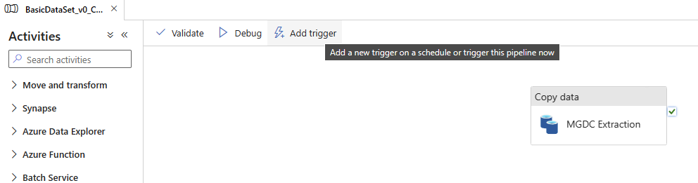

# Microsoft Graph Data Connect templates

Collaboration and communication activities generate a massive amount of rich data in Microsoft 365. You can use Microsoft Graph Data Connect to help you gain insights about your organization. The Data Connect templates help you to reduce the time required to gain data insights and enrich those insights with your own data.

The Microsoft Graph Data Connect templates can help you realize possibilities with your Microsoft 365 data, and accelerate time to added value. Each template contains resources that are specific to different use cases and business scenarios. You can use these templates to help get started with:

- Entity Sentiment Analysis
  - Extract entities from Outlook and Teams data. Then, analyze how users feel about those entities.
  - Sets up Synapse Workspace, Apache Spark Pool, Azure Data Lake Storage Account, and Azure Cognitive Services resources.
- Organizational Network Analysis
  - Identify collaboration and communication patterns that are key for organizations to achieve real business agility.
  - Sets up Synapse Workspace, Apache Spark Pool, and Azure Data Lake Storage Account resources.
- Information Oversharing
  - Secure your business by identifying patterns of information oversharing and fraud in your Microsoft 365 data.
  - Sets up Synapse Workspace, Apache Spark Pool, and Azure Data Lake Storage Account resources.

The templates help you quickly provision Azure resources and provide data pipelines and samples that you can use to realize value right away.

To learn more and get started with the Microsoft Graph Data Connect templates, see the [Data Connect solutions GitHub repository](https://github.com/microsoftgraph/dataconnect-solutions/tree/main).

## Quick start templates

Quick start templates help you easily set up pipelines for the extraction of Microsoft Graph Data Connect datasets along with the Azure resources to deploy them. The configuration of data pipelines becomes faster because the details of registered applications are used to increase efficiency. Currently, the quick start templates only support Azure Data Factory as the platform and copy activity as the activity type.

### Prerequisites

To use the quick start templates, you need the following prerequisites:

- A configured Microsoft Graph Data Connect application. For details on how to create a Microsoft Graph Data Connect application, see [Build your first Data Connect application](/graph/data-connect-quickstart?tabs=AzureSynapsePipeline%2CMicrosoft365).
- The application secret of the Microsoft Entra application used during the Microsoft Graph Data Connect application registration. For details, see [Set up your Microsoft Entra application](/graph/data-connect-quickstart?tabs=NewConsentFlow%2CPAMMicrosoft365%2CAzureSynapsePipeline&tutorial-step=2).
- An Azure Storage container to write data to. For details, see [Set up your Azure Storage resource](/graph/data-connect-quickstart?tabs=NewConsentFlow%2CPAMMicrosoft365%2CAzureSynapsePipeline&tutorial-step=3).

### Set up a pipeline with a quick start template

To set up a pipeline:

1) Open your application from the home page of Microsoft Graph Data Connect in the Azure Portal and go to the **Quick Start Templates** tab.

2) In the **Quick Pipeline Set-Up** template, choose **Start**.

3) Fill in the remaining values in the prepopulated custom deployment form.

  The form contains the following fields:
  - **Resource group**: The resource group where your Azure Storage account is located. The same configuration also applies to the location of the Azure Data Factory.
  - **Service Principal Id**: A prepopulated field that shows the Microsoft Entra application ID used to create an application with Microsoft Graph Data Connect.
  - **Tenant Id**: A prepopulated field that shows the tenant for which data is being extracted.
  - **Application Secret**: The secret value of the Microsoft Entra application used during registration.
  - **Azure Data Factory Name**: This field is prepopulated by concatenating the unique string associated with the resource group ID to *datafactory*. You can also provide an existing Azure Data Factory resource or enter a new unique name for a new Azure Data Factory resource.
  - **Datasets**: A prepopulated field. One pipeline is generated per dataset.
  - **Destination Storage Account Uri**: A prepopulated field. The URI (distributed file system (DFS) or blob) to use based on the registered application.
  - **Storage Container**: The root container in the Azure Storage destination where the data is written to. 

4) Choose the **Review + create** tab to review your settings. After you confirm that all details are correct, choose the **Create** button to initiate the deployment. A deployment status screen appears to monitor the creation of the resources.

5) Go to the Azure Data Factory resource in the selected resource group. If a new Azure Data Factory resource was created during the deployment, you can choose the resource name from the **Deployment details** section.

6) Select a dataset within a copy activity of a pipeline and configure the data filters for the extraction.

Before you trigger the pipeline, choose each copy activity to configure the applicable filters to each dataset. For more information about column filters, see [User selection and filtering capabilities in Microsoft Graph Data Connect](/graph/data-connect-filtering).

7) Use the **Add trigger** button to trigger the pipeline.

