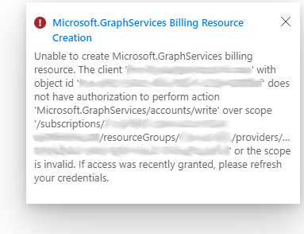
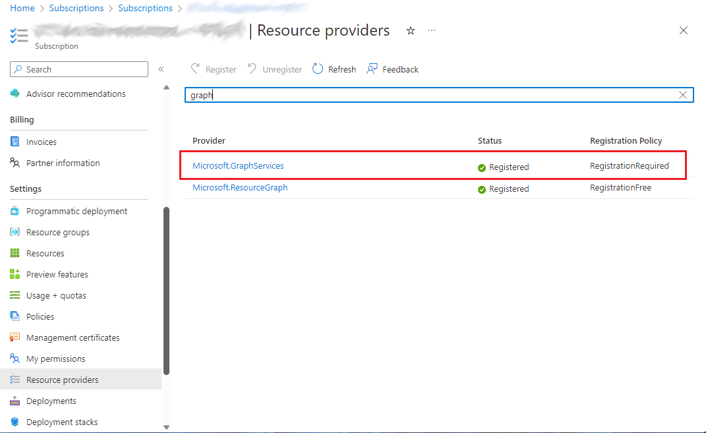
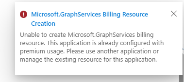

# Troubleshoot Microsoft Graph Data Connect

Microsoft Graph Data Connect (Data Connect) enables you to extend Microsoft 365 data into Azure in order to create applications for analytics, intelligence, and business process optimization. This article provides troubleshooting information for working with Data Connect.

## Issues with finding an application in the Azure portal experience

If you can't find an application in the Data Connect Azure portal experience, verify that you have Microsoft Entra application ownership, as it is required to update and delete app registrations with Data Connect.

## Issues with approving an application

To approve an application in the [Microsoft 365 admin center](https://www.microsoft.com/microsoft-365/business/office-365-administration), the user must be a global admin. An E5 license isn't required.

## Renewing an application consent

You can renew an app authorization before the expiration date. The global admin can click on the consented application and approve it again to extend the consent validity.

## Multi-geo tenant extraction issues

Sometimes, customers might want to add other regions to their pipelines, especially larger customers with multi-geo tenants. While multi-geo tenants can still use Data Connect, be aware that when customers request data, they can only extract data for one region. Customers can't use one pipeline to extract data from multiple regions. Data Connect enforces this rule for the privacy and security of a customer's tenant users. 

Keep the following in mind when customers with multi-geo tenants extract data:

- Data Connect only allows datasets to be extracted from the same region as the tenant. For example, if you have a tenant in Europe (EUR) but want to run your pipeline for your users in North America (NAM), you only get data for users in NAM, because you specified a pipeline for NAM.

- Multi-geo tenants can extract data for their tenants by setting up region-specific pipelines. For example, one region maps to one or a set of pipelines for that region. 

## Aggregating multiple JSON file outputs

To combine files:

1. Add a new **Copy data activity** after the extraction.

    

2. Set the source of the new activity to the location where you extracted the files (Azure storage), set the file format to JSON, and specify *Wildcard file path* as the path type.

3. On the **Sink** tab, specify the location where you want the combined file to be created and make sure you select the **Merge files** behavior.

## Serverless SQL pool service connectivity issue

When connecting Azure Synapse to the destination storage account, you might run into an issue similar to the one described in [Notebook websocket connection issue](/azure/synapse-analytics/troubleshoot/troubleshoot-synapse-studio#notebook-websocket-connection-issue). The issue is related Synapse and how it sets up a websocket in the browser to retrieve the data that is blocked by default on the customer internet proxy. 

You can resolve this issue with an SSP request: `INTERNT PROXY (SWG) - EXCEPTION ON SECURITY FILTERING POLICY`.

## Issues adding network IP address to allow list with Azure integration runtime

If the destination storage account needs to be closed for public access, you need to allow access for a particular set of Azure service IP addresses. Customers need to allow list IPs based on the targeted Office region. To do this:

1. Find an Office-to-Azure region mapping. To look up which Office region you will be extracting user data from, see the following table.

> [!NOTE]
> The Azure region you're running a pipeline in must map to an Office region to extract the users for the tenant. Data Connect doesn't extract data across regions. For example, if you're running a pipeline in the West Europe Azure region, it only extracts the users for the Europe (EUR) Office region because the West Europe Azure region maps to the Europe Office region.

2. After you find the Office to Azure mapping, you need to determine the compatible location of your destination storage account (see the following table). You can look up how to configure your Azure storage account and [grant access from an internet IP range](/azure/storage/common/storage-network-security?tabs=azure-portal#grant-access-from-an-internet-ip-range). 

> [!NOTE]
> This indicates the Azure regions that might NOT be used per region for the destination storage **when it is closed for public access**. This is also the region for which the IP addresses need to be added to the allow list to allow data delivery. To find IP ranges, see [Azure IP Ranges and Service Tags](https://www.microsoft.com/download/details.aspx?id=56519).  

For details about this destination storage region restriction, see:

- [Azure Integration Runtime IP addresses - Azure Data Factory | Microsoft Docs](/azure/data-factory/azure-integration-runtime-ip-addresses#known-issue-with-azure-storage)
- [Configure Azure Storage firewalls and virtual networks | Microsoft Docs](/azure/storage/common/storage-network-security?tabs=azure-portal#grant-access-from-an-internet-ip-range)

&nbsp;

| Office region | Azure region | Alternate Azure regions to use |
| ------------- | ------------ | ------------------------------ |
| **Asia-Pacific**   | <ul><li>East Asia</li><li>Southeast Asia*</li></ul> |   NA |
| **Australia**      | <ul><li>Australia East</li><li>Australia Southeast*</li></ul> | NA |
| **Europe**         | <ul><li>North Europe</li><li>West Europe*</li></ul> | NA |
| **North America**  | <ul><li>Central US</li><li>East US*</li><li>East US 2</li><li>North Central US</li><li>South Central US</li><li>West Central US</li><li>West US</li><li>West US 2</li></ul> | NA |
| **United Kingdom** | <ul><li>UK South*</li><li>UK West</li></ul> | NA |
| **Canada (CAN)** | <ul><li>Canada Central</li><li>Canada East*</li></ul> | NA |
| **Japan (JPN)** | <ul><li>Japan West</li><li>Japan East*</li></ul> | NA |
| **India (IND)** | <ul><li>South India*</li><li>Central India</li></ul> | NA |
| **Korea (KOR)** | <ul><li>Korea Central</li><li>Korea South</li></ul> | NA |
| **Switzerland (CHE)** | <ul><li>Switzerland North</li></ul> | <ul><li>North Europe</li> <li>West Europe</li></ul> |
| **Germany (DEU)** | <ul><li>Germany West Central*</li></ul> | <ul><li>North Europe</li> <li>West Europe</li></ul> |
| **Norway (NOR)** | <ul><li>Norway East*</li></ul> | <ul><li>North Europe</li> <li>West Europe</li></ul> |
| **France (FRA)** | <ul><li>France Central*</li></ul> | <ul><li>North Europe</li> <li>West Europe</li></ul> |
| **UAE (UAE)** | <ul><li>UAE North*</li></ul> | <ul><li>East Asia</li> <li>Southeast Asia</li></ul> |

 > [!NOTE]
 > - At this point, customers can understand and configure the region they want to extract users from (what their Office to Azure region mapping is).
 > - Customers can understand which region their destination storage account can't be in.
> - Based on a compatible destination storage account, customers can use the  information to understand which IP addresses they need to add to the allow list.

3. You can create a new integration run time on the same region that you have added to the allow list, or use auto resolve, depending on your preference and settings. We recommend creating a new IR in the same region. For details, see [Azure Integration Runtime IP addresses: Specific regions](/azure/data-factory/azure-integration-runtime-ip-addresses#azure-integration-runtime-ip-addresses-specific-regions).

    - If you're using Auto Resolve IR, the region depends on several factors. For details, see [Azure IR location](/azure/data-factory/concepts-integration-runtime#azure-ir-location).

### Network access and Azure IR example

The following example describes how to troubleshoot network access issue:

1.	A user wants to extract data for users in the Europe (EUR) Office region. They identify their Office to Azure region mapping. Because the Office region is EUR, the Azure region is in West Europe.

2.	All resources, ADF, and storage account are in the West Europe Azure region, initially.

3.	The user closed the destination storage account for public access.

4.	The user needs to identify where their compatible destination storage account can be based on the Office region I want to extract (EUR).

5.	Because they can't add allow list services in the same region as the storage account, the destination storage account can't be on the West Europe Azure region. They can create a new storage account in North Europe.

6.	For Data Connect internal services to copy the data into the destination storage account, they need to add IP addresses to the allow list from compatible regions based on their Office region (EUR). They need to add ADF public IPs to the allow list in the West Europe Azure region. 

7.	For the ADF destination linked service to also access the destination storage account, they need to create and use an Integration Runtime on the West Europe region, or use auto resolve IR instead.

8.	 The user lists these IP addresses and moves the destination storage to North Europe because the Office region is EUR, and the Azure region is West Europe. 

## Issues with app registration

The following scenarios provide troubleshooting information for registering a Microsoft Entra app with Data Connect.

### No authorization

In the [Data Connect experience in the Azure portal](https://aka.ms/mgdcinazure), when you create or update a Microsoft Fabric app registration, the system tries to create a resource of type **Microsoft.GraphServices** for billing purposes.

 > [!NOTE]
 > Effective January 31, 2024, billing is now enabled for all Microsoft Graph Data Connect pipelines on Fabric. Update your application in the [Microsoft Graph Data Connect experience in the Azure portal](https://aka.ms/mgdcinazure) to use it with Fabric.



The previous image indicates that you don't have the **Microsoft.GraphServices** resource provider registered nor permission to register it in the selected subscription. You need to request a subscription administrator to register this resource provider. For more information, see [Azure resource providers and types](/azure/azure-resource-manager/management/resource-providers-and-types) and [Enable metered APIs and services in Microsoft Graph](/graph/metered-api-setup?tabs=azurecloudshell#enable-an-application). The following image shows a registered **Microsoft.GraphServices** resource provider.



Your subscription administrator can also use the following Azure CLI commands to create the required provider and resource.

Register the resource provider:
``` PowerShell
az provider register --namespace 'Microsoft.GraphServices'
```

Create a billing resource for the app:
``` PowerShell
az resource create --resource-group <resource_group_name> --name mgdc-<app_id> --resource-type Microsoft.GraphServices/accounts --properties  "{`"appId`": `"<app_id>`"}" --location Global --subscription <subscription_id>
```

### Already premium usage

The following error message indicates that a **Microsoft.GraphServices** type resource was already manually created for the app with a different name. This resource is used for billing purposes, and no further action is required.



### Developer email missing

When creating a new registration, it might appear successful, but you receive a "Developer email not found" error. This happens when the registration is created with a guest user; use a non-guest user to successfully complete the registration.

## Related content

- [Data Connect overview](data-connect-concept-overview.md)
- [Data Connect FAQ](data-connect-faq.md)
