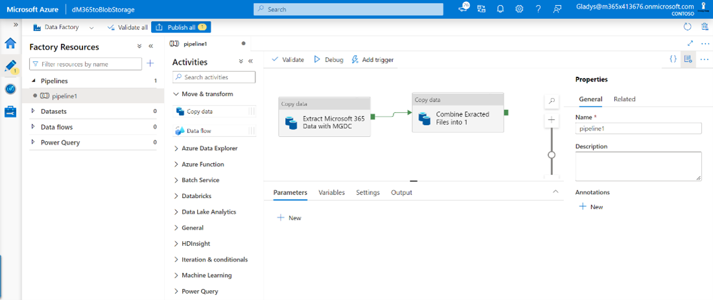

# Troubleshoot Microsoft Graph Data Connect

Microsoft Graph Data Connect enbles you to extend Microsoft 365 data into Azure in order to create applications for analytics, intelligence, and business process optimization. This article provides troubleshooting information for working with Microsoft Graph Data Connect.

For more questions, reach out to the [Data Connect team](mailto:dataconnect@microsoft.com).

## Issues with service principal check when running your first pipeline

If you're having issues running your pipelines for the first time, verify that you have defined the owners for the Source Linked Service as follows:

- The service principal's owner must be a valid user account within the tenant, not another service principal. 

- The owner’s account must have:

    - A valid mailbox, either via an Exchange Online license or an Exchange Online plan within an Office 365 or Microsoft 365 license.

    - An Office 365 or Microsoft 365 E5 subscription assigned. No specific services within the license need to be enabled unless the user does not have a separate Exchange Online license, in which case the Exchange Online plan must be enabled.  
        **Note:** This account does not need the Global Admin role enabled. This is only required for Approver accounts that approve requests through the admin center.

    - Because Data Connect uses the Privilege Access Management system to generate consent requests, E5 licenses are required. For details, see [Integrate with PAM](/graph/data-connect-pam) and [Get started with privileged access management](/microsoft-365/compliance/privileged-access-management-configuration).

- If the owning member is no longer valid in a tenant's system, pipelines will fail this check unless a current valid user within the tenant owns the account. If there is a change in ownership, make sure that the owning account is updated to another member who meets the requirements. 

## PAM approver issues

If you're having issues approving jobs within your tenant for your specified pipeline runs or extractions, verify that the approvers in your tenant meet the following criteria. Certain privileges must be granted to designated approvers to successfully approve jobs.

- Approvers must be active user accounts within the tenant, not other service principals or groups.

- The user account must have an Office 365 or Microsoft 365 E5 license with Exchange Online capabilities and a mailbox.

- If approvers want to approve jobs through the Microsoft 365 admin center, they will need global admin privileges. Global admin privileges are not needed when approving jobs via [PowerShell script](/graph/data-connect-pam#approve-deny-and-revoke-requests-by-using-powershell) .

## Multi-geo tenant extraction issues

Sometimes, customers might want to add other regions to their pipelines, especially larger customers with multi-geo tenants. While multi-geo tenants can still use Microsoft Graph Data Connect, be aware that when customers request data, they can only extract data for one region. Customers cannot use one pipeline to extract data from multiple regrions. Data Connect enforces this rule for the privacy and security of a customer's tenant users. 

Keep the following in mind when customers with multi-geo tenants extract data:

- Data Connect only allows datasets to be extracted from the same region as the tenant. For example, if you have a tenant in Europe (EUR) but want to run your pipeline for your users in North America (NAM), you will only get data for users in NAM, because you specified a pipeline for NAM.

- Multi-geo tenants can extract data for their tenants by setting up region-specific pipelines. For example, one region maps to one or a set of pipelines for that region. 

## Aggregating mutliple JSON file outputs

To combine files:

1. Add a new **opy data activity** after the extraction.

    

2. Set the source of the new activity to the location where you extracted the files (Azure storage), set the file format to JSON, and specify *Wildcard file path* as the path type.

3. On the **Sink** tab, specify the location where you want the combined file to be created and make sure you select the **Merge files** behavior.

## Serverless SQL pool service connectivity issue

When connecting Azure Synapse to the destination storage account, you might run into an issue similar to the one described in [Notebook websocket connection issue](/azure/synapse-analytics/troubleshoot/troubleshoot-synapse-studio#notebook-websocket-connection-issue). The issue is related Synapse and how it sets up a websocket in the browser to retrieve the data that is blocked by default on the customer internet proxy. 

You can resolve this issue with an SSP request: `INTERNT PROXY (SWG) - EXCEPTION ON SECURITY FILTERING POLICY`.

## Issues adding network IP address to allow list with Azure integration runtime

If the destination storage account needs to be closed for public access, you need to allow access for a particular set of Azure service IP addresses. Customers will need to allow list their IPs based on their region, the region of tenancy they want to extract data from, and their Azure IR region. To do this:

1. Find an Office to Azure region mapping. To look up which Office region you will be extracting user data from, see [Regions](/graph/data-connect-datasets#regions).

    **Note:** The Azure region you're running a pipeline in must map to an Office region to extract the users for the tenant. Microsoft Graph Data Connect does not extract data across regions. For example, if you're running a pipeline in the West Europe Azure region, it will only extract the users for the Europe (EUR) Office region because the West Europe Azure region maps to the Europe Office region. 

2. After you find the Office to Azure mapping, you need to determine the correct and compatible location of your destination storage account. You can look up how to configure your Azure storage account and [grant access from an internet IP range](/azure/storage/common/storage-network-security?tabs=azure-portal#grant-access-from-an-internet-ip-range).

   a. Use the following table to select an Azure storage account that meets the criteria.

      | Office 365 region | Region the destination storage can't be in |
      |:------------------|:-------------------------------------------|
      | NAM               | East US                                    |
      | CAN               | Canada East                                |
      | GBR               | UK South                                   |
      | EUR               | West Europe                                |
      | APAC              | Southeast Asia                             |
      | AUS               | Australia Southeast                        |

    b. Add IP addresses to the allow list within your destination storage account that is compatible with the previous table. Use the following table to identify the region. To find IP ranges, see [Azure IP Ranges and Service Tags](https://www.microsoft.com/en-us/download/details.aspx?id=56519).

      | Office 365 region | Region you add to allow list |
      |:------------------|:-----------------------------|
      | NAM               | East US                      |
      | CAN               | Canada East                  |
      | GBR               | UK South                     |
      | EUR               | West Europe                  |
      | APAC              | Southeast Asia               |
      | AUS               | Australia Southeast          |

    > [!NOTE]
    > - At this point, customers can understand and configure the region they want to extract users from (what their Office to Azure region mapping is).
    > - Customers can understand which region their destination storage account can't be in.
    > - Based on a compatible destination storage account, customers can usethe  information to understand which IP addresses they need to add to the allow list. 

3. You can create a new integration run time on the same region that you have added to the allow list, or use auto resolve, depending on your preference and settings. We recommend creating a new IR in the same region. For details, see [Azure Integration Runtime IP addresses: Specific regions](/azure/data-factory/azure-integration-runtime-ip-addresses#azure-integration-runtime-ip-addresses-specific-regions).

    - If you're using Auto Resolve IR, the region depends on several factors. For details, see [Azure IR location](/azure/data-factory/concepts-integration-runtime#azure-ir-location).

### Network access and Azure IR example

The following example describes how to troubleshoot network access issue:

1.	A user wants to extract data for users in the Europe (EUR) Office region. They identify their Office to Azure region mapping. Because the Office region is EUR, the Azure region is in West Europe.

2.	All resources, ADF, and storage account are in the West Europe Azure region, initially.

3.	The user closed the destination storage account for public access.

4.	The user needs to identify where their compatible destination storage account can be based on the Office region I want to extract (EUR).

5.	Because they cannot add allow list services in the same region as the storage account, the destination storage account cannot be on the West Europe Azure region. They can create a new storage account in North Europe.

6.	For Data Connect internal services to copy the data into the destination storage account, they need to add IP addresses to the allow list from compatible regions based on their Office region (EUR). They will need to add ADF public IPs to the allow list in the West Europe Azure region. 

7.	For the ADF destination linked service to also access the destination storage account, they need to create and use an Integration Runtime on the West Europe region, or use auto resolve IR instead.

8.	 The user lists these IP addresses and moves the destination storage to North Europe because the Office region is EUR, and the Azure region is West Europe. 

## See also

- [Data Connect overview](data-connect-concept-overview.md)
- [Data Connect FAQ](data-connect-faq.md)
