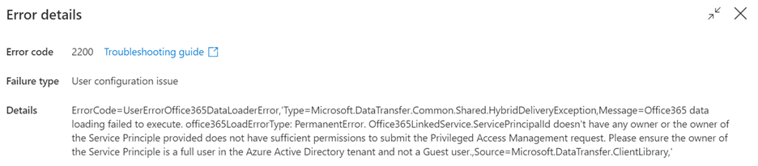
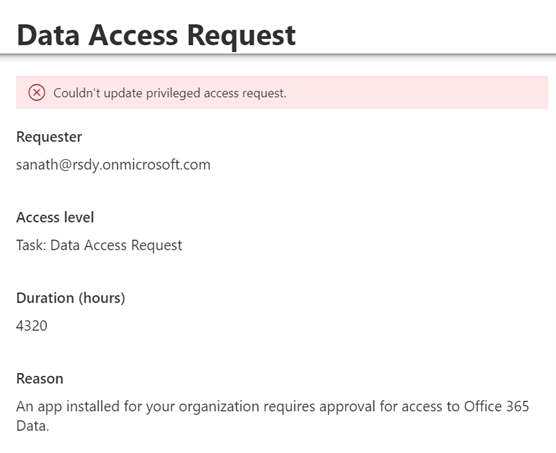

# Microsoft Data Connect Troubleshooting

Microsoft Graph Data Connect lets developers create applications for analytics, intelligence, and business process optimization by extending Microsoft 365 data at scale into Azure. This article aims to help MGDC developers further research any common troubleshooting issues and get unblocked quickly so they can run MGDC successfully on their own.

For an introduction to MGDC, see the [overview](data-connect-concept-overview.md). 

For MGDC FAQ see the [FAQ](data-connect-faq.md).

For further questions that are not covered here, please reach out dataconnect@microsoft.com.

## Troubleshooting for Service Principal check when running your first MGDC Pipeline

If you are having issues running your pipelines for the first time, please check how you have defined the owners for the Source Linked Service.  Please ensure you have followed the below.

1. The Service Principal's owner must be a valid user account within the tenant, not another service principal. 

2. The owner’s account must have:

    1. User account  must have a valid mailbox, either by assigning an Exchange online license or enabling Exchange online plan within the Office365 or Microsoft 365 license.

    2. An Office 365 or Microsoft 365 E5 assigned. No specific services within the license are needed to be enabled unless the user does not have a separate Exchange online license, in which case the Exchange online plan must be enabled.  
        * This account does not need to have Global Admin role enabled, which is only required for Approver accounts approving requests through the admin center.

    3. E5 licenses are required as MGDC uses Privilege Access Management system to generate consent requests, more information [here](https://docs.microsoft.com/en-us/graph/data-connect-pam) and [here](https://docs.microsoft.com/en-us/microsoft-365/compliance/privileged-access-management-configuration?view=o365-worldwide)

3. If the owning member is no longer valid in a tenant's system, pipelines will fail this check unless a current valid user within the tenant owns the account. Please ensure that the owning account is updated to another member with the above requirements if there is a change in ownership. 

## Troubleshooting on PAM Approver Issues

If you are having issues approving jobs within your tenant for your specified pipeline runs or extractions, please ensure that the approvers in your tenant meet the criteria below. Certain privileges must be granted to designated approvers to successfully approve jobs.

1. Approvers must be active user accounts within the tenant, not other service principals or groups.

2. The user account must have an Office 365 or Microsoft 365 E5 Office license  with Exchange Online capabilities and mailbox.

3. If approvers want to approve jobs through the M365 admin center, approvers will need global admin privileges. Global admin privileges are not needed when approving jobs via [PowerShell script](https://docs.microsoft.com/en-us/graph/data-connect-pam#approve-deny-and-revoke-requests-by-using-powershell) .

## Troubleshooting on Multi-Geo tenant extraction for MGDC

Sometimes, customers may want to add other regions to their pipelines, especially larger customers with multi-geo tenants. While multi-geo tenants can certainly still use MGDC, please remember that when customers request data, they can only get data for one region extracted per region. Customers cannot use one pipeline to extract data from multiple geos. This rule is enforced by MGDC for the privacy and security for a customer's tenant users. 

Below things to keep in mind for customers with multi-geo tenats to extract data:

1. When requesting datasets, MGDC only allows datasets to be extracted from the same region as the tenant. 

    1. For example, if you have a tenant in Europe (EUR) but want to run your pipeline for your users in North America (NAM), you will only get data for users in NAM since you specified a pipeline for NAM.

2. Multi-geo tenants can extract data for their tenants by setting up region specific pipelines. 

    1. For example, one region maps to one or a set of pipelines for that region. 

## Troubleshooting on aggregating mutliple JSON file outputs into one

1. To recombine the files together, you will need to add a new *Copy data activity* after the extraction.

    

2. You will need to set the source of this new activity to be the location where you’ve extracted the files (Azure Storage) and set the files’ format as JSON and specify *Wildcard file path* as the path type.

3. Then on the Sink tab, simply specify the location where you wish to have the combined file created and make sure you select the *Merge files* behavior.

## Serverless SQL pool service connectivity issue

The issue you may be running into is similar to [this](https://learn.microsoft.com/en-us/azure/synapse-analytics/troubleshoot/troubleshoot-synapse-studio#notebook-websocket-connection-issue) when connecting Azure Synapse to the destination storage account. The issue is related Synapse and how it sets up a websocket in the browser to retrieve the data which is by default blocked on the customer internet proxy. 

1. You can resolve this issue with an SSP request: "INTERNT PROXY (SWG) - EXCEPTION ON SECURITY FILTERING POLICY"

## Troubleshooting allow listing Network IP address with Azure Integration runtime

If the destination storage account needs to be closed for public access, you will need to allow access for a particular set of Azure services IP addresses. Customers will need to allow list their IPs based on their region, the region of tenancy they want to extract data from and their Azure IR region.

1. Find an Office to Azure region mapping: Look up which Office region you will be extracting user data from [here](https://docs.microsoft.com/en-us/graph/data-connect-datasets#regions).

    1. The Azure region you're running a pipeline in must map to an Office region to extract the users for the tenant. MGDC will extract only for that region as MGDC does not allow for cross region extraction. 

    2. For example, if you're running a pipeline in West Europe Azure region, it will only extract the users for Europe (EUR) Office region since West Europe Azure region maps to the Europe Office region. 

2. After you have found an Office to Azure mapping, you need to determine the correct and compatible location of your destination storage account. You can look up how to configure your Azure storage account and [grant access from an internet IP range](https://docs.microsoft.com/en-us/azure/storage/common/storage-network-security?tabs=azure-portal#grant-access-from-an-internet-ip-range).

    1. Please follow table 1 below to select an Azure Storage account that meets the criteria below.

        | O365 Region | Region where the destination storage can't be in |
        |-------------|--------------------------------------| 
        | NAM         | East US                              |
        | CAN         | Canada East                          | 
        | GBR         | UK South                             |
        | EUR         | West Europe                          |
        | APAC        | Southeast Asia                       |
        | AUS         | Australia Southeast                  |

    2. Next, you will need to allow list IP addresses within your destination storage account that is compatible with table 1 above. Please follow table 2 below to allow list IPs based on the O365 region and then download IP ranges [here](https://www.microsoft.com/en-us/download/details.aspx?id=56519) based on the table below.

        | O365 Region | Region you have to allowlist         |
        |-------------|--------------------------------------| 
        | NAM         | East US                              |
        | CAN         | Canada East                          | 
        | GBR         | UK South                             |
        | EUR         | West Europe                          |
        | APAC        | Southeast Asia                       |
        | AUS         | Australia Southeast                  |

    > [!NOTE]
    > 1. At this point, customers can understand and configure the region they want to extract users from (what their Office to Azure region mapping is)
    > 2. Customers can understand which region their destination storage account CANNOT be in (from table 1)
    > 3. Based on a compatible destination storage account, customers can use information from table 2 to understand which IP addresses they need to allow list. 
    > 4. Next steps will help customers understand Azure Integration runtime (IR)

3. You can create a new integration run time on the same region that you have allow listed from table 2 or use Auto Resolve, either way is equivalent based on how your preference and settings. For ease, we highly recommend creating a new IR on the same region as table 2. More information can be found [here] (https://docs.microsoft.com/en-us/azure/data-factory/azure-integration-runtime-ip-addresses#azure-integration-runtime-ip-addresses-specific-regions).

    1. If you are using Auto Resolve IR then the region depends on [several factors](https://docs.microsoft.com/en-us/azure/data-factory/concepts-integration-runtime#azure-ir-location) 

### Example on Network Access and Azure IR

1.	I want to extract data for my users in Europe (EUR) Office region. I will have to refer to step #1 in the instructions above to find out my Office to Azure region mapping. Since my Office region is EUR, my Azure region is in West Europe.

2.	All my resources, ADF and storage account are in West Europe Azure region, initially.

3.	I closed my destination storage account for public access.

4.	I need to refer to step #2 table #1 to understand where my compatible destination storage account can be based on my Office region I want to extract (EUR).

5.	Since I cannot allow list services in the same region as the storage account, then my destination storage account cannot be on West Europe Azure region. I can create a new storage account in North Europe.

6.	For MGDC internal services to copy the data into my destination storage account, I need to refer to step #2 table #2 to understand how to allow list IP addresses from compatible regions based on my Office region (EUR). I will need to allow list ADF Public IPs in West Europe Azure region. 

7.	For the ADF destination linked service to also access my destination storage account, the easiest way recommended is to create and use an Integration Runtime on the West Europe region. I need to refer to step #3 to complete this or want to use Auto Resolve IR instead.

8.	 I have already listed these IP addresses and moved the destination storage to North Europe since my Office region is EUR, and my Azure region is West Europe. 

