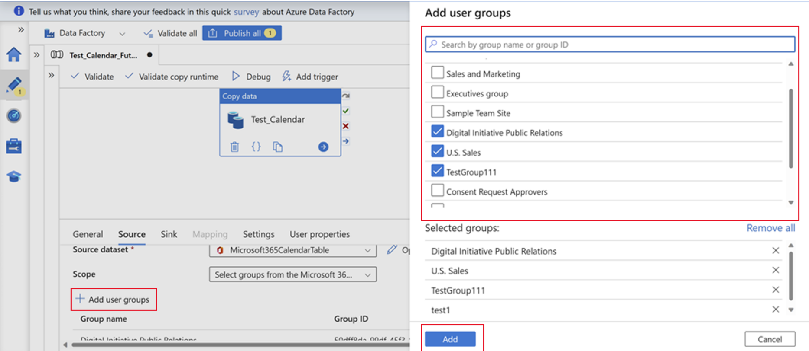
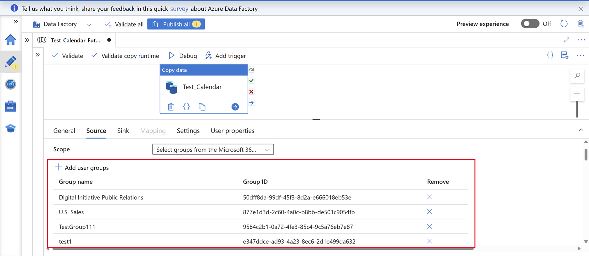
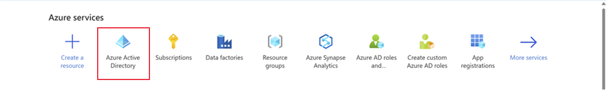
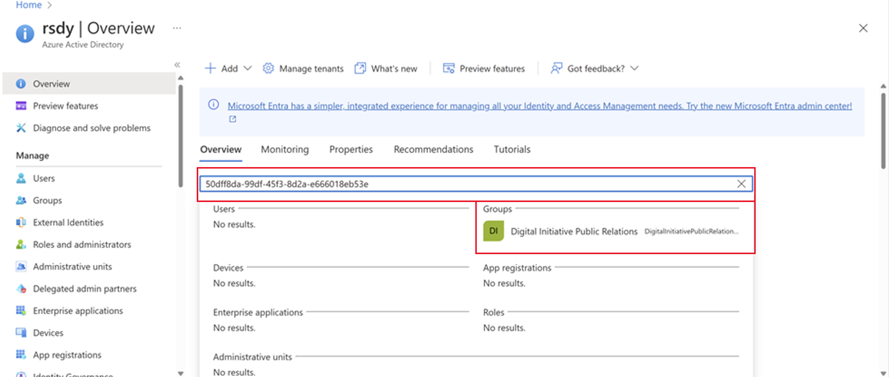
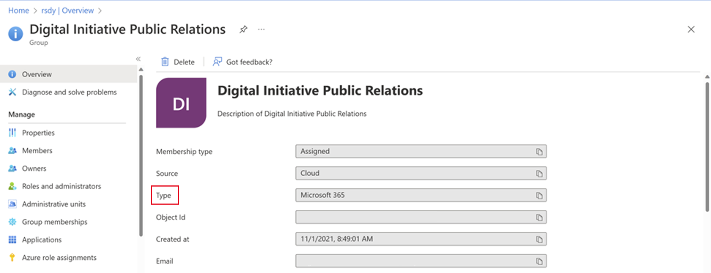

# Use Microsoft Graph Data Connect to define the scope of a dataset

This article explains the concept of groups in Microsoft Graph Data Connect and the options for scope selection. Scope selection allows you to specify how to extract objects; for example, you can extract objects for all users in a Microsoft 365 tenant or select groups in the Microsoft 365 tenant. For more information, see [Demystifying User Scopes](https://devblogs.microsoft.com/microsoft365dev/microsoft-graph-data-connect-demystifying-user-scopes/#:~:text=The%20user%20scope%20option%20lets%20you%20either%20specify,Azure%20Active%20Directory%20Security%20or%20Microsoft%20365%20groups).

You can create and manage several different types of groups in the Microsoft 365 admin center; for details, see [Compare groups](https://learn.microsoft.com/en-us/microsoft-365/admin/create-groups/compare-groups?view=o365-worldwide). The following types of groups are applicable to Microsoft Graph Data Connect:

*  **Microsoft 365 Groups** - Used for collaboration between users, both inside and outside your company. They include collaboration services such as SharePoint and Planner.
* **Distribution groups** - Used for sending email notifications to a group of people.
* **Security groups** - Used for granting access to resources such as SharePoint sites.
* **Mail-enabled security groups** - Used for granting access to resources such as SharePoint and emailing notifications to those users.

## Scope selection in Microsoft Graph Data Connect
You can scope Microsoft Graph Data Connect datasets by users or by groups. The following sections provide details about the scope options for each.

### User-scoped datasets
User-scoped datasets can be messages, events, users, and so on. These datasets focus on data around the individual user for the respective dataset.

The following are the options for user-scoped datasets:

    * **All users in the tenant**: Returns data for all the users in the tenant. Data is extracted for individual users in the selected group. For details, see [User selection and filtering capabilities](/graph/data-connect-filtering).
    * **All users in the tenant with a scope filter**: Returns data for all the users in the tenant that are part of the scope filter applied. Data is extracted for individual users from the selected filter (group).
        * A scope Filter can help filter the users. If it's left empty, all data for all users is returned. 
    *	**Select groups from the Microsoft 365 tenant**: Data is extracted for individual users in the group.

#### Example

A customer wants to extract the messages dataset and creates a security group of users A, B, and C in a tenant of 500 users, and passes this group. Microsoft Graph Data Connect expands the security group into a list of users, extracts the message data for those users, and delivers the data for those users to the customer. The customer will only receive the messages dataset for individual users A, B, and C out of their tenant of 500 users.
        
### Group-scoped datasets

Group-scoped datasets can be Outlook group conversations, Teams channel messages, group details. These datasets focus on the collective data in a group from Outlook or Teams.

The following are the options for group-scoped datasets:

    * **All groups in the tenant**: Returns data for all the groups in the tenant.
    * **All groups in the tenant with a scope filter**: Returns data for all the groups in the tenant with the scope filter applied. The scope Filter can help narrow down the list of groups. 
    *   **Select groups from the Microsoft 365 tenant**: Returns collective data for the selected groups. Microsoft Graph Data Connect looks for data associated with those specific groups rather than the individuals of the group. 

> **Note:**  When the customer specifies a group or groups to be the scope, Microsoft Graph Data Connect looks for data associated with those specific groups rather than the individuals of the group. 
 
The following table maps certain datasets with certain types of groups. This helps you to understand which types of groups are compatible with which datasets when you extract data and use scope filters. Groups can either be distribution groups, security groups, or Microsoft 365 groups. The types of groups supported varies based on which dataset you're requesting.

|              Dataset                 | Microsoft 365 group | Distribution group | Security group | Mail-enabled security group  |
|---------------------------------------|-------------|---------------------|-----------------|------------------------|
|     TeamsStandardChannelMessages      | Yes*        | No                  | No              | No                     |
|     TeamsChannelDetails_v0            | Yes*        | No                  | No              | No                     |
|     OutlookGroupConversations         | Yes         | No                  | No              | No                     |
|     GroupDetails                      | Yes         | Yes                 | Yes             | Yes                    |
|     GroupMembers                      | Yes         | Yes                 | Yes             | Yes                    |
|     GroupOwners                       | Yes         | Yes**               | Yes**           | Yes                    |
|     Viva Insights                     | NA          | NA                  | NA              | NA                     |
|     OneDrive and SharePoint Online    | NA          | NA                  | NA              | NA                     |
|     All other datasets                | Yes         | Yes                 | Yes             | Yes                    |

\*For Teams datasets, Microsoft 365 groups must also be Teams-enabled.

\**Group datasets don't contain a primary mailbox; the region defaults to the region of the tenant. 

#### Example
A customer wants to extract the group details dataset with a security group of users A, B, and C out of their tenant of 500 users. Because this is a group-scoped dataset, the customer will only receive group details data for the specified group. The customer will not receive any individual data for users A, B, and C in the group.

> **Note:** For Teams group-scoped datasets, if the group in scope is not a Teams-enabled group, it will not return any data. Microsoft 365 groups can be enabled as Teams groups, but distribution groups and security groups are not Teams-enabled. The following section provides details about the type of groups that are available to select. 

## Search for and verify group types

Use the following steps to search for the types of groups in your tenant to help you determine what is compatible with the type of scope you want to select:

1. Sign in to your ADF portal, select your tenant, and choose **Source**.

1. On the **Scope** tab, select the group-scoped dataset, search for and add a group or groups, or group IDs, and choose **Add**.
    
    

2. View the group ID. Copy the IDs of the groups you want to verify.

    

3. In a new tab, go to the [Azure homepage](https://www.portal.azure.com) and choose **Azure Active Directory**.

    

4. On the Overview tab, paste the group ID copied from step 2, and then and choose the **Groups** tab.

    

5. In the **Type** field for the group, verify the type of group that you have.

    
 
