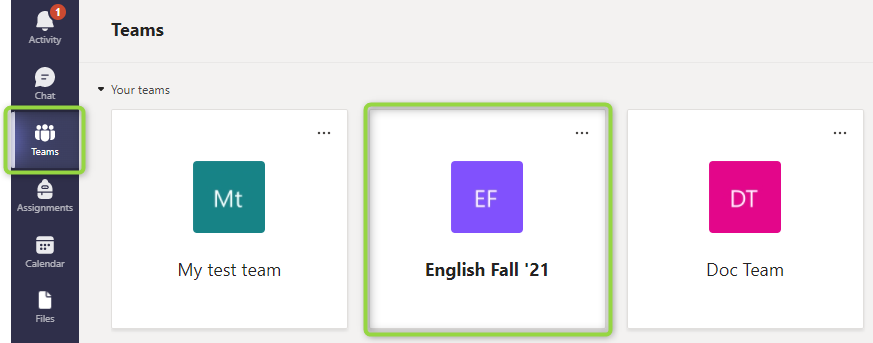
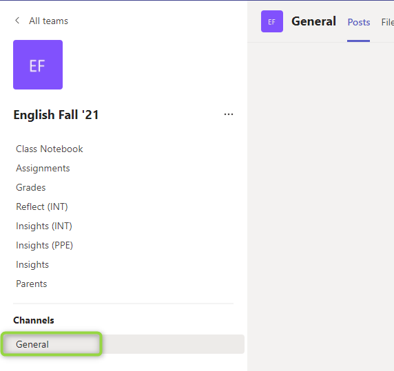

# Specify the default channel for education assignment notifications using the Microsoft Graph API

This article describes how to use the education API in Microsoft Graph to specify the default Microsoft Teams channel to send notifications to about an **assignment**. Specifying the default channel involves building the **notificationChannelUrl** string property for an [educationAssignment](/graph/api/resources/educationassignment). The default value for this property is `null`.

## Prerequisites

Before building the property, identify the corresponding team for the assignment and the name of the channel.

To identify the team for the assignment, in the left menu in Teams, click **Teams** and then select the appropriate team.



Identify the appropriate channel within the team that you selected.



## Build the notificationChannelUrl property value

The following steps describe how to build the property value.

### Step 1 - Get the team ID based on your team name
To find the team id, make a GET request with the team name. If you already have the team id, skip this step.

#### Request

The following example shows the request.

```http
GET https://graph.microsoft.com/v1.0/teams?$filter=displayName eq 'English Fall ''21'
```

#### Response

The following example shows the response.

```http
HTTP/1.1 200 Ok
Content-type: application/json

{
    "@odata.context": "https://graph.microsoft.com/v1.0/$metadata#teams",
    "@odata.count": 1,
    "value": [
        {
            "id": "72a7baec-c3e9-4213-a850-f62de0adad5f",
            "createdDateTime": null,
            "displayName": "English Fall '21",
            "description": "English Fall '21",
            "internalId": null,
            "classification": null,
            "specialization": null,
            "visibility": null,
            "webUrl": null,
            "isArchived": null,
            "isMembershipLimitedToOwners": null,
            "memberSettings": null,
            "guestSettings": null,
            "messagingSettings": null,
            "funSettings": null,
            "discoverySettings": null
        }
    ]
}
```

### Step 2 - Get the channel ID based on channel name and team ID
Make a GET request with the team ID obtained in the previous step and the channel name. Skip this step if you already have the channel id.

#### Request

The following example shows the request.

```http
GET https://graph.microsoft.com/v1.0/teams/72a7baec-c3e9-4213-a850-f62de0adad5f/channels?$filter=displayName eq 'General'
```

#### Response

The following example shows the response.

```http
HTTP/1.1 200 Ok
Content-type: application/json

{
    "@odata.context": "https://graph.microsoft.com/v1.0/$metadata#teams('72a7baec-c3e9-4213-a850-f62de0adad5f')/channels",
    "@odata.count": 1,
    "value": [
        {
            "id": "19:jb2-ckDy2jONyW6ElO1phAVD5cTjuswYgoumI0oxrUw1@thread.tacv2",
            "createdDateTime": "2021-08-25T12:33:49.124Z",
            "displayName": "General",
            "description": "English Fall '21",
            "isFavoriteByDefault": null,
            "email": "",
            "webUrl": "https://teams.microsoft.com/l/channel/19%3Ajb2-ckDy2jONyW6ElO1phAVD5cTjuswYgoumI0oxrUw1%40thread.tacv2/General?groupId=72a7baec-c3e9-4213-a850-f62de0adad5f&tenantId=b6338c92-533e-4f6d-a327-994263712399",
            "membershipType": "standard"
        }
    ]
}
```

### Step 3 - Construct the value for the notificationChannelUrl property
Build the value for the **notificationChannelUrl** property using the following format: 

> `https://graph.microsoft.com/v1.0/teams/{team-id}/channels/{channel-id}` 

Replace the `{team-id}` and `{channel-id}` placeholders with the values described in the following table.

| Placeholder | Description | Example |
|:--|:--|:--|
| `{team-id}` | The team ID from the response in step 1. This is the team that the current assignment belongs to. | 72a7baec-c3e9-4213-a850-f62de0adad5f |
| `{channel-id}` | Item ID from the response body obtained in step 2. | 19:jb2-ckDy2jONyW6ElO1phAVD5cTjuswYgoumI0oxrUw1@thread.tacv2 |

The following example shows a **notificationChannelUrl** based on this format.

```http
https://graph.microsoft.com/v1.0/teams/72a7baec-c3e9-4213-a850-f62de0adad5f/channels/19:jb2-ckDy2jONyW6ElO1phAVD5cTjuswYgoumI0oxrUw1@thread.tacv2
```

### Step 4 - Assign the value to the notificationChannelUrl property for the assignment

You have now successfully built the url, it's time to assign the value to the property. You can perform this operation by updating either the **educationAssignment** or **educationAssignmentDefaults** resources.

#### Example 1: Update an educationAssignment

##### Request
The following is an example of the request.

```http
PATCH https://graph.microsoft.com/beta/education/classes/72a7baec-c3e9-4213-a850-f62de0adad5f/assignments/4679bc1b-90c5-45af-ae1a-d5357672ed39
Content-type: application/json

{
    "displayName": "Property update",
    "notificationChannelUrl": "https://graph.microsoft.com/v1.0/teams/72a7baec-c3e9-4213-a850-f62de0adad5f/channels/19:jb2-ckDy2jONyW6ElO1phAVD5cTjuswYgoumI0oxrUw1@thread.tacv2"
}
```

##### Response
The following is an example of the response. 

>**Note:** The response object shown here might be shortened for readability.

<!-- {
  "blockType": "response",
  "truncated": true,
  "@odata.type": "microsoft.graph.educationAssignment"
} -->
```http
HTTP/1.1 200 OK
Content-type: application/json

{
    "@odata.context": "https://graph.microsoft.com/beta/$metadata#education/classes('72a7baec-c3e9-4213-a850-f62de0adad5f')/assignments/$entity",
    "classId": "72a7baec-c3e9-4213-a850-f62de0adad5f",
    "displayName": "Property update",
    "closeDateTime": null,
    "dueDateTime": "2021-09-10T00:00:00Z",
    "assignDateTime": null,
    "assignedDateTime": null,
    "allowLateSubmissions": true,
    "resourcesFolderUrl": null,
    "createdDateTime": "2021-09-03T23:57:14.6088791Z",
    "lastModifiedDateTime": "2021-09-04T15:01:35.3361649Z",
    "allowStudentsToAddResourcesToSubmission": true,
    "status": "draft",
    "notificationChannelUrl": "https://graph.microsoft.com/v1.0/teams/72a7baec-c3e9-4213-a850-f62de0adad5f/channels/19:jb2-ckDy2jONyW6ElO1phAVD5cTjuswYgoumI0oxrUw1@thread.tacv2",
    "webUrl": "https://teams.microsoft.com/l/entity/66aeee93-507d-479a-a3ef-8f494af43945/classroom?context=%7B%22subEntityId%22%3A%22%7B%5C%22version%5C%22%3A%5C%221.0%5C%22,%5C%22config%5C%22%3A%7B%5C%22classes%5C%22%3A%5B%7B%5C%22id%5C%22%3A%5C%2272a7baec-c3e9-4213-a850-f62de0adad5f%5C%22,%5C%22displayName%5C%22%3Anull,%5C%22assignmentIds%5C%22%3A%5B%5C%224679bc1b-90c5-45af-ae1a-d5357672ed39%5C%22%5D%7D%5D%7D,%5C%22action%5C%22%3A%5C%22navigate%5C%22,%5C%22view%5C%22%3A%5C%22assignment-viewer%5C%22%7D%22,%22channelId%22%3Anull%7D",
    "addToCalendarAction": "studentsAndPublisher",
    "addedStudentAction": "none",
    "id": "4679bc1b-90c5-45af-ae1a-d5357672ed39",
    "instructions": {
        "content": "Read chapter 5 and write your review",
        "contentType": "text"
    },
    "grading": {
        "@odata.type": "#microsoft.graph.educationAssignmentPointsGradeType",
        "maxPoints": 50
    },
    "assignTo": {
        "@odata.type": "#microsoft.graph.educationAssignmentClassRecipient"
    },
    "createdBy": {
        "application": null,
        "device": null,
        "user": {
            "id": "f3a5344e-dbde-48b0-be24-b5b62a243836",
            "displayName": null
        }
    },
    "lastModifiedBy": {
        "application": null,
        "device": null,
        "user": {
            "id": "f3a5344e-dbde-48b0-be24-b5b62a243836",
            "displayName": null
        }
    }
}
```

#### Example 2: Update educationAssignmentDefaults

##### Request

``` http
PATCH https://graph.microsoft.com/beta/education/classes/72a7baec-c3e9-4213-a850-f62de0adad5f/assignmentDefaults
Content-Type: application/json

{
  "addToCalendarAction": "studentsOnly",
  "notificationChannelUrl": "https://graph.microsoft.com/v1.0/teams/72a7baec-c3e9-4213-a850-f62de0adad5f/channels/19:jb2-ckDy2jONyW6ElO1phAVD5cTjuswYgoumI0oxrUw1@thread.tacv2"
}
```

##### Response

>**Note:** The response object shown here might be shortened for readability.
<!-- {
  "blockType": "response",
  "truncated": true,
  "@odata.type": "microsoft.graph.educationAssignmentDefaults"
}
-->
``` http
HTTP/1.1 200 OK
Content-Type: application/json

{
  "addedStudentAction": "assignIfOpen",
  "addToCalendarAction": "studentsOnly",
  "dueTime": "23:59:00",
  "notificationChannelUrl": "https://graph.microsoft.com/v1.0/teams/72a7baec-c3e9-4213-a850-f62de0adad5f/channels/19:jb2-ckDy2jONyW6ElO1phAVD5cTjuswYgoumI0oxrUw1@thread.tacv2"
}
```

## See also

* [Update educationAssignmentDefaults](/graph/api/educationassignmentdefaults-update)
* [Update educationAssignment](/graph/api/educationassignment-update)
