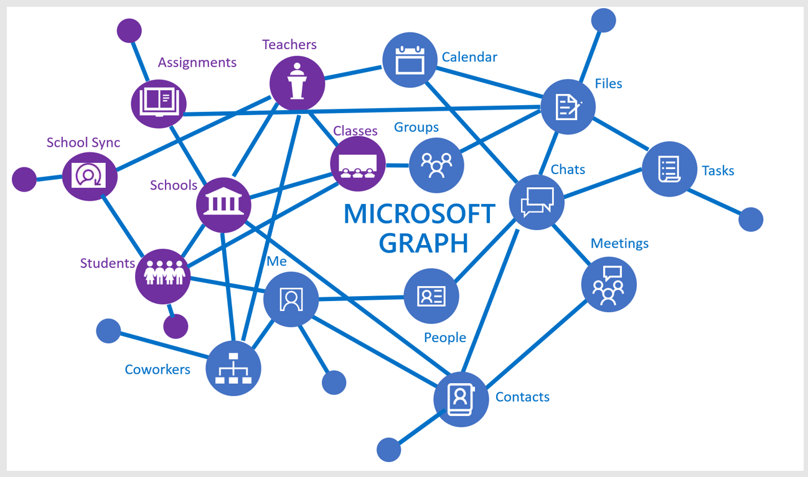
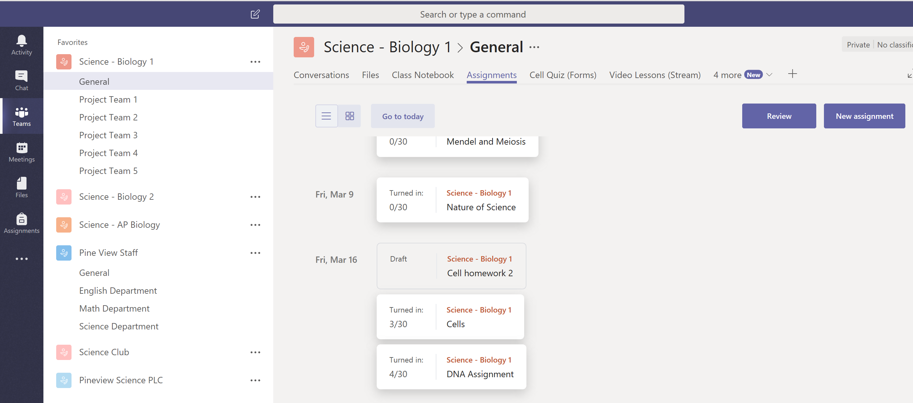

# Education API overview

The education API in Microsoft Graph enhances Office 365 resources with information that is relevant for education scenarios, including information about schools, classes, users (students and teachers), assignments, and submissions. This makes it easy for you to build solutions that integrate with educational resources for various school and classroom scenarios.

The education API in Microsoft Graph provides access to classes, schools, users, assignments, submissions and more.

## Why integrate with education scenarios?

### Build applications that are aware of class roster

Most education software developers learn early on that class roster is one of the key pieces of information they need to run their application, and it's typically locked away inside a school Student Information System (SIS). Any time teachers bring a new application into their classroom, they spend time manually importing roster data into the app. Many ISVs address this by connecting with a SIS to import roster data. With hundreds of Student Information Systems with proprietary formats, this can become a challenge. [Microsoft School Data Sync](https://sds.microsoft.com/), combined with roster APIs, addresses this challenge for application developers and schools.

The following are some of the scenarios that the roster APIs enable:

- [Get all classes in a school](../api-reference/v1.0/api/educationschool_list_classes.md)
- [Get all users in a class](../api-reference/v1.0/api/educationclass_list_members.md)
- [Get all the classes I teach](../api-reference/v1.0/api/educationuser_list_classes.md)

### Use Microsoft Teams to create class assignments in an assignments tab

You can use the assignments API to create a web app that manages class assignments and then integrate your app into Microsoft Teams on a new custom tab.  

Microsoft Teams in Office 365 is a digital hub that brings conversations, content, and apps together in one place for classrooms. Microsoft Teams provides a [rich set of extensibility points](https://docs.microsoft.com/en-us/microsoftteams/platform/concepts/apps/apps-overview), including creating Tabs, Connectors, and Bots. These extensibility points can call education APIs in Microsoft Graph to work with assignments and submissions. Build a more comprehensive experience by enabling your extension point with any other Microsoft Graph API along with assignment and submission APIs.

For education, Microsoft Teams custom tab apps are opened in an education class (a team) context, where it makes sense to manage the end-to-end assignment flow, from creation and distribution to grading and feedback. This is just one example of how Microsoft Teams saves time and simplifies everyday logistics, leaving educators free to dedicate themselves to their students.

The following image shows a web app for managing assignments in an Assignments custom Tab for a **Science - Biology 1** class.

With the assignment API, your app can interact with the assignment service outside of Microsoft Teams. Microsoft Teams will handle distribution, due dates, and grading while your system can provide a rich learning experience to students.
The following are examples of a few scenarios enabled by the assignments API:

- [Add an assignment that links to your application](../api-reference/beta/api/educationclass_post_assignments.md) 
- [Assign grades to individual students for assignments linked to your application](../api-reference/beta/api/educationsubmission_update.md)
- [Create a student dashboard to show which assignments are due by when](../api-reference/beta/api/educationclass_list_assignments.md)

### Enable school admins to manage identity and roster sync using School Data Sync Management (preview)

[School Data Sync](https://sds.microsoft.com/) helps to automate the process of importing and synchronizing student identity and roster data from student information systems with Azure Active Directory (Azure AD) and Office 365. When the information is synchronized, you can use the roster APIs to read the roster information into the applications. If you're a system integrator setting up integration of a school's Student Information System with School Data Sync, you can use the [SDS management APIs](../api-reference/beta/resources/educationsynchronizationprofile.md) in Microsoft Graph to set up synchronization from either a CSV file or a supported SIS API connector.

School Data Sync management APIs support end-to-end scenarios for managing sync; for example:

- [Create a synchronization profile that automatically starts a sync](../api-reference/beta/api/educationsynchronizationprofile_post.md)
- Manage sync lifecycle with [pause](../api-reference/beta/api/educationsynchronizationprofile_pause.md), [resume](../api-reference/beta/api/educationsynchronizationprofile_resume.md) and [reset](../api-reference/beta/api/educationsynchronizationprofile_reset.md) operations

## API reference
Looking for the API reference for this service?

- [Education API in Microsoft Graph v1.0](../api-reference/v1.0/resources/education-overview.md)
- [Education API in Microsoft Graph beta](../api-reference/beta/resources/education-overview.md)

## Next Steps

- To start using the education APIs, see:
    - [Use the roster APIs](../api-reference/v1.0/resources/education-overview.md)
    - [Use the assignment APIs](../api-reference/beta/resources/educationassignment.md)
    - [Use the SDS management APIs](../api-reference/beta/resources/educationsynchronizationprofile.md)
- Try the education APIs in [Graph Explorer](https://developer.microsoft.com/graph/graph-explorer).
- Explore the following education-related samples:
    - [.NET sample for SSO & Rostering](https://github.com/OfficeDev/O365-EDU-AspNetMVC-Samples.md)
    - [Angular Node sample for SSO & Rostering](https://github.com/OfficeDev/O365-EDU-AngularNodeJS-Samples.md)   
    - [Python sample for SSO & Rostering](https://github.com/OfficeDev/O365-EDU-Python-Samples.md)
    - [PHP sample for for SSO & Rostering](https://github.com/OfficeDev/O365-EDU-PHP-Samples.md)
    - [Sample for profile management APIs](https://github.com/OfficeDev/O365-EDU-SDS-AspNetMVC-Samples.md) 

 

