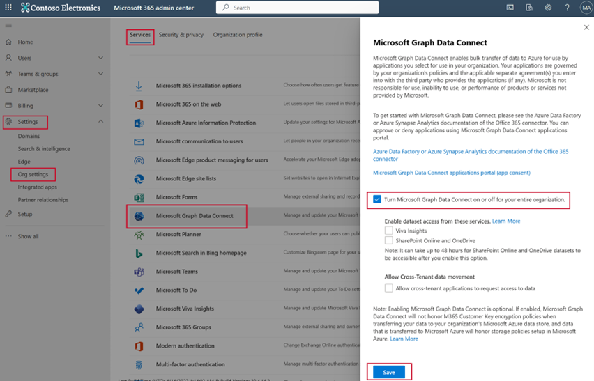
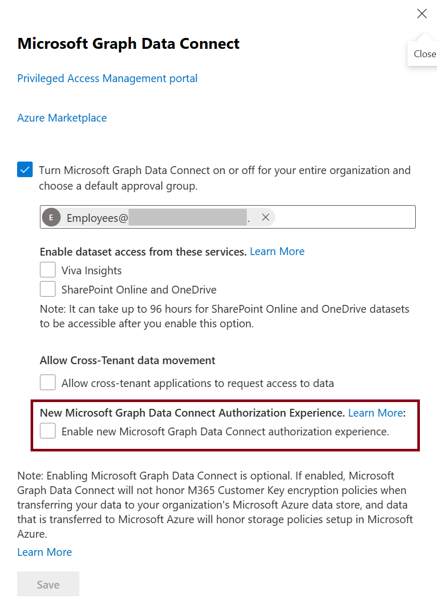

# Migrate existing customers to the enhanced Microsoft Graph Data Connect consent experience

Starting August 17, 2023, new customers who onboard to Microsoft Graph Data Connect will automatically benefit from the enhanced authorization experience. Existing customers who onboarded by using the [PAM authorization flow](./data-connect-pam.md) have three options to migrate to the enhanced experience.

## Option 1: Self-serve migration

<!-- Update 8/17/2023 changed date per developer guidance to August 17, 2023. -->

If you're an existing Data Connect customer and you want to get started with the enhanced app registration and authorization experience, have your tenant admin disable Data Connect in the Microsoft 365 admin portal and then reenable it by using the following steps:

1. Deselect the checkbox to **Turn Microsoft Graph Data Connect on or off for your entire organization**.
2. Choose **Save**. This disables Data Connect for your tenant. 
3. Refresh the page. The opt-in flyout will no longer present a textbox for providing an approver security group, along with modified text and links to reflect the new experience.  
4. Select the checkbox to **Turn Microsoft Graph Data Connect on or off for your entire organization**.
5. Choose **Save**. This reenables Data Connect for your tenant with the new onboarding experience.
6. Follow the steps in the [onboarding guide](./onboarding-experience-overview.md) to register the apps that you require and work with your tenant administrator to get them authorized for Data Connect.

This option is available today. If you choose this option, none of your existing Privileged Access Management (PAM) authorizations are migrated to the new experience. You need to register the apps and work with your tenant admin to get them authorized.

## Option 2: One-click automatic migration

Existing Data Connect customers can perform a one-click automatic migration from PAM to the enhanced onboarding experience. This migration is done for each tenant independently and handles the conversion of existing PAM authorizations into app registrations and maintains existing app authorizations. The goal is to enable a smooth migration with no downtime for existing customers.

<!-- This option will be available in late 2023. Stay tuned for more details. -->

The new experience requires that each app consents to one list of datasets, and each dataset be mapped to only one set of columns and one scope.

For tenants that meet this requirement, the tenant admin can complete the migration in the Microsoft 365 admin portal by selecting the **Enable new Microsoft Graph Data Connect authorization experience** checkbox and choosing **Save**. After the migration, the admin should review the migrated applications in the Data Connect app registration portal. 

### Special case migration

Your tenant requires special attention if it has active consents with any of the following conditions: 
- Multiple column sets per dataset 
- Multiple scopes per dataset 
- Multiple destination sinks per app registration
- A combination of any of these

Upon one-click migration, the active consents are merged where applicable. 

If there are multiple PAM consents corresponding to the same app and dataset combination, then the migration will take a superset of the column sets and scopes from the PAM consents for that app and dataset combination. Once migration is complete, you will be able to view this final result in the MGDC app registration portal and modify any of the above properties as desired.

If multiple PAM consents correspond to the same app, the migration takes a superset of all the destination sinks from the PAM consents for that app. When the migration is complete, pipelines continue working for one app with multiple sinks until you modify your app registration. The new Data Connect onboarding experience only supports one sink per registered app, but in order to facilitate a smooth migration, support for multiple sinks is available after migration. When you go to the Data Connect app registration portal, you will see a warning about this. To continue modifying the migrated app, you need to modify all pipelines by using that app to use a single destination sink.

For example, consider the following consents:

1. **Application**: `Productivity_Analysis`; **Sink**: `Storage_Account_1`; **Dataset**: `Message_v1`; **Columns**: [SentTime]; **Scope**: [Legal]  
2. **Application**: `Productivity_Analysis`; **Sink**: `Storage_Account_2`; **Dataset**: `Message_v1`; **Columns**: [Message]; **Scope**: [Engineering]
3. **Application**: `Productivity_Analysis`; **Sink**: `Storage_Account_2`; **Dataset**: `DirectReports_v1`; **Columns**: [Direct Report]; **Scope**: [Engineering] 

After migration, the consents merge because they are under the same application: 

**Application**: `Productivity_Analysis` \
|-- **Sink**: [`Storage_Account_1`, `Storage_Account_2`] \
|-- **Datasets**: \
|---- **Dataset**: `Message_v1`;  **Columns**: [SentTime, Message]; **Scope**: [Legal, Engineering] \
|---- **Dataset**: `DirectReports_v1`; **Columns**: [Direct Report]; **Scope**: [Engineering]
 
> [!NOTE]
> With special cases, when merging consents, new consents can be introduced. In this example, the migration newly enables extracting the `Message` column for the `Legal` group and the `SentTime` column for the `Engineering` group. In addition, the data can now be delivered to any of the two sinks.  
>
> If this is not the desired state, customers can either revoke the consents that they do not want migrated in PAM prior to migration or correct it after migration by updating the Data Connect app registration and re-approving that updated registration. For any questions, reach out to dataconnect@microsoft.com.

## Option 3: Automatic migration

<!-- Update 12/15/2023 changed date per developer guidance to mid 2024. -->

Between March 31, 2024 and April 30, 2024, existing Microsoft Graph Data Connect customers who didn't perform the one-click automatic migration will be migrated automatically to the new onboarding experience on their first pipeline run of Microsoft Graph Data Connect. During this time, no new PAM requests will be created. In both cases (one-click migration and automatic migration), Data Connect will convert all your approved PAM requests for Data Connect into Data Connect app registrations and authorizations for the new experience so that existing pipelines continue to work without any modifications required. 

> [!NOTE]
> The migration logic during automatic migration is the same as described in the one-click automatic migration section. 

After April 30, 2024, if your tenant has not been migrated to the new experience, PAM approvals for your tenant will not be converted and you must manually use the new onboarding experience to enable your pipelines again.
