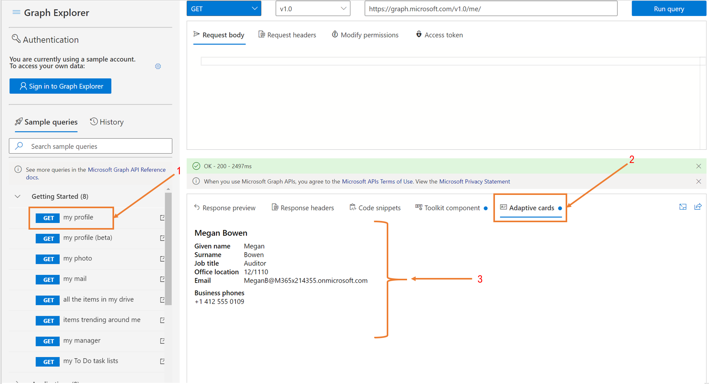

---

title: "Working with Graph Explorer"
description: "Find out how to use some of the important features in Graph Explorer."
ms.localizationpriority: medium
author: bettirosengugi

---
# Working with Graph Explorer

[Graph Explorer](https://developer.microsoft.com/graph/graph-explorer/) is a developer tool that lets you conveniently make Microsoft Graph REST API requests and view corresponding responses. This article describes how to use some of the important features in Graph Explorer.

## Consent to permissions

The user or administrator must grant Graph Explorer the correct permissions via a consent process to access data in Microsoft Graph. Consent to permissions in Graph Explorer either via the **Modify permissions** tab or the **Select permissions** option in the settings gear next to your profile when you’re signed in. 
The **Modify permissions** tab lists all permissions you need to run the query in the address bar. 

To consent to permissions:

1.	Select a sample query and run it.
2.	Select the **Modify permissions** tab.
3.	See the list of permissions required to run the query.
4.	Select the consent button next to the permission you want to consent to. 

The **Modify  permissions** feature is currently in preview, and some queries might be missing permissions. If permissions are missing for a query, the **Select permissions** option in the settings gear next to your profile contains the list of all available permissions:

1.	Go the settings gear and click the **Select permissions** option. This option contains the list of all available permissions.
2.	From the list of all the permissions, consent to the ones you want.

## Get an access or authentication token

Graph Explorer includes an **Access token** tab that shows your access token when you are signed in. On the **Access token** tab, you can copy the token if you need to use it in your favorite REST client application.

## Copy code snippets

For each REST API query you select or enter in Graph Explorer, you can find how to call that API in each of the four languages showcased under the **Code snippets** tab - C#, Java, JavaScript, and Objective-C. 

## UI component integration

Graph Explorer includes several features to make implementing UI easier. Reuse these components in your apps too.

### Microsoft Graph Toolkit integration

The [Microsoft Graph Toolkit](../toolkit/overview.md) is a collection of reusable, framework-agnostic web components and helpers for accessing and working with Microsoft Graph. The components are fully functional, with built in providers that authenticate with and fetch data from Microsoft Graph.

Graph Explorer provides sample REST API queries that correspond to Microsoft Graph Toolkit components. A blue dot on the **Toolkit component** tab indicates that the Toolkit provides a component for the currently specified REST API query in Graph Explorer. You can conveniently copy the code for the component to your app.

The following table lists the sample queries that currently include a Toolkit component.

| **Graph Explorer sample query** | **Toolkit sample iFrame URL** |
| --- | --- |
| GET my profile | [https://mgt.dev/iframe.html?id=components-mgt-person-card—person-card-hover](https://nam06.safelinks.protection.outlook.com/?url=https%3A%2F%2Fmgt.dev%2Fiframe.html%3Fid%3Dcomponents-mgt-person-card--person-card-hover&amp;data=04%7C01%7CElise.Yang%40microsoft.com%7Ca81f0f07873240d8571b08d7dac329d4%7C72f988bf86f141af91ab2d7cd011db47%7C1%7C0%7C637218404083362882%7CUnknown%7CTWFpbGZsb3d8eyJWIjoiMC4wLjAwMDAiLCJQIjoiV2luMzIiLCJBTiI6Ik1haWwiLCJXVCI6Mn0%3D%7C-1&amp;sdata=9FvGlMZNc78EE66JiY7hrusYVuGUm2NeflYlVgwTVwo%3D&amp;reserved=0) |
| GET people I work with | [https://mgt.dev/iframe.html?id=components-mgt-people—people](https://nam06.safelinks.protection.outlook.com/?url=https%3A%2F%2Fmgt.dev%2Fiframe.html%3Fid%3Dcomponents-mgt-people--people&amp;data=04%7C01%7CElise.Yang%40microsoft.com%7Ca81f0f07873240d8571b08d7dac329d4%7C72f988bf86f141af91ab2d7cd011db47%7C1%7C0%7C637218404083372878%7CUnknown%7CTWFpbGZsb3d8eyJWIjoiMC4wLjAwMDAiLCJQIjoiV2luMzIiLCJBTiI6Ik1haWwiLCJXVCI6Mn0%3D%7C-1&amp;sdata=yMF3X0M%2FmvWTUfhMdNYkG5I7fDMXpPHS6Fwea%2B3ycPs%3D&amp;reserved=0) |
| GET all my planner tasks | [https://mgt.dev/iframe.html?id=components-mgt-tasks—tasks](https://nam06.safelinks.protection.outlook.com/?url=https%3A%2F%2Fmgt.dev%2Fiframe.html%3Fid%3Dcomponents-mgt-tasks--tasks&amp;data=04%7C01%7CElise.Yang%40microsoft.com%7Ca81f0f07873240d8571b08d7dac329d4%7C72f988bf86f141af91ab2d7cd011db47%7C1%7C0%7C637218404083382869%7CUnknown%7CTWFpbGZsb3d8eyJWIjoiMC4wLjAwMDAiLCJQIjoiV2luMzIiLCJBTiI6Ik1haWwiLCJXVCI6Mn0%3D%7C-1&amp;sdata=Vk5IhPb%2FNbni7c6bteEveIdQNn%2BPm6AchwewCJ%2Fkmzk%3D&amp;reserved=0) |
| GET my events for the next week | [https://mgt.dev/iframe.html?id=components-mgt-agenda—get-events-for-next-week](https://nam06.safelinks.protection.outlook.com/?url=https%3A%2F%2Fmgt.dev%2Fiframe.html%3Fid%3Dcomponents-mgt-agenda--get-events-for-next-week&amp;data=04%7C01%7CElise.Yang%40microsoft.com%7Ca81f0f07873240d8571b08d7dac329d4%7C72f988bf86f141af91ab2d7cd011db47%7C1%7C0%7C637218404083382869%7CUnknown%7CTWFpbGZsb3d8eyJWIjoiMC4wLjAwMDAiLCJQIjoiV2luMzIiLCJBTiI6Ik1haWwiLCJXVCI6Mn0%3D%7C-1&amp;sdata=VVFcx3gXMmg%2B%2BdQCZXjAmkCk5zKcrntK6fI35jbdN94%3D&amp;reserved=0) |
| GET my photo | [https://mgt.dev/iframe.html?id=components-mgt-person—person-photo-only](https://nam06.safelinks.protection.outlook.com/?url=https%3A%2F%2Fmgt.dev%2Fiframe.html%3Fid%3Dcomponents-mgt-person--person-photo-only&amp;data=04%7C01%7CElise.Yang%40microsoft.com%7Ca81f0f07873240d8571b08d7dac329d4%7C72f988bf86f141af91ab2d7cd011db47%7C1%7C0%7C637218404083392872%7CUnknown%7CTWFpbGZsb3d8eyJWIjoiMC4wLjAwMDAiLCJQIjoiV2luMzIiLCJBTiI6Ik1haWwiLCJXVCI6Mn0%3D%7C-1&amp;sdata=aI%2BUqciLPOxEqlIpbjT8wtWBgcaJWM6sqooRlLVspZ0%3D&amp;reserved=0) |

### Adaptive cards integration

[Adaptive cards](https://adaptivecards.io/) are platform-agnostic snippets of UI, authored in JSON, that apps and services can openly exchange. When you run a query and an adaptive card is available, a blue dot appears on the **Adaptive cards** tab.

## Customize the theme in Graph Explorer

Choose the theme for Graph Explorer by selecting the **Change theme** option under the settings gear. Theme options are Light, Dark, and High contrast.

## Storing and sharing queries

Queries run in Graph Explorer are saved for 30 days in the **History** tab. On the History tab, you can:

1.	Export all history items in .har format.
2.	Delete all history items.
3.	View this history item.
4.	Run this query.
5.	Export this history item in .har format.
6.	Delete this history item.

To share queries that you run, click the share query button in the response pane and click **copy**. This copies a link to share and allow others to see your query and the results.

## Graph Explorer UI features

Collapse and expand the sidebar component in Graph Explorer when you want to widen the request and response area. To collapse the sidebar component, select the hamburger icon on the top left of the sidebar.

Expand and collapse the response preview by selecting the expand arrow in the response preview window.

Conveniently access the Microsoft 365 Developer Program site from the Graph Explorer UI to get a free sandbox with sample data to experiment with. Under the setting gear, select **Get a sandbox with sample data**.

## Next steps

- Visit [Graph Explorer](https://developer.microsoft.com/graph/graph-explorer/) and explore sample queries.
- Explore the [Microsoft Graph Toolkit documentation](../toolkit/overview.md).
- Contribute or provide feedback in the [Graph Explorer GitHub repo](https://github.com/microsoftgraph/microsoft-graph-explorer-v4/issues/new/choose).
