# Work with Graph Explorer

[Graph Explorer](https://developer.microsoft.com/graph/graph-explorer/) is a developer tool that you can use to learn about Microsoft Graph APIs. It has a variety of features to help you on your journey. This article describes some of the important features of Graph Explorer and how to use them.

For an overview, see [Use Graph Explorer to try Microsoft Graph APIs](/graph/graph-explorer/graph-explorer-overview).

## Header

From the top navigation, you can sign in, view the tenant you're using, access your settings, and find helpful links and a feedback mechanism.

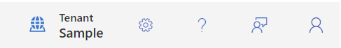

- **Tenant**: View the tenant you are currently using.
- **Settings**: Access Graph Explorer settings to change the interface theme or to get a free instant sandbox preconfigured with sample data packs.
- **Help**: Access useful links such as the documentation or the GitHub repo for Graph Explorer.
- **Feedback**: If you want to provide feedback, you can fill in the survey form.
- **Profile avatar**: Sign in, view your profile, consent to permissions, switch accounts, or sign out of your account. For details about consenting to permissions, see [Consent to permissions](#consent-to-permissions).

### Consent to permissions

The user or administrator must grant Graph Explorer the correct permissions by using a consent process to access data in Microsoft Graph. You can consent to permissions in Graph Explorer by choosing either the **Modify permissions** tab or the **Consent to permissions** option under the profile avatar when you’re signed in.

The **Consent to permissions** option in the profile avatar contains the list of all available permissions:

1. Click the profile avatar and choose the **Consent to permissions** option. This option contains the list of all available permissions.
2. From the list of all the permissions, consent to the ones you want.

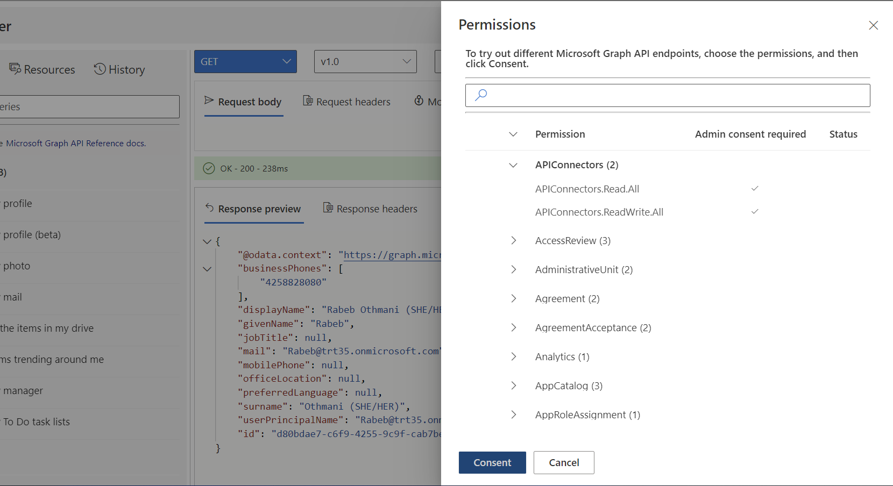

The **Modify permissions** tab lists all the permissions that you might need to run the query in the address bar. When possible, choose the least privileged permission.

To consent to permissions:

1. Select a sample query and run it.
2. Select the **Modify permissions** tab.
3. See the list of permissions required to run the query.
4. Select the **Consent** button next to the permission that you want to consent to.

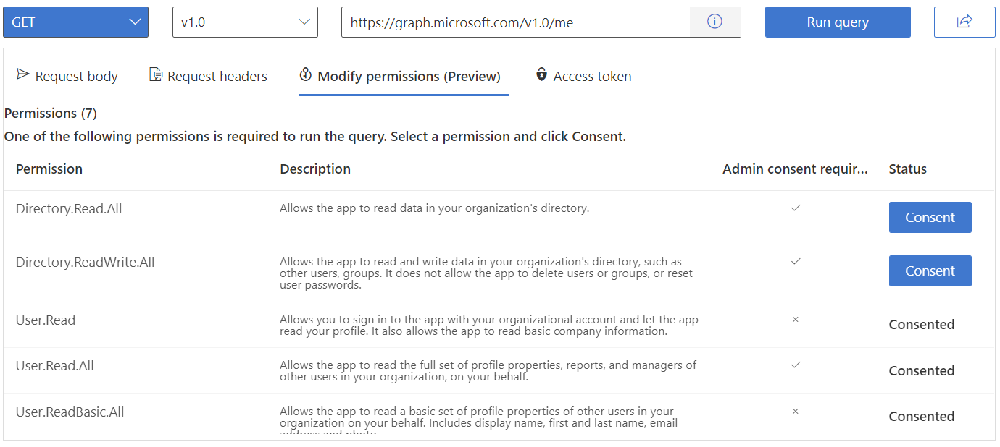

> [!NOTE] 
> The **Modify permissions** feature is currently in preview, and some queries might be missing permissions.

## Left pane

The left pane allows you to access the main features of Graph Explorer:

- [Sample queries](#sample-queries)
- [Resources](#resources)
- [History](#history)

### Sample queries

The **Sample queries** tab provides a set of queries categorized by service that you can select and run to help you get started with Microsoft Graph API calls.

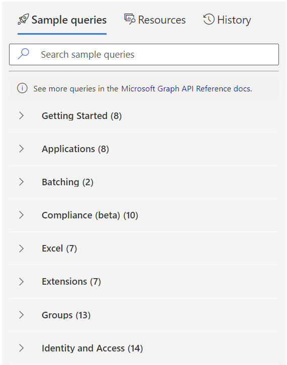

When you select a query, the selected query populates the query box. To try the request, choose **Run query**.

### Resources

Use the **Resources** tab to explore Microsoft Graph resources in the beta and v1.0 endpoints. Browse the list of resources or use the search bar to search for a specific resource.

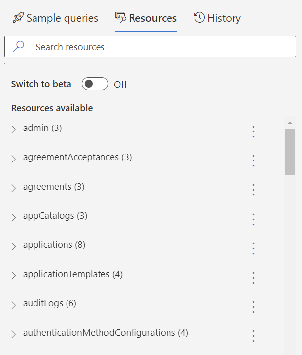

From the **Resources** tab, you can export a collection of resources into a Postman collection by doing the following:

1. From the kebab menu next to the resource, select **Add to collection**.
1. When you're finished adding resources, choose **Preview collection**.
1. From the collection view, you can review the resources you selected and remove any if you choose.
1. Choose **Download Postman collection**.

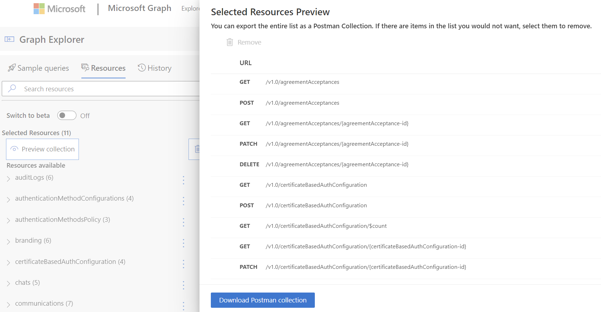

### History

All queries you run in Graph Explorer are saved for 30 days in the **History** tab. From the **History** tab, you can:

- Export all history items in **.har** format.
- Delete all history items.
- View a history item.
- Run a query.
- Export a history item in **.har** format.
- Delete a history item.

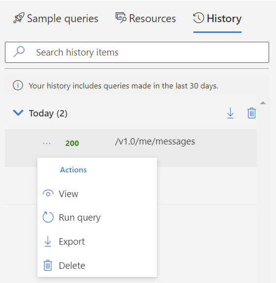

To share queries that you run, select the **Share** button situated next to the **Run query** button, and then select **Copy**. This copies a shareable link that allows others to see your query and the results.

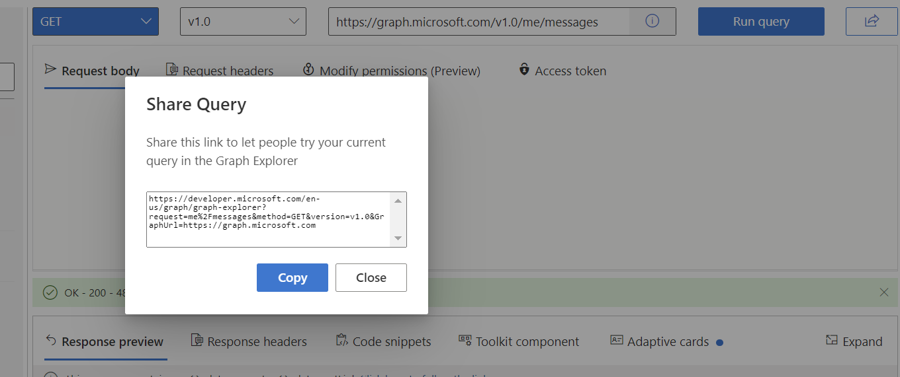

## Query area

Use the query area to run requests and see the responses. The query area includes the following elements:

- **HTTP methods**: A dropdown list of the HTTP methods.
- **API version**: A dropdown list of the API versions available publicly.
- **Query box**: A bar where you can manually build your query, or see the autopopulated query if you selected one from the left pane.
- **Request body**: A space to write the request body in JSON format or MIME content, according to the desired request.
- **Request headers**: A section to add headers to your request by specifying the key and value.
- **Modify permissions**: You need to consent to the right permissions to be able to run a query. For details, see [consenting to permissions](#consent-to-permissions).
- **Access token**: This tab shows your access token when you're signed in. You can copy the token if you need to use it in your favorite REST client application.

 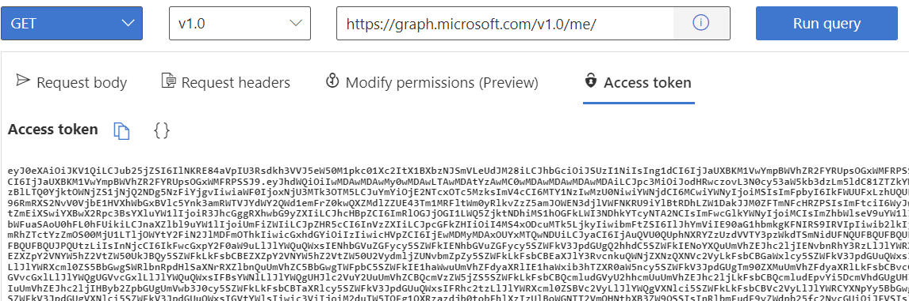

When you run a query, you will see a **Response preview** and **Response headers** in the response pane.

In addition to the response, this pane also includes:

- [Code snippets](#leverage-the-power-of-the-client-libraries)
- [Microsoft Graph Toolkit integration](#microsoft-graph-toolkit-integration)
- [Adaptive cards integration](#adaptive-cards-integration)

### Use the power of the client libraries

For each REST API query that you select or enter in Graph Explorer, you can find how to make that call in each of the supported languages: C#, Java, JavaScript, Go and PowerShell.

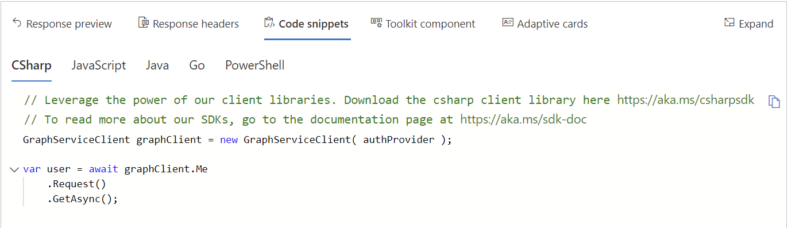

### Microsoft Graph Toolkit integration

[Microsoft Graph Toolkit](../toolkit/overview.md) is a collection of reusable, framework-agnostic web components and helpers for accessing and working with Microsoft Graph. The components are fully functional, with built-in providers that authenticate with and fetch data from Microsoft Graph.

Graph Explorer allows you to visualize Microsoft Graph Toolkit components that correspond to the API queries. A blue dot on the **toolkit component** tab indicates that the Toolkit provides a component for the currently specified REST API query in Graph Explorer. You can conveniently copy the code for the component to your app.

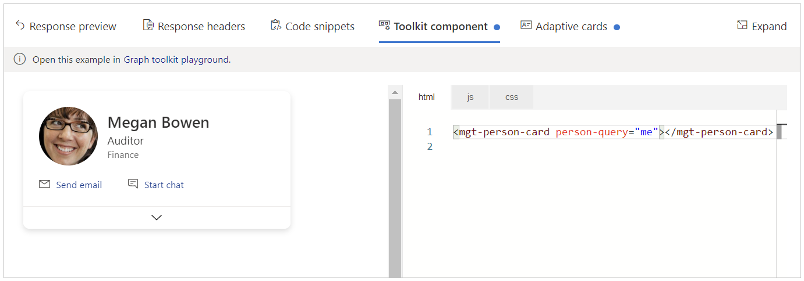

### Adaptive cards integration

[Adaptive cards](https://adaptivecards.io/) are platform-agnostic snippets of UI, authored in JSON, that apps and services can openly exchange. A blue dot on the **Adaptive cards** tab indicates that an adaptive card is available for the selected query.

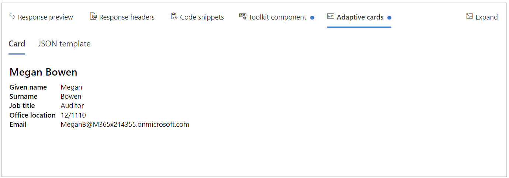

## Next steps

- Visit [Graph Explorer](https://developer.microsoft.com/graph/graph-explorer/) and start learning about Microsoft Graph.
- Explore the [Microsoft Graph Toolkit documentation](../toolkit/overview.md).
- Contribute or provide feedback in the [Graph Explorer GitHub repo](https://github.com/microsoftgraph/microsoft-graph-explorer-v4/issues/new/choose).
